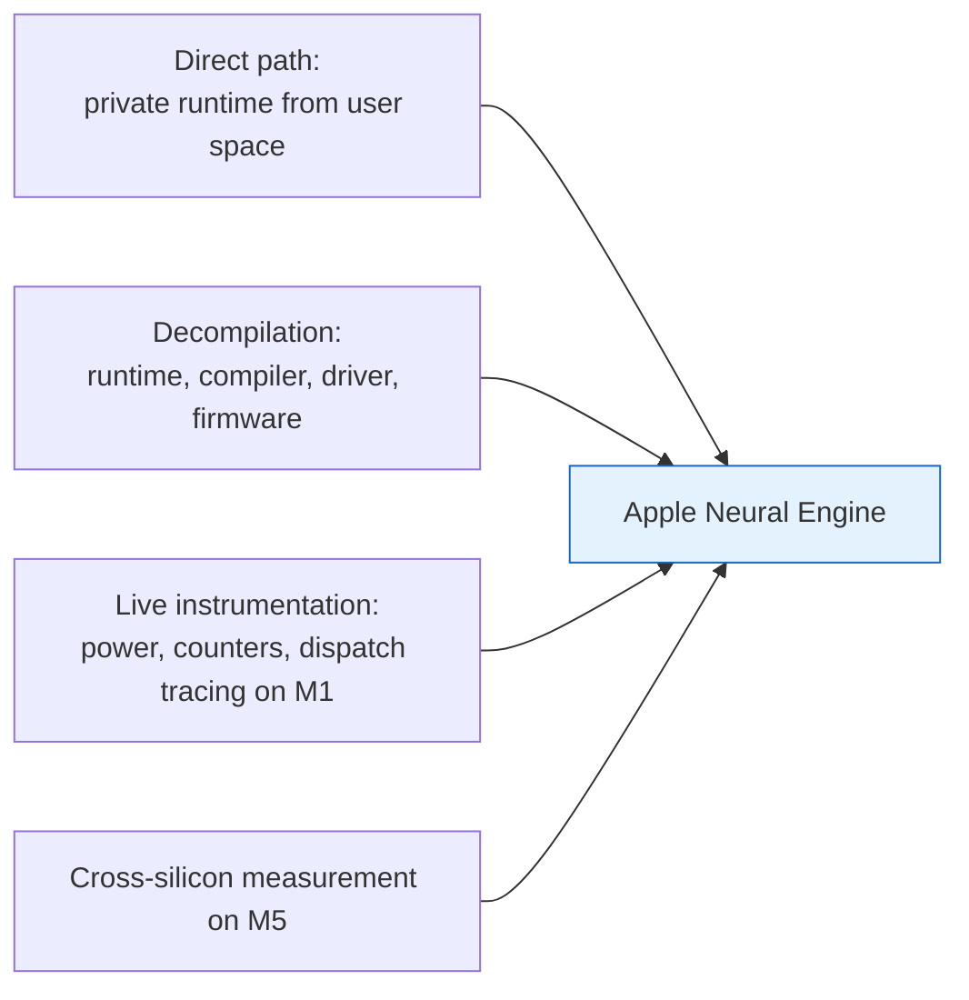

# Methodology

> Every finding rests on one of four techniques: a direct private-runtime path, static decompilation of the stack, live read-only instrumentation, and compile-and-run probing.
> The results rest on two measured silicon points, M1/H13 as the primary host and M5/H17s as the second, with claims marked as measured on a named generation or as predicted.

Every quantitative claim in this guide is either measured on running silicon, read out of a binary or table, or marked as predicted from those artifacts.
This chapter states how the engine was reached and how it was characterized.
The four converging lines of evidence behind the findings are the direct private-runtime path, static decompilation, live instrumentation, and cross-silicon measurement, which [figure](#fig:meth-evidence) shows against the engine.

## Reaching the engine

The engine was reached without the public model framework.
The same private Espresso and dispatch runtime that the system's own dispatchers use is callable from ordinary user space.
No high-level framework is in the path, and the operations the compiler accepts need no special entitlement.
The compiler lowers a graph to the engine's program format, and the runtime loads it and drives it through an execution stream directly.
This route bypasses the public compute-unit selector [AppleCoreML] and holds every measured result in the guide.

In-process instrumentation mapped the dispatch path: a library inserted into the dispatching process interposed on the kernel-driver calls.
The mapping showed the dispatch as input and output surfaces passed to an asynchronous driver selector, and it located the boundary below which user space cannot see.

## Static analysis of the stack

Decompilation and static analysis of four artifacts read out the structure of the stack, which [table](#tbl:meth-artifacts) pairs with what static analysis recovered from each.

| Artifact | What was read out |
| --- | --- |
| the dispatch and compiler runtime | the operation vocabulary, the compiler passes, and the program bundle format |
| the kernel driver | the user-to-kernel boundary and the expanded program binary it lowers |
| the engine firmware | the on-engine execution model and the host-to-firmware command protocol |
| the intermediate-language operation set | the lowering from the public operation set to the engine's own |

Table: The four decompiled artifacts of the stack and what static analysis read out of each. {#tbl:meth-artifacts}

Apple distributes the firmware on the M1 unencrypted, an ARM64 real-time-kernel image behind an image wrapper.
Its execution loop, its driver, and its ninety-three-command host protocol were decoded statically rather than inferred.
The compiler lowers a graph to a ninety-seven-operation internal vocabulary that is a superset of the public set.
Static reading of those passes separated the hidden internal operations from the user-reachable ones.

## Live instrumentation

Three escalating instruments supplied the running values that static reading cannot recover, each read-only or recoverable on a dedicated host.
A user-space counter interface exposed live hardware counters: DRAM bytes moved, energy in millijoules, and clock frequency.
Sampling those counters around a hot loop gave the roofline directly.
That fixed the M1 at about 12 fp16 TFLOP/s of compute, about 85 GB/s of DRAM bandwidth, and near 0.5 pJ per FLOP sustained, 0.37 at the compute optimum.
It also fixed a 2 MB on-chip working-set threshold, confirmed by the counters falling off exactly where the working set crosses 2 MB.
A signpost trace on the engine subsystem gave the op-level event sequence and independently confirmed the bundle finding that each dispatch wraps three driver requests.

The lowest-level instrument was kernel tracing with boot security lowered on a wipeable development machine.
Read-only function-boundary tracing instrumented over a hundred thousand kernel probes, about eighteen hundred of them inside the engine driver, with no driver extension and no crash class.
That trace captured the expanded program binary that does not exist on disk.
The binary is a sectioned executable lowered below user space whose program section is a list of forty-four-byte records, each one a register write that wires a buffer address into a direct-memory-access engine.

## Attestation versus reachability

A capability listed in a hardware table or accepted by the frontend attests existence, not that the engine will run it.
Only a compile-and-run on the target confirms a capability.
One case forced the rule: the hardware abstraction layer advertises three-dimensional convolution and the intermediate language recognizes it, yet it fails backend lowering on every device mask and never reaches the engine.
Two-dimensional convolution, fused attention path, normalization family, and activation and reduction set appear here because they survived compile-and-run probing, not because a capability bit promised them.
The same rule, read off the counters and the device mask, separates operations that compile but route to the CPU or GPU from operations that run on the engine.

## What each technique cannot see

The boundaries do not overlap.
[Table](#tbl:meth-boundaries) pairs each characterization technique with what it observes and the boundary it cannot cross.

| Technique | What it observes | What it cannot observe |
| --- | --- | --- |
| decompilation and static analysis | code structure, formats, vocabularies, command and register tables | runtime values, and any data the firmware computes rather than stores |
| user-space hardware counters | aggregate power, energy, bandwidth, and frequency around a loop | per-operation register-level timing, which is gated below the dispatch layer |
| signpost and dispatch tracing | the op-level event order and the three-request dispatch shape | the expanded program, which is lowered below user space |
| kernel function-boundary tracing | the expanded program binary and the section layout it lowers | the semantic identity of an individual register, virtualized per load by the memory-management unit |
| compile-and-run on the target | what the engine accepts and runs, and its numeric output | another generation's behavior, which requires that chip to measure |

Table: Each characterization technique paired with what it observes and the boundary it cannot cross. {#tbl:meth-boundaries}

The last unmapped item is the name of each individual silicon register.
Its address is a per-load device address that the memory-management unit remaps on every load, the firmware writes it through a generic writer with no address-to-name table, and the per-offset naming is undocumented.
What remains is a labeling gap behind address virtualization and undocumented silicon, not a deeper layer left uncaptured.

## Two measured silicon points

Two generations were measured directly, and they anchor the cross-generation claims.
The M1, internally H13, is the primary measurement host.
It fixed the roofline, unencrypted firmware decode, kernel capture of the expanded program down to the register-write records, operation-conformance set, and all four axes of the fp16 divergence model.
It is also where the system-wide compile service was characterized.
A rapid burst of compile crashes spaced faster than the daemon's ten-second relaunch drives an unrelated control compile from 120 ms to a multi-minute hang.
This is a rate condition rather than a per-crash leak, recoverable only by terminating the daemon.

The M5, internally H17s, is the second measured point and confirmed the cross-generation scaling.
It established that the numeric divergence accumulates to at most a fraction of a percent over a full training run, that the family-wide capability limits are not specific to one chip, and that the operation set is portable across the generations.
A capability table can be cross-compiled statically for an unmeasured generation, but only the chip itself confirms its numerics.

The M5 ran with System Integrity Protection enabled, the shipping configuration, while the lowest-level M1 instrumentation lowered boot security.
Security and isolation claims therefore take the M5 as the authoritative point, since it reports the entitlement gates, exclave boundary, and counter access a normal client meets under the enforced configuration rather than what a lowered-security system exposes.

## Reproducing the measurements

Every headline number maps to one command and one committed result file, taken in a fixed environment.
The measurements were taken with ANECompiler 9.509.0, whose intermediate-language component is versioned 3520.4.1, on macOS 14 or later (verified on macOS 26.5), with Python 3.10 or later (developed and verified on Python 3.14), and with numpy as the only core numeric dependency.
Python 3.10 is the floor because several core modules use PEP 604 union syntax in runtime-evaluated signatures.

The reproduction has two layers.
A single top-level driver script runs the full sequence and is fail-soft: it reports and skips a device or power step that cannot run, so the deterministic claims still reproduce.
Beneath it are the individual measurement harnesses, each producing a committed result file, so a paper claim resolves to a command and to a stored result.
A capability smoke test and an operation smoke test confirm that the closed capability set and every released operation compile and run on the engine.
A corpus runner is the correctness gate that the optimizer is held to.
A device-comparison harness records latency and speed-per-watt across the engine, GPU, and CPU; a roofline harness records the saturation and bandwidth ceilings.
Both harnesses write JSON result files that the committed roofline analysis and figure are built from.

Several limits bound how the numbers should be read.

- The per-rail power figures come from the system power estimator, `powermetrics`, which reports a modeled estimate rather than an independent wall-meter measurement.
  There is no separate validation of that estimator: the reported total-package active power with idle subtracted is a calibrated estimate, not a metered reading.
- The work runs on Apple silicon only.
  It installs on any platform but cannot run without an Apple silicon Mac and the built dispatch library, and there is no CPU, GPU, or other fallback for the engine path.
- The path calls private Apple framework symbols tied to ANECompiler 9.509.0.
  A macOS update can break the dispatch-library build or the dispatch path, and none of it is an Apple API contract.
- Determinism splits by claim type.
  The capability census, operation conformance check, operation smoke test, and correctness corpus are deterministic pass-or-fail gates; the device-comparison, serving, and roofline numbers are measurements and vary run to run.
