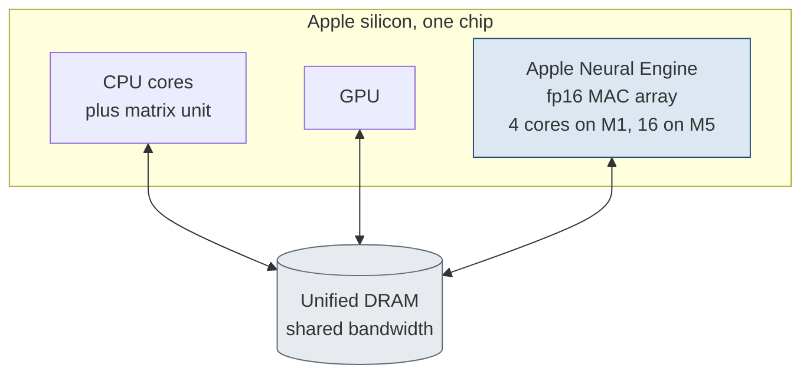

# 1. What the ANE is

> The Apple Neural Engine is a fixed-function fp16 matrix accelerator with a wide accumulator, reachable directly below Core ML.
> The fp16 product path and wide accumulator explain much of the engine's numerical behavior and contribute to its efficiency.
> It is faster than the GPU on compute-bound vision and convolution, 3.8 times faster and 9 times more efficient on a 256-channel 3x3 convolution; the GPU leads only on bandwidth-bound decode.
> The overhead-isolated compute slope reaches near 12 fp16 TFLOP/s against 85 GB/s of DRAM bandwidth, with a 2 MB on-chip working-set threshold as the primary design limit.

The Apple Neural Engine is a fixed-function matrix accelerator built into every recent Apple system on chip, from the A11 and the M1 onward.
It runs the feed-forward neural networks of on-device perception, vision and speech, at low power, and leaves the CPU and the GPU free for the rest of the system.
Apple distributes it in volume and documents almost none of it.
The engine is beside the CPU and the GPU on the same chip, where the three share one pool of DRAM, as [the figure](#fig:soc) shows.



## Reachable surface

The public way to use the engine is Core ML [AppleCoreML], whose load-and-predict call shape [Listing](#lst:c1-coreml-predict) shows.

```swift
// The public path: ask for the engine, but Core ML still places the work.
let config = MLModelConfiguration()
config.computeUnits = .cpuAndNeuralEngine  // a hint, not a guarantee
let model = try MLModel(contentsOf: url, configuration: config)
let out = try model.prediction(from: input)  // planner splits ops across CPU, GPU, ANE
// The caller is not told which device ran each segment.
```

Listing: The Core ML load-and-predict path, where the compute-unit field is a placement hint rather than a guarantee. {#lst:c1-coreml-predict}

A cost-driven placement planner segments a model handed to Core ML across the CPU, GPU, and ANE.
An eligibility check decides which operations the engine can accept, and a roofline and transfer cost model decides where each segment runs.
The planner is opaque.
A caller does not choose the device and is not told which device ran the work.

A direct route reaches the engine without Core ML.
The same private Espresso runtime that Apple's own dispatchers use is callable from ordinary user space.
It compiles a network to the engine's program format, loads it, and drives an execution stream, with no placement planner in the path and no special entitlement for the operations the compiler accepts.
This route makes the engine a target a developer can address on purpose rather than a scheduling hint.
It is not a supported or App-Store-safe path; see the status note in the front matter.
Part II covers it in full.

The stack from a graph to the silicon is a fixed set of layers, and the direct route enters one level below Core ML at the runtime, as [table](#tbl:c1-stack) gives layer by layer.

| Layer | Role |
| --- | --- |
| Core ML, the GPU graph framework, the direct runtime route | three independent front ends |
| Espresso and the runtime | the universal compile, load, and execution-stream layer |
| the engine framework and its daemon | program lifecycle, brokered over cross-process messaging |
| the kernel driver | the coprocessor endpoint, mailbox transport, signed program load |
| the firmware | the engine's own real-time operating system, the dispatch loop, the data-movement and power control |
| the silicon | the multiply array, the on-chip memory, and the address-translation unit |

Table: The software and firmware stack from a compute graph to the silicon, with the role of each layer. {#tbl:c1-stack}

The compile path requires the modern intermediate language, which the compiler accepts only from the A13 and M1 generation up.
The pre-A13 parts have no path through this toolchain, which is why the M1 is the practical floor for addressing the engine directly.

## One fact that explains the machine

The products are fp16 while the accumulator is wide, of fp32 class, and that property accounts for most of what the engine does.
The datapath multiplies in fp16 end to end: fp16 inputs, fp16 weights, fp16 outputs.
The frontend accepts fp32, int32, and bf16 type annotations, but the backend does not implement them.
The datapath reconstructs compressed weights to fp16 before they reach the multiplier.

The running sum is not fp16.
Input tiles round to fp16 on the way in, the output port rounds to fp16 on the way out, and the accumulation between those two points is held in a wide accumulator.
Representable sums thus come back near exact.
A reduction of sixteen thousand ones is bit exact, where a naive fp16 running sum would stall near two thousand once the partial total exceeds the spacing of its own increments.
A cancellation probe settles the question: a sum of a large value, its negation, and one, taken near sixteen thousand, returns the one intact, which a fp16 running sum would have swallowed.
The sum is physically wider than fp16.

The wide accumulator is what suits the engine to vision, audio, and encoders.
Those workloads are convolutions, matrix multiplies, and normalizations whose partial sums stay in range and whose results are representable, so the accumulator holds their precision.
The same arithmetic explains where a transformer decoder loses precision in fp16.
The loss comes from the per-product fp16 rounding of the inputs and weights under heavy cancellation, in the down-projection in particular, not from the accumulator.
The accumulator is wide enough; the inputs to it are already quantized.
A cancellation-heavy step has no fp16-safe form on the engine and needs a wider anchor on the CPU or the GPU.

The fp16 datapath also accounts for the power efficiency.
A narrow multiply and a fixed-function pipeline move and compute far fewer bits per result than a general-purpose vector unit.

## Two core counts

The engine reports two different core counts, and only one is the throughput unit.
The advertised 16-core figure is the count Apple markets, 16 on the M1, exposed at runtime as the device property for the number of engine cores.
The architectural figure is the core count the compiler tiles work across and the cost model scales by, read from the hardware-abstraction-layer offset `0x238`, which is 4 on the M1.
The core count is 4 on the M1 base part, 8 on the M1 Pro and Max, and 16 on the M5.
Each core emits up to 4 output channels per cycle in the default fp16 path.
The M1 thus reaches about 16 output-channel multiply-accumulates per cycle in fp16, and int8 doubles the lanes to reach about 32, consistent with the overhead-isolated compute slope near 12 fp16 TFLOP/s.

## Where it leads

On compute-bound work the engine is faster than the GPU outright.
A 3x3 convolution at 256 channels runs about 3.8 times faster than the same work on the GPU and about 9 times more energy efficient, and batched matrix multiply is more efficient at every batch size, as [table](#tbl:c1-gpu) records for both workloads.

| workload | engine vs GPU speed | engine vs GPU efficiency |
| --- | --- | --- |
| 3x3 convolution (256 channels) | 3.8x faster | 9x more efficient |
| batched matrix multiply | faster below N of 2048 | more efficient at every batch size |

Table: Engine versus GPU speed and efficiency on the convolution and batched matrix multiply workloads. {#tbl:c1-gpu}

The case where the GPU leads is real but limited: it holds for bandwidth-bound autoregressive decode, where the work is moving weights rather than computing on them.
The measured envelope on the M1 fixes the scale.
The overhead-isolated compute slope reaches near $P \approx 12$ fp16 TFLOP/s against a DRAM bandwidth of $B \approx 85$ GB/s, at about $0.5$ pJ per FLOP sustained, near $0.37$ at the compute optimum.
The roofline ridge point, the arithmetic intensity above which a kernel is compute-bound rather than bandwidth-bound, is at $I^{*} = P / B \approx 141$ FLOP per byte.
A hard 2 MB on-chip working-set threshold is the primary design limit: a kernel whose live tiles exceed it stalls on off-chip streaming rather than running on the multiplier.
Newer chips scale the core count and the clock, but the form of the roofline and the fp16 datapath apply across the family.

## Reference: the M1 envelope

[Table](#tbl:c1-envelope) collects the M1 envelope figures, the two distinct core counts, and the family core-count span.

| Quantity | Symbol | M1/H13 value |
| --- | --- | ---: |
| Compute roof | $P$ | 12 fp16 TFLOP/s |
| DRAM bandwidth roof | $B$ | 85 GB/s |
| Energy per FLOP | | 0.5 pJ sustained, 0.37 pJ optimum |
| Roofline ridge point | $I^{*}$ | 141 FLOP/byte |
| On-chip working-set threshold | | 2 MB |
| fp16 maximum finite magnitude | | 65504 |
| Advertised 16-core figure, M1 | | 16 |
| Core count, M1 (HAL `0x238`) | | 4 |
| Core count, M1 to M5 | | 4 to 16 |
| Output channels per cycle per core, fp16 | | 4 |

Table: The M1 envelope figures, the two distinct core counts, and the family core-count span. {#tbl:c1-envelope}
