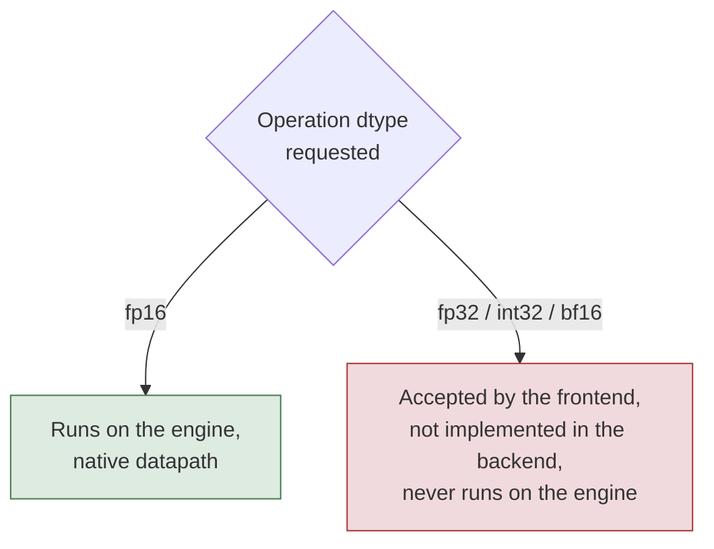

# 4. Capability surface

> The engine runs the operations on-device perception networks are built from: convolution, matrix multiply, fused attention, the normalizations, the activations, and data movement, all native from the M1 onward.
> A confirmed set has no hardware path on any family, including reduce_prod, the scatter family, and the recurrent cells; a network that needs one rewrites it.
> Some operations are family-gated: the texture-engine sampler arrives on the A14, and sin and cos arrive on the A15.
> A capability attested at one layer is not a reachable operation: three-dimensional convolution has a capability byte yet fails backend lowering on every device, so only a compile-and-run confirms an operation.

The Apple Neural Engine computes a fixed vocabulary of tensor operations.
The full operation-by-device table is Appendix A; this chapter gives its shape and the rules for fitting work to the engine.

## What fits

The engine runs the operations that on-device perception networks are built from.
Convolution and matrix multiply are at the center, the normalizations and activations around them, and data-movement operations between the compute steps.

Two-dimensional convolution is native, including the transpose (deconvolution) and the dilated, depthwise, and grouped forms, with kernel and tensor sizes bounded by the per-chip limits in Appendix A.
The compiler selects a Winograd path for eligible 3x3 stride-1 convolutions without any caller action.
Matrix multiply and fully-connected layers are native and fold into the convolution datapath when the operand fits the on-chip working set, tiling when it does not.
Attention runs as a fused operation: scaled dot-product attention runs on the matrix-multiply and softmax path, native on every family from the M1 onward and not gated behind the texture engine.

The common normalizations all run: layer, instance, group, and L2 normalization, plus batch normalization folded to an affine at inference.
Pooling (average, max, and L2) is native, as are the elementwise arithmetic and comparison operations.
The activation set covers ReLU and its variants, sigmoid, tanh, gelu, swish, softmax, erf, exp, and log, which evaluate through the lookup tables described in chapter 3; that table is a programmable piecewise-linear curve, and chapter 26 covers reaching an arbitrary pointwise function through it.
Data movement is native for reshape, flatten, expand, squeeze, transpose, concat, split, stack, constant pad, and slice, all descriptor edits or DMA operations rather than compute.
A reduction or transpose over a large axis switches to a tiled route at a per-chip threshold, at no change to the result.

The backend represents these operations in its own dialect, `anec.*`, one level below the frontend intermediate language. [Listing](#lst:c4-anec-dialect) gives the signatures for the core operations.

```mlir
// 2D conv: weights and bias fold in; rank 4 or 5; M1 kernel at most 29x29 (13x13 fp16).
anec.convolution(%input) {
    strides, dilation_rates, groups, kernel_sizes,
    explicit_padding, padding_style, weights_layout
}

// matrix multiply: contraction direction is set by the transpose flags, not by operand order.
// depth D must be 1 on both operands ("depth > 1 is not supported for MatMult inputs").
anec.matmul(%lhs, %rhs) { transpose_lhs, transpose_rhs }

// layer and group normalization are one atom: group_norm is layer_norm with num_groups > 1.
// channels must be divisible by num_groups; the output format must be Float.
anec.layer_norm(%input) { groups, epsilon, axis }   // gamma and beta fold in
```

Listing: The backend dialect signatures for convolution, matrix multiply, and normalization, with the operands and attributes the compiler expects. {#lst:c4-anec-dialect}

The tensor layout the compiler reasons about is five-dimensional, `N` batch, `D` depth, `C` channel, `H`, `W`, with a maximum rank of five, and transforms act only on the last four dimensions.

## Hard limits

Some operations have no hardware path on any current family.
They do not run on the engine and must be computed off-engine or reformulated.
The confirmed cases, unsupported on every family from the M1 through the M5, are: reduce_prod, the scatter family (scatter, scatter along axis, scatter ND), mod, one_hot, non_zero, band_part, reverse_sequence, shape, sliding_windows, the logical and, or, and xor operations, the recurrent gru, lstm, and rnn cells, the inverse and hyperbolic trigonometric functions, and the random-sampling operations other than the uniform generator.
A network that needs one of these rewrites it: a product reduction through log-sum-exp, logical-and through a minimum, recurrent cell through an unrolled fixed-trip-count graph.

A second class is family-gated rather than universal, and Appendix A gives the chip that enables each.
Gather on the M1 takes a software path valid only for a batch of one, depth of one, and three-element index channel, and is rejected outside it.
The texture-engine operations (resize as a hardware sampler, crop-resize, resample, affine) are absent on the M1 and arrive on the A14 generation.
Trigonometric sin and cos are native only from the A15 generation; the M1 and the A14 reject them and decompose on the host.

[Table](#tbl:c4-op-classes) groups the operation classes by status, from native on every family through the family-gated paths to those with no hardware path.

| Class | Examples | Status |
| --- | --- | --- |
| Convolution | 2D, transpose, dilated, depthwise, grouped | Native, M1 onward |
| Matrix multiply, fully-connected | `matmul`, `linear` | Native, M1 onward |
| Fused attention | scaled dot-product attention | Native, M1 onward |
| Normalization | layer, instance, group, L2, batch-fold | Native, M1 onward |
| Pooling | average, max, L2 | Native, M1 onward |
| Elementwise, activation | add, mul, ReLU, sigmoid, tanh, gelu, swish, softmax | Native, M1 onward |
| Data movement | reshape, transpose, concat, split, pad, slice | Native, M1 onward |
| Product reduction | `reduce_prod` | No path on any family |
| Scan | `cumsum` | Native on the M1 through a curated runtime path |
| Scatter | scatter, scatter along axis, scatter ND | No path on any family |
| Indexing, shape | `one_hot`, `non_zero`, `shape`, `band_part` | No path on any family |
| Recurrent cells | gru, lstm, rnn | No path on any family |
| Trig, inverse and hyperbolic | tan, asin, sinh, atanh | No path on any family |
| Gather | limited software envelope | M1 (batch 1, depth 1, 3-element index) |
| Texture-engine | resize, crop-resize, resample, affine | A14 onward |
| Trig sin and cos | `sin`, `cos` | A15 onward |

Table: Operation classes by status, from native on every family through limited or family-gated paths to those with no hardware path. {#tbl:c4-op-classes}

## Type limits

The datapath is fp16, as chapter 3 shows.
The frontend accepts fp32, int32, and bf16 as type annotations, but the backend does not implement them, so those annotations do not reach the silicon as wider arithmetic.
The compiler rejects a cast to int32 on the M1, and bf16 is not usable as a program input or output dtype.
Requesting a wider type gains no precision: the multiply, activation tables, and output port are fp16 regardless, and only the accumulator is wide.

A requested dtype routes by type, as [figure](#fig:c4-dtype-route) traces the fp16 and wider-type paths.



## Attested is not reachable

A hardware capability bit, or an operation the compiler appears to accept, does not guarantee a reachable, correct operation on the direct path.
Capability is attested at one layer and must be confirmed at the layer that runs the work.

The case that fixes the rule is three-dimensional convolution.
It is advertised by a hardware capability byte and recognized by the compiler frontend, yet it fails backend lowering on every device mask: the operation exists in the attestation and does not run.
The gap appears in the other direction too.
On the M1 the top-k, sort, and dynamic-slice validators are all callable, yet the code generator rejects all three.
A capability advertised in a table, recognized by a frontend, or validated by a checker is a claim about one layer; only a compile-and-run on the target confirms the operation at the layer that executes it.

The guide reports a reachable surface rather than the advertised one.
Every operation marked native in Appendix A was compiled and run on the M1, not inferred from a capability bit.
The advertised surface is the larger, and the difference is the operations that pass an earlier check and fail at code generation or backend lowering.
This account extends and partly corrects the documented convertible operation set, which lists operations the public converter accepts rather than the operations that lower to the engine [AppleCoreMLTools].

## Two compile routes

The engine has two compile routes with different capability gates, and an operation's availability can differ between them on the same chip.
The intermediate-language route is gated by the per-operation family floor: an operation is native when the chip family is at or above the operation's floor, and below the floor the compiler decomposes or rejects it.
The bridge route authors a fused layer directly and is gated by the hardware-abstraction-layer feature bytes rather than the family floor.
The clear example is the whole-tensor argument-maximum.
On the intermediate-language route it is gated to the A15 generation and is rejected on the M1, yet on the bridge route it runs correctly on the M1, because the feature byte that gates it is already set on the A13.
The same structure explains the other direction.
Native sin and cos have no bridge route, so they stay on the intermediate-language route and are rejected on the M1, while the rank and sort operations have a bridge route that is rejected at code generation on the M1.

[Table](#tbl:c4-gate-bytes) lists the hardware-abstraction-layer feature bytes that gate the bridge-route capabilities, with the per-generation value of each.

| Capability | Gate byte | older | A13 / M1 | A14 | A15 |
| --- | --- | --- | --- | --- | --- |
| softmax | `0x815` | 0 | 1 | 1 | 1 |
| instance normalization | `0x816` | 0 | 1 | 1 | 1 |
| argument-maximum, hardware form | `0x4f2` | 0 | 1 | 1 | 1 |
| square-after-reduction fusion | `0x494` | 0 | 0 | 1 | 1 |
| texture engine | `0x81d` | 0 | 0 | 1 | 1 |
| dropout and random | `0x4a9` | 0 | 0 | 0 | 1 |
| kernel-memory streaming select | `0x48f` | 0 | 1 | 1 | 1 |

Table: The hardware-abstraction-layer feature bytes that gate the bridge-route capabilities, with the per-generation value of each. {#tbl:c4-gate-bytes}

## Confirming an operation on the target

Because attestation is not reachability, an operation is confirmed by compiling the graph to the chip target and running it, not by reading a capability bit.
A graph that lowers and runs on the target is reachable there; a graph that the compiler rejects names the operation and the layer that refused it.

The graph compiles against the target and runs before an operation is relied on, the procedure [listing](#lst:c4-confirm-op) carries out for one operation at a time.

```python
# Confirm one operation on a target by compiling a graph that contains ONLY
# that operation, then reading the compiler's verdict. Do not trust a
# capability byte: a byte can be set for an op that still fails to lower.

# Build the smallest legal graph that exercises the operation under test.
function one_op_graph(operation, target):
    graph G:
        input  x                                  # a dummy input of a legal shape
        output operation(x)                       # the single op we want to confirm
    return G

# Ask the compiler to lower the graph against the target. Two outcomes only:
#   - it lowers and loads        -> the op is REACHABLE on this target
#   - the compiler rejects it    -> it names the op and the layer that refused
function confirm_op(operation, target):
    G = one_op_graph(operation, target)
    try:
        P = compile(G, target = target)           # lower + load against this chip
        return NATIVE                             # reached the silicon: reachable
    catch reject as r:
        # r holds the rejecting layer and message, e.g.
        #   "Some ops are not supported on any of the specified backends"  (no path)
        #   "<op> requires family >= N"                                    (family-gated)
        report r.layer, r.message                 # the reject string IS the signal
        return REJECTED

# Worked checks against the M1 target (family H13):
status_conv = confirm_op(conv_2d,     target = H13)   # NATIVE: 2D conv lowers from M1 onward
status_sin  = confirm_op(sin,         target = H13)   # REJECTED: sin/cos are gated to A15+
status_prod = confirm_op(reduce_prod, target = H13)   # REJECTED: no hardware path on any family

# An op gated to a later family is rejected when compiled against an earlier
# target, so the target argument is how a caller checks the family floor
# before building anything on top of the operation.
```

Listing: Confirming one operation on a target by compiling a single-op graph and reading the compiler's verdict. {#lst:c4-confirm-op}

## Reference: the per-chip shape limits

The operations that run have per-chip shape and kernel limits, read from the compiler's hardware-abstraction-layer tables.
The headline limits separate the M1 from the M5 by a factor of four on the tensor extent and by a step on the kernel size; the full table is Appendix A.
[Table](#tbl:c4-shape-limits) gives the per-generation kernel and tensor shape limits decoded from those tables.

| Limit | older | A13 / M1 | A14 | A15 | A16+ (M5) |
| --- | ---: | ---: | ---: | ---: | ---: |
| max kernel width, default format | 29 | 29 | 32 | 32 | 32 |
| max kernel width, fp16 | 13 | 13 | 16 | 16 | 16 |
| min kernel width, large mode | 16 | 16 | 1 | 1 | 1 |
| max kernel depth | 1 | 16 | 16 | 16 | 16 |
| max tensor width, height | 16384 | 16384 | 16384 | 16384 | 65536 |
| max tensor depth | 1 | 16384 | 16384 | 16384 | 65536 |
| max tensor batch | 4096 | 65536 | 65536 | 65536 | 65536 |
| reduction-to-transpose threshold | none | 192 | 192 | 384 | 384 |
| matrix-multiply working set | 2 MB | 2 MB | 2 MB | 2 MB | 2 MB |
| has texture engine | no | no | yes | yes | yes |

Table: The per-generation kernel and tensor shape limits, decoded from the compiler's hardware-abstraction-layer tables, M1 measured. {#tbl:c4-shape-limits}

Two per-operation envelopes are hard limits a caller meets early.
The matrix-multiply operation requires the depth axis to be 1 on both operands, and the fully-connected operation rejects an input of rank 5 or more.
The software gather path on the M1 is valid only inside a small envelope: the data batch and depth must be 1, the index channel must be 3, the index width and depth must be 1, and the gather-axis count must be 3.
Outside it the compiler aborts rather than falling back.

## Reference: the compile-legal envelope

The shape limits above bound the operations that run; a second set of rules bounds the programs the compiler accepts at all.
These were measured compile-only on the M1, building each graph and calling the compiler inside a guard, never running the result, so a rejected program names its layer without provoking the firmware.
Two layers refuse a program: a Python-side check in the frontend, before anything reaches the device, and the on-device compiler, which validates and returns an Espresso exception.

A tensor has a maximum rank of five, the `N, D, C, H, W` layout of the per-chip limits, and the frontend rejects a graph that builds a rank-6 tensor.
Per-operation support is narrower than the generic rank cap: a rank-5 batched matrix multiply builds yet the on-device matrix-multiply backend rejects it, and convolution is pinned to four-dimensional `NCHW` input.
Each axis is capped at $2^{14}$, the 16384 tensor extent of the M1, applied per-axis rather than to the last axis alone: the matrix-multiply output and contraction dims, both elementwise axes, and the rank-1 length all accept 16384 and reject 16385.
The convolution input-channel and output-channel dims escape this cap, both `Cin` and `Cout` of 16385 compile, while the convolution input spatial axis obeys it.
Size-1 dims and the rank-0 scalar are legal and compile; a zero-size dim is the one degenerate shape the on-device validator rejects, as a type mismatch, since the frontend does not pre-screen it.

Program inputs are `fp16` or `uint8` only.
The `fp16` input is the compute type; the `uint8` input supplies only the in-graph dequantization path for an integer image input, not an `add` or `matmul` directly, and the frontend rejects any other input dtype.
Weight constants accept any float numpy dtype, with `fp32` constants down-cast to `fp16`, while the compiler rejects integer-typed weights.
Convolution pre-screens the kernel width in the frontend, rejecting a width above 15 on the M1, while the fp16 datapath caps it lower at 13 as the limit table above shows, so an fp16 kernel of width 14 or 15 still rejects at lowering.
The kernel height is unconstrained, so a 16x3 kernel compiles and a 3x16 kernel does not.
Stride, dilation, grouped and depthwise forms, and padding wider than the input all compile; the on-device compiler rejects an indivisible group count.

[Table](#tbl:c4-compile-envelope) records each compile-legal probe with its result, the layer that ruled on it, and the message the rejecting layer returns.

| Probe | Result | Layer | Compiler message |
| --- | --- | --- | --- |
| tensor rank 1 through 5 | accept | | |
| tensor rank 6 | reject | frontend | `tensor rank 6 exceeds the ANE maximum of 5` |
| batched matmul rank 5 | reject | on-device | `Some ops are not supported on any of the specified backends` |
| any axis = 16384 | accept | | |
| any axis = 16385 | reject | frontend | `exceeds ANE family 2's max dimension 16384` |
| conv `Cin` or `Cout` = 16385 | accept | | |
| size-1 dims, rank-0 scalar | accept | | |
| zero-size dim `(0, 8)` | reject | on-device | `Expected tensor<fp16,[1,8]>; got tensor<fp16,[0,8]>` |
| input dtype `fp16` | accept | | |
| input dtype `uint8` into arithmetic | reject | on-device | `Param 'y' ... got tensor<uint8,...>` |
| input dtype `fp32`, `int32`, `bf16`, `int8` | reject | frontend | `dtype must be 'fp16' or 'uint8'` |
| conv kernel width `kW` <= 15 | accept | | |
| conv kernel width `kW` = 16 | reject | frontend | `kW must be <=15` |
| conv kernel height `kH` = 16 | accept | | |
| conv indivisible groups | reject | on-device | `KernelChannels (2) != InputChannels (8) / Group (3)` |

Table: The compile-legal envelope on the M1, separating the frontend rejects from the on-device compiler rejects. {#tbl:c4-compile-envelope}
