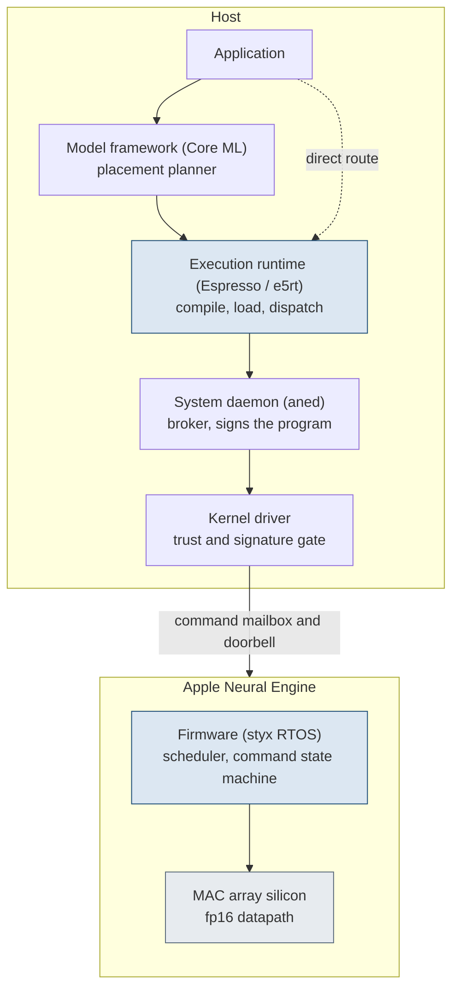

# 5. Software stack

> Four user-space layers separate an application from the engine, and the execution runtime beneath the model framework is reachable directly with no placement planner and no entitlement for accepted operations.
> The model framework segments work across the processor, graphics processor, and engine by a shortest-path solve over a per-operation cost graph, reported through the public model-plan read-out.
> A system daemon holds the single privileged device gate, a content-hashed program cache, and one time-shared request queue that arbitrates every client.

Part I treated the engine as a machine: a fixed-function matrix accelerator with an fp16 datapath, driven as an autonomous coprocessor through a command mailbox.
Part II treats it as a target a developer can address.
Between an application and the silicon are several layers of system software, each with a defined job.
This chapter maps those layers and marks the one this Part enters.

## Layered stack

Four user-space layers separate an application from the engine, with a system daemon and a kernel driver below them out of the dispatch band.
[Figure](#fig:c5-stack) shows the full stack from the application down to the silicon, with the two routes that reach the runtime.



The top layer is the model framework.
It accepts a trained network, decides which operations the engine can accept, and segments the work across the central processor, graphics processor, and engine under a cost-driven placement planner.
A caller at this layer does not choose the device and is not told which device ran the work.
Chapter 1 describes this public surface.

Beneath it is the execution runtime, the layer every path passes through.
It owns compilation: it turns a network in the intermediate representation into the engine's program format, writes the result to a content-addressed cache on disk, and produces a loadable program.
It owns the program library and the callable functions inside it.
It owns the execution stream, the queue against which a compiled program is encoded and dispatched, and the descriptors that bind operands to a program's named ports.
The same runtime hosts the central-processor and graphics-processor executors as alternative backends, so a single stream can hold operations placed on different devices.
The engine is one backend among those three.

Beneath the runtime, on the path to the engine, is the client layer.
It splits into two duties.
The client layer hands program lifecycle, meaning compile, load, instantiate, cache, and purge, to the system daemon over an interprocess channel.
Per-inference dispatch goes directly to the kernel driver once a program instance exists.
The daemon holds the privileged device handle and the on-disk program cache; the client process holds the connection it uses for the hot path.

The lowest user-space layer is a thin shim over the kernel driver.
Its calls translate into driver method invocations on the engine's user client.
Below that is the kernel driver itself, then the firmware and the silicon.

[Table](#tbl:c5-layers) lists the four user-space layers and their reachability from ordinary user space, with the daemon and kernel driver below them out of the dispatch band.

| Layer | Role | Reachable directly |
| --- | --- | --- |
| Model framework | Cost-driven placement planner; segments work across processor, graphics, and engine | No: device is a scheduling outcome, not a choice |
| Espresso runtime | Network loading and operator graph beneath the framework | Yes, but the framework drives it |
| Execution runtime | Owns compile, program library, execution stream, and operand descriptors | Yes: names the engine as target, no entitlement for accepted ops |
| Client / user-client layer | Splits program lifecycle to the daemon from per-inference dispatch to the driver | Yes, for the hot dispatch path |
| System daemon (out of band) | Holds the privileged device gate and the content-hashed program cache; arbitrates clients | No: reached through its interprocess channel |
| Kernel-driver shim (out of band) | Thin user-space translation into driver method invocations on the engine's user client | Yes, as the lowest user-space call |

Table: Layers of the engine software stack, each layer's role, and whether a caller can reach it directly. {#tbl:c5-layers}

Each layer has a distinct symbol family in the binaries, and the family name identifies the layer a call is on.
The execution runtime exports a flat C facade over a C++ core in the `E5RT::` namespace, with every entry point prefixed `e5rt_`.
The client layer is Objective-C, every class prefixed `_ANE`.
The daemon communicates over a private interprocess protocol whose selectors hold the arguments verbatim.
The shim into the kernel driver is the `ANEServices` C and C++ entry points, which lower to the IOKit `IOConnectCall*` calls on the engine's user client.
[Table](#tbl:c5-symbols) gives the entry-point symbol family that marks each layer, from the execution runtime down to the kernel-driver shim.

| Layer | Symbol family (entry points) |
| --- | --- |
| Execution runtime (`Espresso.framework`) | `e5rt_e5_compiler_compile` (compile MIL to `.e5`), `e5rt_program_library_retain_program_function`, `e5rt_program_function_load_for_execution`, `e5rt_execution_stream_execute_sync` / `_submit_async`; C++ core `E5RT::E5Compiler`, `E5RT::ExecutionStream` |
| Client layer (`AppleNeuralEngine`) | `_ANEClient`, `_ANEModel` / `_ANEInMemoryModel`, `_ANERequest`, `_ANEIOSurfaceObject`, `evaluateWithQoS:options:request:error:` |
| System daemon (`aned`, NSXPC `com.apple.aned`) | `createProgramInstanceForModel:modelToken:...:statsMask:memoryPoolID:enableLateLatch:...:error:` |
| Kernel-driver shim (`ANEServices.framework`) | `_ANEServicesProgramCreate`, `ANE::ANEServicesDevice::ANE_ProgramSendRequest(...)` to `IOConnectCallAsyncMethod(selector=2)` on `H11ANE` |

Table: The entry-point symbol family that marks each layer of the engine software stack, from the execution runtime down to the kernel-driver shim. {#tbl:c5-symbols}

## Runtime is reachable below the framework

The same execution runtime that the system's own dispatchers use is callable from ordinary user space, below the model framework.
A caller can compile a network to the engine's program format, open the resulting program library, load a function for execution, bind operand buffers to its ports, encode the operation onto a stream, and submit it.
No placement planner is in this path, and the operations the compiler accepts require no special entitlement.
The caller names the engine as the target rather than receiving it as a scheduling outcome.

### Runtime surface and its tunable dictionary

The execution runtime is a flat C facade over a refcounted C++ core in the `E5RT::` namespace.
The binary exports 292 `e5rt_` entry points, organized into five object families: a compiler and its configuration, program library and the functions inside it, precompiled compute operation, execution stream with its buffer and port objects, and asynchronous event for fences.
Each family pairs a `_create` constructor with a `_release` destructor, and each has a create-options object whose typed get/set accessors are the runtime's tunable dictionary.

The dictionary spans four objects.
The compile-time options object (`e5rt_e5_compiler_options_`) exposes 21 keys: the backend bitmask (`compute_device_types_mask`, where `0x4` names the engine), the cache controls `force_recompilation` and `force_fetch_from_cache`, the `segmenter` selection, and a set of backend-preference and experimental toggles.
A separate compiler-configuration object (`e5rt_e5_compiler_config_options_`) holds the 2 cache keys: `cache_bundle_location`, the directory the daemon writes the compiled bundle into, and `bundle_cache_apfs_purgeable`, which marks that bundle reclaimable under storage pressure.
The per-operation options object (`e5rt_precompiled_compute_op_create_options_`) holds 14 keys, including `operation_name`, `allocate_intermediate_buffers`, the resident-weight path `mutable_mil_weight_paths`, and a cross-process IOSurface pool binding.
The execution-stream configuration object holds 3 keys: `enable_concurrent_sync_execution`, `enable_low_latency_async_events`, and `skip_io_fences`.
A neutral all-engine compile sets only a small subset of these: the engine bitmask, `force_recompilation`, and the `"graph"` segmenter, leaving every other key at its runtime default.

The on-disk program cache the daemon writes is keyed by content, not by source filename.
The runtime assembles a `cacheURLIdentifier` from a per-segment key computed over each segment's network structure and weight blob containers, combined with the resolved source URL, options dictionary, and platform.
Two compiles of structurally identical graphs with identical weights and options resolve to the same identifier and hit the cache, while changing any weight, shape, operation, the device mask, or the segmenter changes the key.
The `force_recompilation` key bypasses the cache fetch and rewrites the bundle unconditionally, which is the documented inverse of `force_fetch_from_cache`.

### Dispatch selector that splits the path

The split between the daemon and the client described above resolves to specific kernel-driver selectors, measured by read-only tracing of `IOConnectCall*Method` on this M1.
Per-inference submit is `IOConnectCallAsyncMethod` selector 2, the `ANE_ProgramSendRequest` handler in the H11ANE dispatch table, and the unentitled client issues it directly: a freshly compiled program issued selector 2 exactly once per execute, observed in the client process and never in the daemon.
The daemon issues only the lifecycle selectors over its own connection during the same compile and prepare, the synchronous selectors 3 through 6 for program destroy, status, instance create with unprepare, and program create.
The division of labor is thus precise: the daemon compiles the network and creates, prepares, and destroys the program object over IOKit, while the client submits each inference over selector 2 itself.
A warm re-execute on an already-submitted program issued no additional `IOConnectCall` from the client, since the runtime reuses the armed async submit ring and signals the engine without a fresh external method per call.
This is consistent with the warm-eval cost being firmware round-trip bound rather than dispatch-call bound.

## Placement segmenter above the runtime

The model framework adds one stage the direct route does not have: it decides, per operation, which of the three backends runs it.
When the framework places a model, it segments the operation graph across the central processor, graphics processor, and engine by solving a shortest path (Dijkstra) over a cost graph with one node per operation-and-backend pair.
The per-operation cost on each backend comes from a set of learned regression decision trees, several hundred of them, keyed by operation and by backend.
Two coarse compute and bandwidth anchors order the backends, and the trees supply the calibrated per-operation cost the solver minimizes.
A fixed launch penalty per segment and a transfer penalty at every backend boundary bias the solution toward fewer and larger engine segments, for the reason given with the cost equation below.
An operation the engine cannot accept has no engine node in the cost graph, so the minimum-cost path routes around the engine through the central or graphics processor.
This mechanism drives the framework's automatic fallback, and the direct route skips it by authoring a single all-engine graph.

A developer can read this placement decision without running inference, through the supported public model-plan API.
`MLComputePlan.load` parses a compiled model and reports the segmenter's choice per operation.
`deviceUsage(for:)` returns the set of devices that could run an operation and the one device the planner preferred, with a `Reason` describing why an operation is or is not supported on a device.
`estimatedCost(of:)` returns the per-operation cost weight the segmenter compared.
These are documented at developer.apple.com/documentation/coreml [AppleCoreML].

The segmenter is a named pipeline inside the ahead-of-time compiler.
The compiler canonicalizes the intermediate program for the platform, expands the requested compute-unit mask into a set of backend identifiers, then runs one of three segmenters over the graph.
[Table](#tbl:c5-segmenter) names the segmenter's stages inside the ahead-of-time compiler, from eligibility through validity and cost to segmentation.

| Stage | Component | Role |
| --- | --- | --- |
| Eligibility | `ComputeUnitsToBackends` | expands the compute-unit mask into concrete backend identifiers |
| Validity | `AneValidator`, `BnnsValidator`, `MpsGraphValidator` | per-backend per-operation legality, one validator per backend |
| Cost | `EstimatorMILDecisionTree`, `ConstCostEstimator` | the per-operation cost the solver minimizes |
| Segmentation | `SegmenterCoarse`, `SegmenterGraph`, `SegmenterShortestPath` | greedy, graph-grouped, or shortest-path placement |

Table: The named stages of the placement segmenter inside the ahead-of-time compiler. {#tbl:c5-segmenter}

The cost the shortest-path segmenter minimizes is the larger of compute and bandwidth time plus penalties.
The per-operation compute cost is the larger of the compute time and the bandwidth time, drawn from the engine compute rate and bandwidth primitives `GetEngineGflopsPerS` and `GetEngineBwGbPerS`.
The placement adds a fixed launch cost per segment and a transfer cost at each backend boundary.

$$\mathrm{cost} = \max\!\left(\frac{\mathrm{flops}}{\mathrm{gflops}},\ \frac{\mathrm{bytes}}{\mathrm{bw}}\right) + \mathrm{launch} + \mathrm{transfer}$$

The transfer cost is why the minimum-cost solution favors long single-backend runs: each boundary charges a tensor repack between the engine channel-interleaved fp16 layout and the host layout, so one engine segment is cheaper than several.
The placement audit trail is itself a queryable compile output: the program library exposes a post-compile analytics dictionary, keyed by `selected_backend`, `backend_support`, `estimated_runtime`, `op_type`, `op_path`, and `validation_messages`, so the chosen backend and predicted runtime for each operation are readable without running inference.

## Broker

A system daemon mediates access to the engine.
Only that daemon and its per-user sibling hold the kernel gate that opens the device, so every other process reaches the engine through it.
A client proves itself to the daemon over the interprocess channel, and the daemon performs the privileged device open on the client's behalf, returning a program handle the client then drives.

The daemon arbitrates across clients.
There is one physical engine, so concurrent demand resolves by time-division on a single request queue rather than by partitioning the hardware.
The daemon owns the shared program cache, keyed by a content hash of each compiled network, so a network already compiled by one client is a cache hit for the next.
It holds a quality-of-service value on every request and adjusts a client's requested queue depth under contention, which keeps one client from depriving another of service.
A request from a developer-signed program and a request from a system dispatcher arrive at the same broker, and the same queue arbitrates both.

The daemon is the one process holding the kernel gate, and its interprocess surface is the program-lifecycle protocol every client drives.
The program-instance method holds the per-instance parameters verbatim in its selector, as [listing](#lst:c5-instance-selectors) shows, with the residency, power, and statistics arguments named.

```objectivec
# the daemon's central program-instance method (recovered selector, NSXPC _ANEDaemonProtocol)
createProgramInstanceForModel:modelToken:modelFilePath:qos:isPreCompiled:
  enablePowerSaving:skipPreparePhase:statsMask:memoryPoolID:enableLateLatch:
  modelIdentityStr:owningPid:cacheUrlIdentifier:aotCacheUrlIdentifier:
  optOutOfModelMemoryUnwiring:error:

# the weights-streaming variant: one resident base, a thin adapter per call
createProgramInstanceWithWeights:modelToken:qos:baseModelIdentifier:
  owningPid:numWeightFiles:error:
```

Listing: The daemon's program-instantiation selectors, with the per-instance residency, power, and statistics parameters held as named arguments. {#lst:c5-instance-selectors}

The on-the-wire instance is a C struct the daemon returns to the client, two opaque pointers, two 512-byte name buffers, the input and output port tables, a procedure record, and counters, whose recovered type encoding [listing](#lst:c5-instance-struct) gives.

```objectivec
# ANEProgramInstanceStruct (recovered NSXPC type encoding)
^{ANEProgramInstanceStruct=^v^vQQC^[512c]^Q^{ANEProgramIOInfoStruct}
  ^{ANEProgramIOInfoStruct}C^[512c]^QC^{ANEProgramProcedureStruct}QIQQcQQiC}
```

Listing: The program-instance struct the daemon returns over the interprocess channel. {#lst:c5-instance-struct}

## Access-control model

The device has one user-space entry point.
The kernel driver denies opening the user client without the entitlement `com.apple.ane.iokit-user-access`, and exactly two binaries on the system hold it: the daemon and its per-user sibling.
Every other process proves itself to the daemon over the interprocess channel instead, gated by a `com.apple.aned.private.*` entitlement family that the daemon checks per connection and per method.
[Table](#tbl:c5-entitlements) gives that entitlement family, what each member authorizes, and the count of system binaries holding it in this build.

| Entitlement | What it authorizes | Holders |
| --- | --- | ---: |
| `com.apple.ane.iokit-user-access` | the hard kernel gate: privileged device open, compile, cache | 2 |
| `com.apple.aned.private.allow` | baseline: compile, load, and instantiate models through the daemon | 18 |
| `com.apple.aned.private.ANEAccess.allow` | the inference-client access grant | 14 |
| `com.apple.aned.private.adapterWeight.allow` | stream adapter weights onto a shared resident base model | 5 |
| `com.apple.aned.private.processModelShare.allow` | share one resident model across processes | 4 |
| `com.apple.aned.private.secondaryANECompilerServiceAccess.allow` | use the longer-duration secondary compiler service | 1 |

Table: The entitlement family that gates the engine, with the count of system binaries holding each in this build. {#tbl:c5-entitlements}

A privileged subset of 27 binaries also holds a sandbox exception for the class `H11ANEInDirectPathClient`, which lets a latency-sensitive client open the low-latency user client and drive per-inference submission on its own connection rather than round-tripping each inference through the daemon.
The exception grants no device access by itself: the daemon still performs the privileged open and returns the program handle.
A developer-signed binary cannot assert the kernel gate, since it names a restricted user-client class that ad-hoc and development signing cannot claim.
The direct route thus reaches the engine the same way a sanctioned application does, through the daemon.
It authors its work at the model and program layer rather than at the kernel interface.

## Compiler is its own gated service

Compilation does not happen in the calling process.
The service that turns a network into the engine's program format is a separate sandboxed interprocess service, `com.apple.ANECompilerService`, reached through an `NSXPCConnection` named for it.
That service vends a single entry point, the method `compileModelAt:csIdentity:sandboxExtension:options:tempDirectory:...:withReply:`, and admits a connection only through an entitlement gate.
The service's `listener:shouldAcceptNewConnection:` delegate calls `valueForEntitlement:` on the connection against the string returned by `+compilerServiceAccessEntitlement`, then logs whether the client holds the entitlement or is missing it.

This is the concrete reason the service compiles a hand-authored or self-compiled program rather than the calling process compiling it.
The service holds two entitlements an ordinary process does not: it writes the system-protected compile cache under `rootless.storage.ane_model_cache`, and it decrypts under `coreml.decypt_allowed`.
A caller thus hands its network to the service and receives the compiled bundle back, the same separation the daemon imposes on device access.

The service keeps a warm-start cache so a repeat compile of the same network is not re-paid.
The cache is a nested directory tree of the form `cache/com.apple.e5rt.e5bundlecache/<os-build>/<hash>/`, keyed by the model hash `model.anehash`, which is a double SHA-256 over the program.
A repeat compile of the same program reuses the cached bundle.
The `force_recompilation` option defeats the warm start and compiles from scratch.

## Entering the runtime below the framework

A caller that names the engine as the target enters at the execution-runtime layer rather than the model framework, so no placement planner is in the path.
The runtime compiles a graph to the engine program format, loads it, and dispatches it, and the same call works whether or not a chip is in hand for the cost estimate.

The neutral workflow builds a graph, compiles it to a chip target, and dispatches, with no segmenter between the graph and the engine.

```c
/* Enter at the execution-runtime layer: compiler -> library -> function -> stream. */
e5rt_e5_compiler_create_with_config(&compiler, config);            /* the runtime object */
e5rt_e5_compiler_compile(compiler, model_path, options, &library); /* to the engine format */

/* The program library vends the callable function, below any model framework. */
e5rt_program_library_retain_program_function(library, fn_name, &function);
e5rt_precompiled_compute_op_create_options_create_with_program_function(&op_opts, function);
e5rt_execution_stream_operation_create_precompiled_compute_operation_with_options(&op, op_opts);

/* The execution stream is the runtime's dispatch queue, with no segmenter above it. */
e5rt_execution_stream_operation_retain_input_port(op, "x", &in_port);
e5rt_io_port_bind_buffer_object(in_port, in_buf);
e5rt_execution_stream_create(&stream);
e5rt_execution_stream_encode_operation(stream, op);
e5rt_execution_stream_execute_sync(stream);
```

The framework layer is one client of this same runtime, and an application that names the engine is another.
