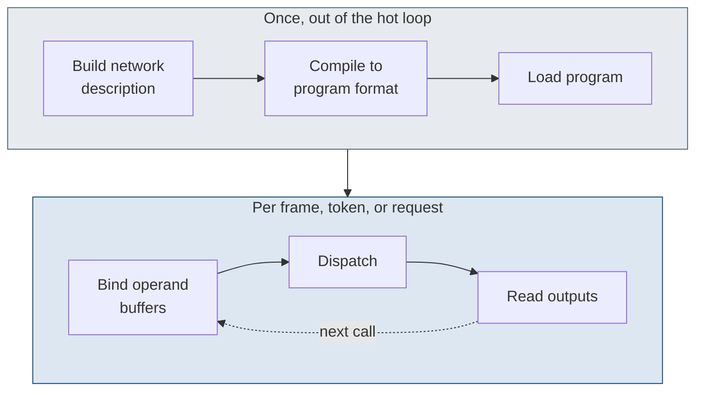

# 6. Dispatching without Core ML

> The engine is reachable in five steps from ordinary user space: build a graph, compile it to the program format, load it, bind operand buffers, and dispatch.
> No placement planner is in the path, and the operations the compiler accepts require no entitlement.
> A single submission can drive several on-engine steps without a host round-trip per step, at the same rate as the steps issued one host call at a time, so the unentitled path is performance-complete for dispatch.

## Five steps

Build a network description first.
This is the layer-and-wiring graph for the work: the operations, their parameters, the weight blobs, and the input and output ports.
The runtime accepts the description directly, so the graph does not have to come from a trained model file or pass through a converter.

Compile that description to the engine's program format.
The runtime drives the compiler, which lowers the graph, lays the weights out for the streaming datapath, validates every operation against the native-layer catalog, and writes a loadable program to a content-addressed cache on disk.
This is the costly phase, and it runs once per network.

Load the compiled program.
The runtime opens the program from the cache and instantiates the function it exposes, preparing the program for execution on the device.
A freshly compiled program pays a one-time cost on this first load to produce the loadable hardware form; a program already in the cache is a hit.

Bind operand buffers.
Each external input and output of the program is a named port.
Binding attaches a buffer to each port so the engine reads its inputs and writes its outputs in memory the caller prepared.

Dispatch last.
The caller encodes the loaded program as an operation into an execution stream and submits the stream, synchronously or asynchronously, then reads the output buffers back when the work completes.
Dispatch is the low-cost phase, and it runs in the hot loop.

The runtime that runs these steps is the engine's own C dispatch layer, the `e5rt_*` family exported from the Espresso framework.
Every entry point returns an `int64_t` error code, zero on success, and an entry point that creates an object returns it through its first out-parameter, while the compile and retain calls return through their last.
The five steps map onto the call sequence [listing](#lst:c6-direct-route) gives.

```c
/* Compile (step 2): the runtime drives the out-of-process compiler. */
e5rt_e5_compiler_create_with_config(&compiler, config);
e5rt_e5_compiler_compile(compiler, model_path, options, &library);

/* Load (step 3): retain the callable function the program exposes. */
e5rt_program_library_retain_program_function(library, fn_name, &function);
e5rt_precompiled_compute_op_create_options_create_with_program_function(&op_opts, function);
e5rt_execution_stream_operation_create_precompiled_compute_operation_with_options(&op, op_opts);

/* Bind (step 4): attach a CPU buffer object to each named I/O port. */
e5rt_buffer_object_alloc(&buf, nbytes, /*type=*/0);
e5rt_execution_stream_operation_retain_input_port(op, "x", &in_port);
e5rt_io_port_bind_buffer_object(in_port, buf);

/* Dispatch (step 5): encode the op into a stream and submit, in the hot loop. */
e5rt_execution_stream_create(&stream);
for (;;) {
    /* fill input buffer via e5rt_buffer_object_get_data_ptr(buf, &ptr) */
    e5rt_execution_stream_operation_prepare_op_for_encode(op);
    e5rt_execution_stream_encode_operation(stream, op);
    e5rt_execution_stream_execute_sync(stream);   /* or async_submit */
    /* read output buffer back via its data pointer */
    e5rt_execution_stream_reset(stream);
}
```

Listing: The direct route, from compiling a network to dispatching it on an execution stream. {#lst:c6-direct-route}

A network expressed for the compiler is a netplist, the `.espresso.net` representation the compiler accepts alongside `.mil`.
Its layers are dictionary entries the binary calls Units, keyed under a network body, with a `ProcedureList` of callable entry points naming the `InputList`, `OperationList`, and `OutputList`.
A single matmul lowers to the native `MatrixMultLayerDesc`, whose backend operation is `anec.matmul` with `transpose_lhs` and `transpose_rhs` attributes.

The netplist keys are dictionary string constants the compiler parses verbatim, recovered from the runtime binary.
They name the network body (`Networks`, `NetworkName`, `ProcedureList`, `Units`, `Weights`), the per-unit wiring (`Name`, `OperationName`, `OperationList`, `Bottom`, `Top`), the external ports (`InputList`, `OutputList`, `InputName`, `OutputName`, `InputType`, `OutputType`), and the port shape, a five-tuple plus an interleave factor and a dtype (`BatchSize`, `InputChannels`, `InputDepth`, `InputHeight`, `InputWidth`, `InputInterleave`, `OutputChannels`, `OutputInterleave`).
Chapter 22 lists each key with its role.

A Unit is one layer.
It has a `Type` tag, a `Bottom` wiring list naming its input symbols, the per-bottom and output dtypes, and a `Params` sub-dictionary of typed attributes.
The directed-graph wiring is by symbol name, a Unit's `Bottom` referencing another Unit's `Name` or an external `InputName`.
The execution order is the network body's `Units` array.
[Table](#tbl:c6-call-families) maps the execution-runtime call families onto the compile, load, bind, and dispatch phases of the direct route.

| Family | Phase | Representative entry points |
| --- | --- | --- |
| `e5rt_e5_compiler_*` | compile | `create_with_config`, `compile`, `is_new_compile_required` |
| `e5rt_program_library_*`, `e5rt_program_function_*` | load | `create`, `retain_program_function`, `load_for_execution` |
| `e5rt_precompiled_compute_op_*` | load | `create_options_create_with_program_function` |
| `e5rt_buffer_object_*`, `e5rt_io_port_*` | bind | `alloc`, `get_data_ptr`, `bind_buffer_object` |
| `e5rt_execution_stream_*` | dispatch | `encode_operation`, `execute_sync`, `submit_async`, `reset` |

Table: The execution-runtime call families, mapped onto the compile, load, bind, and dispatch phases of the direct route. {#tbl:c6-call-families}

One network is compiled and loaded a single time, and the same program is dispatched against fresh operands on every call.
[Figure](#fig:c6-once-loop) shows the split between the one-time setup and the per-call hot loop.



## Compiler and runtime options

Compiler and runtime options are not a fixed-layout struct.
They are a string-keyed dictionary of `std::any` values, which is why setting an option changes no fixed byte offset in the option handle.
Each key has its value type in the name, for example `forceRecompilation<bool>`, `segmenter<std::string>`, and `computeDeviceTypesAllowed<std::vector<ComputeDeviceType>>`, and the compute-device mask value `0x4` selects the engine.

Most of the runtime is reachable but unused by an ordinary dispatch.
The runtime exposes 292 exported entry points, of which about 275 are callable and about 52 are exercised by a normal dispatch.
The largest reachable but unused capabilities are zero-copy input and output through an image surface or a graphics buffer, firmware-side data chaining, a warm-start cache, a quality-of-service control, mutable weights, and an asynchronous submission with a timeout.
These are present on the direct path and are not exercised by the standard flow.

## No planner and no entitlement

The direct route has no placement planner.
The public framework path loads a model and selects engine eligibility through a compute-unit setting, segments a model across the processors, and decides per segment where the work runs, and the caller is not told the result [AppleCoreML].
On the direct route the caller has already decided: the network is compiled for the engine and dispatched to the engine, with no segmentation step in between.

The operations the compiler accepts require no special entitlement.
The runtime, the compiler, and the dispatch path are all reachable from ordinary user space.
The set of operations is the catalog the compiler validates: an operation the compiler accepts compiles and dispatches without a privileged handle, and the compiler rejects an operation outside that set at compile time rather than the dispatch path gating it.
Reachable here means no entitlement is required, not that the path is supported: these interfaces are private, unsupported, version-fragile across operating-system updates, and not App-Store-safe.
The boundary that does require an entitlement is a separate matter, taken up in chapter 8.

## Unentitled path is performance-complete

Host dispatch is not the limiting cost on the direct path.
A single submission can drive several on-engine steps without a host round-trip per step.
The mechanism is the resident state from chapter 2: a buffer stays in the engine's working set across steps, so the output of one step is the input of the next in place.
The submission advances through the steps without returning to the host between them.
The host supplies the small per-step inputs and reads the held buffers back at a checkpoint, rather than copying the full state across the boundary twice per step.

The arithmetic confirms it.
A submission that drives the steps on the engine runs at the same rate as the same steps issued one host call at a time, so removing the per-step host calls does not speed the work up.
The unentitled direct path is performance-complete for dispatch: it reaches the same throughput as any path with more privilege.

The stream offers one synchronous and two asynchronous submission forms.
The synchronous form blocks the caller until the encoded stream completes.
The lightweight asynchronous form returns a submit and a complete identifier, and the full asynchronous form delivers an error object and accepts a timeout, the timeout existing because an asynchronous completion can hang.
Single-stream pipelining is sound: keep several operations in flight, each with its own completion event, and drain by waiting on the events.
Overlapping two or more streams at once is the unsound path, where the completion event of the second and later streams never notifies and the waiter blocks; the low-latency-async-event stream option and the timeout argument are the controls that break that wait.
The caller holds resident state across steps by binding a buffer object once and reusing it: the output port of one step is the input port of the next in the same buffer.
The caller re-encodes the prepared operation against fresh small inputs without rebinding the held buffer.

## Compiling once, dispatching many

The five real steps collapse to two phases against the neutral API: compile and load once out of the hot loop, then bind and dispatch against fresh operands on every call.
The caller reuses the compiled program across calls, so the costly compile phase runs a single time.

Build and compile are above the loop; bind and dispatch are inside it.

```c
/* Once, above the loop: compile to a program library, then retain the callable function. */
e5rt_e5_compiler_compile(compiler, model_path, options, &library);
e5rt_program_library_retain_program_function(library, fn_name, &function);
e5rt_precompiled_compute_op_create_options_create_with_program_function(&op_opts, function);
e5rt_execution_stream_operation_create_precompiled_compute_operation_with_options(&op, op_opts);
e5rt_execution_stream_create(&stream);      /* ports bound once via e5rt_io_port_bind_buffer_object */

for (;;) {                                  /* the hot loop: dispatch the same op per call */
    e5rt_execution_stream_operation_prepare_op_for_encode(op);
    e5rt_execution_stream_encode_operation(stream, op);
    e5rt_execution_stream_execute_sync(stream);
    e5rt_execution_stream_reset(stream);    /* read outputs back, then reset for the next call */
}
```
