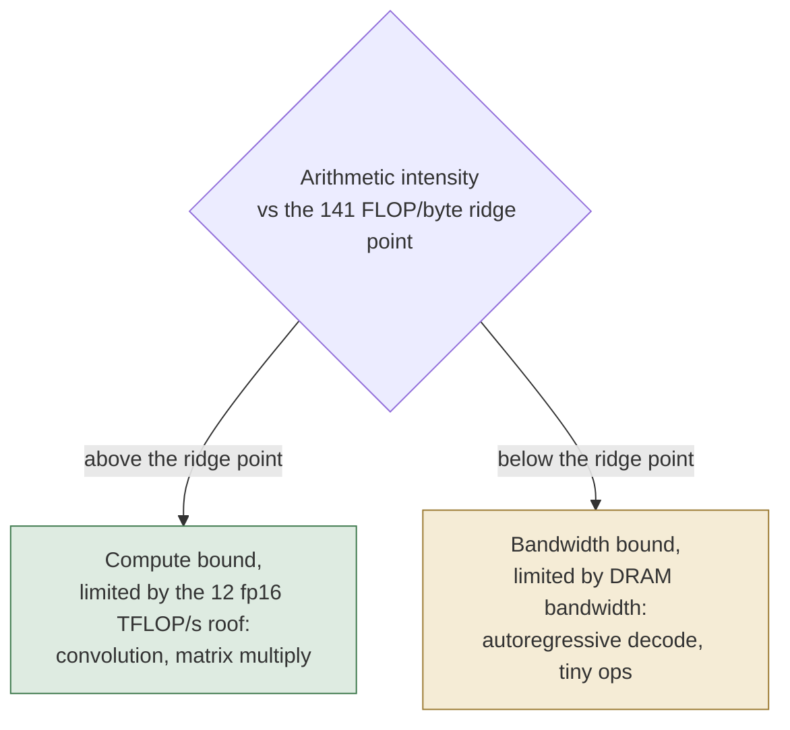

# 9. Roofline

> A layer is compute-bound only above 141 FLOP per byte; below it the engine runs on the memory slope.
> Keep every operation's working set under 2 MB or it streams its full activation from DRAM.
> Every dispatch pays a 0.23 ms floor, so batch or fuse until the compute clears it.

The Apple Neural Engine is a roofline machine [Williams2009].
Two ceilings bound its performance on any layer: the multiply array sets a peak compute rate, and how fast operands stream from DRAM sets a peak bandwidth.
A layer runs at whichever ceiling its arithmetic intensity reaches first.
The constants below are the M1 instance, the measured silicon.
The roofline has the same form on every chip in the family; only its constants change, scaling with core count and clock, which chapter 12 covers and the M5 confirms.

## Roofline ceilings and ridge point

The compute ceiling depends on how it is measured, and two figures bracket it.
The overhead-isolated matmul slope is about 12 fp16 TFLOP/s: a fused matmul chain runs as one dispatch, so deepening it grows the compute at fixed input and output cost.
The per-layer slope cancels that fixed cost, leaving the marginal rate.
A direct absolute measurement of one large matmul is lower, about 4.8 fp16 TFLOP/s on a 4096-dimension matrix multiply whose call time is far above the dispatch floor.
That is about 87 percent of the roughly 5.5 TFLOP/s theoretical peak.
A single conv dispatch is lower still, about 1.8 TFLOP/s, because it pays the fixed cost the slope subtracts away.

The M1 fp16 peak is best read as the sequence of consistent numbers listed in [the constants table](#tbl:roofline), from the 1.8 TFLOP/s conservative headline through the 3.25 TFLOP/s effective peak to the 4.8 TFLOP/s saturating ceiling.
Apple markets the engine in int8 operations per second, the M1 at about 11 TOPS [AppleANE], and the fp16 rate is by convention about half of an int8 figure, which puts the fp16 theoretical peak near 5.5 TFLOP/s.
The 4.8 TFLOP/s figure is the rate one large matrix multiply holds after it crosses the 2 MB working-set threshold, while a fused chain whose activations stay under the threshold sustains more.
That is why chapter 10 gives a fused steady state near 8.1 TFLOP/s.
The 5.5 TFLOP/s figure is a convention derived from the marketed int8 TOPS rather than a measured hardware ceiling.

The int8 path is faster than fp16 rather than equal to it.
A measured int8 convolution runs about 1.4 times faster than the fp16 form and trends toward 2 times at scale.
The multiply array has a double-int8 mode that packs two int8 products into one multiply-accumulate, so int8 arithmetic runs at about twice the fp16 rate on the same array.
This is distinct from the compressed-weight path of chapter 7, where an int8 weight is dequantized to fp16 and then enters an ordinary fp16 multiply: there the saving is in stored bytes, here the saving is in compute cycles.
The int8 path thus cuts compute cycles as well as storage.

The bandwidth ceiling is the rate at which operands cross the DRAM boundary.
The engine sustains about 85 GB/s of DRAM bandwidth measured at the memory controller, and the roofline below holds that figure as its B.
A direct wall-clock measurement of weight streaming runs lower: a large matrix multiply with one output row reads each weight once and saturates at about 51 GB/s, roughly 60 percent of that 85 GB/s ceiling.
That figure matches the compiler's own internal bandwidth constant of 50 GB/s.
The achieved-streaming rate is noted alongside the ceiling in [the constants table](#tbl:roofline).
A small elementwise op reaches less than either.
A single relu stream saturates near 10 GB/s effective, because the per-dispatch overhead caps it well below the DRAM rate.

The attainable rate is the lower of the two ceilings at a layer's arithmetic intensity $I$, measured in FLOP per byte.

$$R(I) = \min(P,\ I\,B), \qquad P \approx 12\ \text{fp16 TFLOP/s}, \qquad B \approx 85\ \text{GB/s}$$

A layer with intensity $I$ is compute-bound when $I\,B \ge P$ and bandwidth-bound otherwise.
The ridge point is where the two ceilings cross, near 141 FLOP per byte, the compute roof over the bandwidth roof, $12 \times 10^{12}$ over $85 \times 10^9$.

$$I^{*} = \frac{P}{B} = \frac{12 \times 10^{12}}{85 \times 10^9} \approx 141\ \text{FLOP/byte}$$

A layer above 141 FLOP per byte is compute-bound and is on the 12 TFLOP/s roof; a layer below it is bandwidth-bound and is on the memory slope.
[Figure](#fig:c9-ridge) routes a kernel to its bound by comparing its arithmetic intensity against the 141 FLOP-per-byte ridge point.



Convolutions are far to the right of the ridge point: a 3x3 conv at 256 channels reaches 466 FLOP per byte, so the engine rarely touches its DRAM ceiling on conv work.

## On-chip working-set threshold

The primary design limit is not the 141 FLOP-per-byte crossing but the on-chip working set, 2 MB on the M1.
While a layer's activation fits in the 2 MB on-chip memory, its intermediate values stay on chip and do not cross DRAM.
Once the activation exceeds 2 MB, every layer streams its full activation in and out of DRAM and arithmetic intensity collapses.
The hardware counters show the threshold directly: at a batch where the activation is exactly 2 MB, a 96-layer matmul chain moved 426 MB of DRAM per dispatch, and arithmetic intensity fell to 60 FLOP per byte.
The same matmul that reached 12 TFLOP/s with a 1 MB activation dropped to about 4.8 TFLOP/s.
Crossing 2 MB moves a workload from compute-bound to bandwidth-bound on one step, so the working set is the first thing to tune.
The working-set limit scales with on-chip memory: it is near 2 MB on the M1 and 4.72 MB on the M5, and chapter 12 gives the per-generation values.

## Dispatch floor

Every dispatch pays a fixed minimum cost regardless of the work it holds.
On the M1 that floor is about 0.23 ms per evaluation.
A relu, sigmoid, average pool, and small convolution are all at 0.23 to 0.26 ms, and a 64-element linear is 0.23 ms: below the floor, neither the operation nor its size matters.
Host dispatch and operand transfer set the floor, not engine compute, so a small op spends almost all of its wall time outside the multiply array.
A live decomposition of a tiny model puts the full-call floor near 0.19 ms, of which about 98 percent is dispatch overhead and about 0.13 ms is the firmware round trip; chapter 2 breaks the budget down stage by stage.

The wall time of a dispatch adds the fixed floor $t_0$ to the time the work takes at the attainable rate $R$.

$$t \approx t_0 + \frac{\text{work}}{R}, \qquad t_0 \approx 0.23\ \text{ms}$$

When the work is small the second term vanishes and $t \approx t_0$, so small operations are dispatch-bound: a layer whose compute time is under 0.23 ms gains nothing from the engine being faster.
The same convolution runs at 63 GFLOP/s at a 16x16 spatial size, where the floor dominates, and at 1247 GFLOP/s at 256x256, where compute amortizes the floor, a 20x span from one shape change.
Batching and fusion grow the work term until it dominates the fixed $t_0$, amortizing the floor across more useful FLOP.

## Fusion economics

Fusing a chain of operations into one program removes the per-dispatch floor from every operation but the first and removes the intermediate round-trips between them.
A network run as N separate dispatches pays the 0.23 ms floor N times and copies each intermediate back to the host and forward again.
The same network fused into one program pays the floor once and keeps the intermediates resident in the engine's working set.
The slope measurement isolated that fixed per-dispatch cost at roughly 0.76 ms for a program with 1 MB of operand input and output, and fusion removes it from every dispatch it eliminates at close to no compute cost.

The amortization is measured directly, and depth and batch are the two controls.
A stack of conv-relu layers fused into one program holds its per-call latency flat near 0.19 ms from one layer to thirty-two.
A thirty-two-layer model thus pays one firmware round trip just as a one-layer model does, while the cost charged to each operation falls from about 222 microseconds at one layer to about 6.3 microseconds at thirty-two.
Batching the same program to 512 samples amortizes that one round trip across the batch, dropping the per-sample cost from about 196 microseconds to about 1.5 microseconds, a 127-fold reduction.
A deep model on a large batch thus pays a single round trip for all of it, which is why packing work into one fused program is the main way to cut latency below the compute roof.

## Cross-device roofline

The M1 ceilings above locate a layer against one engine.
Taken on three devices, the same two measurements locate a layer against the whole machine, and the difference between the three rooflines is the device map.
Each device's compute roof comes from a saturation sweep and its bandwidth roof from a streaming sweep, and the ratio of the two is the device's ridge point, the arithmetic intensity at which a layer crosses from bandwidth-bound to compute-bound.

The three ridge points are far apart, as [Table](#tbl:c9-perdevice) gives the compute roof, bandwidth roof, and ridge point of the engine, GPU, and CPU side by side.

| Device | Compute roof (GFLOP/s) | Bandwidth roof (GB/s) | Ridge (FLOP/byte) |
| --- | ---: | ---: | ---: |
| Engine | 10191 (matmul) / 18771 (conv) | 24.1 (standalone) | 424 |
| GPU | 30862 | 229.7 | 134 |
| CPU | 1898 | 130.4 | 15 |

Table: Per-device compute roof, bandwidth roof, and ridge point, M5/H17s measured; the engine bandwidth is its standalone-activation path. {#tbl:c9-perdevice}

The engine ridge near 424 FLOP per byte is about three times the GPU ridge near 134 and about twenty-nine times the CPU ridge near 15.
A layer must reach roughly three times the arithmetic intensity to be compute-bound on the engine that it would need on the GPU.
The high engine ridge is a direct consequence of the standalone bandwidth: the engine still delivers about 10 TFLOP/s of compute while a standalone elementwise stream moves only about 24 GB/s, so the crossover is far to the right.

The engine has two distinct effective bandwidths, and the gap between them sets which regime each workload runs in.
A standalone elementwise or memory-bound operation streams at roughly 24 GB/s, the activation path measured on a relu or a reduction in isolation.
A compiled matmul streams its weights faster than the standalone path, though the rate depends on the measurement.
A decode GEMV at arithmetic intensity near 1 reaches about 112 GFLOP/s, which implies a weight-direct-memory-access path near 112 GB/s.
A direct wall-clock measurement of one large single-row matrix multiply saturates lower, at the 51 GB/s established by the M1 bandwidth ceiling above.
Either way the weight path is far faster than the throttled standalone activation path.

A standalone bandwidth-bound operation, a large softmax or a large elementwise op, reaches only the 24 GB/s activation path on the engine, and the GPU reaches roughly 230 GB/s on the same stream.
Such an op is thus dispatched to the GPU, not the engine: against the engine's own bandwidth roof a standalone layer_norm reaches 18 percent and a standalone softmax 63 percent, so dispatching them one at a time leaves the engine mostly idle.

## Fusion as a control

Fusion moves the engine's operating point to the right of its ridge, and the move is measured rather than argued.
Fusing operations into one program keeps intermediate activations on chip and streams each weight once for reuse across the whole graph, raising the program's effective arithmetic intensity above that of any single operation in it.
A real three-convolution stack fused into one program reaches an effective rate of 20718 GFLOP/s.
That rate is above the single-convolution saturation peak of 18771 GFLOP/s, at 110 percent of the convolution roof.
Fusion lifts the block's effective arithmetic intensity from about 1076 for one standalone convolution to about 2854 for the fused stack, moving the operating point past the ridge into the compute-bound region.
The over-roof GEMV at 466 percent of the standalone roof is the same effect for a single compiled weight stream.
A fused convolution or attention graph runs in the compute-bound region where the engine is efficient, and the identical operations dispatched standalone do not.

## Locating a layer before it is built

Two questions locate any layer.
First, is its arithmetic intensity above 141 FLOP per byte, where it is compute-bound against the 12 TFLOP/s roof, or below, where it is bandwidth-bound against the 85 GB/s roof.
Second, does its activation fit under 2 MB, since above that it is forced onto the memory slope no matter its nominal intensity, and the working set must shrink before any other tuning helps.
The 0.23 ms dispatch floor sets a latency a small op cannot beat, so the developer batches or fuses small ops until their compute clears the floor.

The cost estimate locates a layer against the roofline statically, with no device in hand.

```python
# Locate a layer against the roofline BEFORE building it, from its shape alone,
# with no hardware in hand. Three numbers decide where it falls and which
# control moves it.

# M1 roofline constants (see the constants table below):
P            = 12e12    # compute roof, fp16 FLOP per second
B            = 85e9     # bandwidth roof, bytes per second
ridge_point  = 141      # P / B, in FLOP per byte: the compute-vs-bandwidth crossover
working_cap  = 2e6      # on-chip working set, in bytes: above this it streams from DRAM
t0           = 0.00023  # per-dispatch floor, in seconds (~0.23 ms), paid no matter the work

# Count the layer's work and the bytes it must move, from its shape.
function arithmetic_intensity(layer):
    return total_flops(layer) / dram_bytes(layer)        # FLOP per byte

# Classify the layer and name the control it needs.
function place_layer(layer):
    intensity    = arithmetic_intensity(layer)
    working_set  = activation_bytes(layer)               # live intermediate size
    work_seconds = total_flops(layer) / attainable_rate(intensity)
    latency      = t0 + work_seconds                     # t ~= t0 + work / R(I)

    # The working-set threshold dominates: above it, intensity collapses regardless.
    if working_set > working_cap:
        return ("bandwidth", "shrink the working set: reshape or split below 2 MB")

    # Below the dispatch floor the op size does not matter at all.
    if work_seconds < t0:
        return ("dispatch", "batch or fuse until the compute clears the 0.23 ms floor")

    # Otherwise the ridge point decides which roof binds.
    if intensity >= ridge_point:
        return ("compute", "near the 12 TFLOP/s roof: no tuning needed")
    else:
        return ("bandwidth", "compress the weights or fuse to raise the intensity")

# attainable_rate is the lower of the two roofs at this intensity.
function attainable_rate(intensity):
    return min(P, intensity * B)                         # R(I) = min(P, I*B)

# Worked placement of a 3x3 convolution, 256 channels:
(bound, lever) = place_layer(conv_3x3_256ch)
# intensity ~= 466 FLOP/byte  -> well right of the 141 ridge point
# working_set < 2 MB          -> not on the memory slope
# bound == "compute", lever  == "no tuning needed"

# A layer that comes back "bandwidth" or with a working set above 2 MB is
# reshaped, batched, or fused before any other tuning, because no clock-rate
# advantage helps a layer pinned to the memory slope.
```

## Reference: the M1 roofline constants

| Constant | Symbol | M1/H13 value |
| --- | --- | ---: |
| Compute roof, overhead-isolated matmul slope | $P$ | 12 fp16 TFLOP/s |
| Compute roof, saturating large matmul | | 4.8 fp16 TFLOP/s |
| Effective peak the analytic model is fit to | | 3.25 fp16 TFLOP/s |
| Convolution end-to-end ceiling | | 1.8 TFLOP/s |
| int8 over fp16 compute rate | | 1.4 to 2 times |
| Bandwidth roof, DRAM ceiling | $B$ | 85 GB/s |
| Bandwidth roof, saturating weight-stream wall clock | | 51 GB/s |
| Standalone activation-stream rate | | 24 GB/s |
| Single-relu effective stream | | 10 GB/s |
| Roofline ridge point | $I^{*}$ | 141 FLOP/byte |
| On-chip working-set threshold | | 2 MB |
| Per-dispatch floor, slope method | $t_0$ | 0.23 ms |
| Per-dispatch floor, measured tiny model | | 0.19 ms |
| Fused per-dispatch cost, 1 MB operands | | 0.76 ms |

Table: The M1 roofline constants, with the symbol each has in this chapter. {#tbl:roofline}
