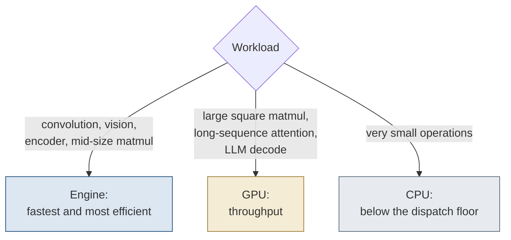

# 11. ANE, GPU, and CPU

> The engine is faster and more efficient on convolution, vision, short-sequence attention, and mid-size matrix multiply, running a sixteen-deep convolution stack about 4.2 times faster than the GPU at about 13 times the energy efficiency on the M5.
> The GPU is about 2.8 times faster on large square matrix multiply, long-sequence attention, and bandwidth-bound decode.
> The CPU is fastest on the trivial operations that fall below the 0.23 ms dispatch floor.
> Serving moves the line: the GPU overtakes the engine on a batched encoder block near a batch of 23 and on self-attention near a batch of 6.

A workload on an Apple system on chip has no single fastest processor.
It has three candidates, and the right one depends on the form of the work.
This chapter maps which of the engine, GPU, and CPU leads on which class of work, on raw speed and on energy per result, from a single harness across sixteen workload classes on the same silicon.
The map is two-dimensional: a processor can lead on latency, on energy, on both, or on neither.

## Form of the map

The engine is the efficiency processor for convolution and vision, and a low-latency processor for encoders at low to moderate batch.
The GPU is the throughput processor for large square matrix multiply and for the bandwidth-bound work of autoregressive decode.
The CPU collects the work too small for either, where dispatching to an accelerator costs more than the arithmetic.

## Where the engine leads

The engine is faster and more efficient on convolution, convolution stacks, stencil-like fixed-iteration numerics, short-sequence attention, and mid-size matrix multiply.
The convolution stack leads the set: a sixteen-deep stack of 3x3 convolutions at 256 channels runs about 4.2 times faster than the GPU and at about 13 times its energy efficiency on the M5 generation.
On the M1 generation it runs about 2 times faster and at 14.5 times the GPU's efficiency, the widest power gap in the set.
A five-point stencil iterated thirty-two times as one fused graph runs about 10 times faster and at about 49 times the GPU's efficiency on the M5, because the fixed-iteration graph amortizes the per-dispatch floor across every step.
Short-sequence attention, a transformer block at sequence length 197, is fastest, most efficient, and most accurate in fp16 on the engine.

The real models track the primitives: a ResNet-18 forward runs about 6.1 times faster than the GPU reference and at about 11 times the energy efficiency per inference, and a twelve-layer encoder forward about 1.5 times faster and at about 18 times the energy efficiency per inference.
A single-sentence encoder runs about 4.4 times faster.
The energy advantage is wider than the speed advantage and persists where the speed advantage does not.
On the M1 the engine draws 4.4 W on a large compute-bound matrix multiply where the GPU draws 32.5 W, a 4.0 times efficiency edge even where the GPU is about 2 times faster.

## Where the GPU leads

The GPU leads on raw speed on large square matrix multiply, long-sequence attention, and bandwidth-bound autoregressive decode.
A 256 by 4096 by 4096 matrix multiply runs about 2.8 times faster on the GPU than on the engine, and the gap grows to 3.0 times at saturation, about 30.9 fp16 TFLOP/s against the engine's 10.2 TFLOP/s peak.
The engine's single fused matrix multiply stalls on weight streaming once a square operand passes its on-chip working set near N of 2048.
Long-sequence attention shifts to the GPU as the sequence grows: at sequence length 512 the GPU is about 2.1 times faster, though the engine keeps a 1.8 times energy edge.

On very large reductions the GPU also leads on fp16 accuracy.
On the large square matrix multiply the GPU holds an fp16 relative error of $3.6 \times 10^{-4}$ flat across size, while the engine's error grows with the contraction dimension, from $1.2 \times 10^{-2}$ at N of 2048 to $6.2 \times 10^{-2}$ at N of 8192.
That workload is thus disfavored on the engine on both axes.

## Where the CPU leads

The CPU is the better choice for the trivial cases, where call overhead decides the result.
On the floor matrix multiply, 64 by 256 by 256, the CPU completes in about 0.026 ms, below the per-dispatch floor of either accelerator.
The engine pays a fixed per-eval overhead of about 0.23 ms on the M1, so any single small operation is overhead-bound and cheaper on the CPU.
On any larger class the CPU is not competitive, reaching about 1.9 fp32 TFLOP/s on a saturated matrix multiply.

## M1 per-class measurement

The verdicts above are taken from one harness across sixteen workload classes, and the M1 rows make the per-class split concrete.
The engine leads on energy on every class but the dispatch-bound floor, and it is fastest on the convolution-heavy and mid-bandwidth classes, as [Table](#tbl:c11-m1class) gives the per-class engine and GPU speed and efficiency on idle-subtracted package power.

| Workload | Engine GFLOP/s | Engine GFLOP/s/W | GPU GFLOP/s | GPU GFLOP/s/W | Engine efficiency advantage |
| --- | ---: | ---: | ---: | ---: | ---: |
| GEMM floor (K=256) | 51 | 17 | 46 | 27 | 0.6x |
| GEMM bandwidth (K=1024) | 662 | 470 | 1109 | 207 | 2.3x |
| GEMM compute (K=4096) | 3588 | 775 | 7286 | 192 | 4.0x |
| Conv single (C=64) | 99 | 23 | 89 | 18 | 1.3x |
| Conv resnet (d=16) | 9602 | 2063 | 4671 | 142 | 14.5x |
| Attention ViT (S=197) | 1711 | 370 | 1831 | 187 | 2.0x |
| Attention long sequence (S=512) | 1775 | 544 | 3768 | 217 | 2.5x |

Table: The M1 per-class speed and efficiency comparison, engine versus GPU, idle-subtracted package power. {#tbl:c11-m1class}

fp16 accuracy tracks the same boundary the M5 shows: the engine matches or beats GPU fp16 where the arithmetic is well-conditioned and degrades on the large-K reduction, reaching $2.7 \times 10^{-2}$ relative error at K of 4096.

## Dispatch floor and conv throughput

A single small operation is overhead-bound on the engine: it costs about 0.23 milliseconds regardless of the operation or its size.
A relu, sigmoid, average pool, and small convolution are all between 0.24 and 0.26 milliseconds, with a 64-element linear at 0.23 milliseconds.
That floor is host dispatch and operand transfer, not engine compute, so it sets a latency a small operation cannot beat.

A convolution amortizes the floor as its spatial size grows, and [Table](#tbl:c11-convramp) traces the throughput climbing roughly twenty-fold from the floor to the saturated shape.

| Spatial size | Latency | GFLOP/s |
| --- | ---: | ---: |
| 16x16 | 0.231 ms | 63 |
| 32x32 | 0.248 ms | 267 |
| 64x64 | 0.395 ms | 718 |
| 128x128 | 1.062 ms | 1102 |
| 256x256 | 3.814 ms | 1247 |

Table: A 3x3 convolution at 64 channels on the M1, throughput climbing as spatial size amortizes the dispatch floor. {#tbl:c11-convramp}

Raising channels rather than spatial size reaches the higher M1 end-to-end conv peak, about 2212 GFLOP/s at 256 channels.
A matrix multiply with a single output row stays overhead-bound regardless of inner size, reaching only about 5.9 GFLOP/s at an inner dimension of 1024, which is why a decode-shaped projection does not supply the array.

## Batch threshold for serving

The single-stream map is the device choice for one request, but serving batches requests, and the choice moves with batch size.
On a true-batched encoder block the GPU overtakes the engine on throughput near a batch of 23, and on a self-attention block near a batch of 6, as the GPU scales with batch while the engine saturates near a batch of 1.
The energy crossover is at a larger batch than the throughput crossover, and on three of four serving workloads it never appears.
Vision convolution serving never crosses on either axis, leading throughput by 3.6 to 5.7 times and energy by 6 to 10 times at every batch from 1 to 256.
Only bare large-batch matrix multiply converges, to an energy tie by a batch of 16.

[Table](#tbl:c11-serving) collects the per-workload serving crossovers.

| Serving workload | Throughput crossover to GPU | Energy crossover to GPU |
| --- | --- | --- |
| Encoder block, true-batched | near batch 23 | none from batch 1 to 256 |
| Self-attention block | near batch 6 | none from batch 1 to 256 |
| Vision convolution | none; engine leads 3.6 to 5.7x | none; engine leads 6 to 10x |
| Large-batch matrix multiply | GPU regime throughout | energy tie near batch 16 |

Table: The batch at which the GPU overtakes the engine for each serving workload, on throughput and on energy. {#tbl:c11-serving}

## Verdict table

[Figure](#fig:c11-verdict) is the decision tree that maps a workload to the engine, GPU, or CPU.



The per-class verdicts collapse into one table.
[Table](#tbl:c11-verdict) names for each workload class the processor that is fastest, the processor that is most efficient on energy per result, and the headline figure from the sections above.

| Workload | Fastest | Most efficient | Standout number |
| --- | --- | --- | --- |
| Convolution and vision | Engine | Engine | Convolution stack about 4.2 times faster and about 13 times the GPU efficiency on M5; about 2 times faster and 14.5 times on M1 |
| Encoder and embedding serving, low to moderate batch | Engine | Engine | Single-sentence encoder about 4.4 times faster; throughput crossover to GPU near a batch of 23 |
| Mid-size matrix multiply | Engine | Engine | Engine is faster and more efficient below the square-operand working set near N of 2048 |
| Short-sequence attention | Engine | Engine | Transformer block at sequence length 197 is fastest, most efficient, and most accurate in fp16 on the engine |
| Large square matrix multiply, large K | GPU | GPU | About 2.8 times faster, growing to 3.0 times at saturation: 30.9 against 10.2 fp16 TFLOP/s |
| Long-sequence attention | GPU | Engine | At sequence length 512 the GPU is about 2.1 times faster; the engine keeps a 1.8 times energy edge |
| Autoregressive decode | GPU | GPU | Bandwidth-bound, the GPU's throughput regime |
| Tiny operations | CPU | CPU | Floor matrix multiply 64 by 256 by 256 in about 0.026 ms, below the per-eval floor of about 0.23 ms on M1 |

Table: The fastest and most efficient device among engine, GPU, and CPU for each workload class, with a standout figure. {#tbl:c11-verdict}

## Picking the processor for a workload

The device choice is the workload's regime read against the thresholds above.
The procedure estimates the layer, then routes it: compute-bound and resident to the engine, large-square or long-sequence to the GPU, below the floor to the CPU.

```python
# Pick the processor for a workload from its regime, before choosing a device.
# Example workload: a 256 by 4096 times 4096 by 4096 matrix multiply.

given workload W = matmul([256, 4096], [4096, 4096])
given target chip = H13            # M1; thresholds below are read from its roofline

# 1. Estimate the workload statically on the chip's roofline.
flops        = total multiply_adds in W
bytes        = weight_bytes(W) + input_bytes(W) + output_bytes(W)
working_set  = bytes that must stay resident at once   # in MB
compute_time = flops / compute_peak(chip)
memory_time  = bytes / memory_bandwidth(chip)
floor        = dispatch_floor(chip)        # about 0.23 ms on H13

if max(compute_time, memory_time) < floor:  bound = "dispatch"
else if compute_time >= memory_time:        bound = "compute"
else:                                        bound = "bandwidth"

# 2. Classify the workload by shape and bound.
is_engine_shape = (bound == "compute") and (working_set <= 2.0)
                  # convolution, encoder block, or mid-size GEMM that stays on chip
is_gpu_shape    = (working_set > 2.0)                  # large square GEMM, streams from DRAM
                  or (sequence_length(W) is long)      # long-sequence attention
is_cpu_shape    = (bound == "dispatch")                # below the floor, too small to dispatch

# 3. Apply the regime rules to pick the processor.
if is_cpu_shape:        choose CPU       # call overhead dominates, keep it local
else if is_gpu_shape:   choose GPU       # GPU saturates wide work and holds fp16 better here
else if is_engine_shape: choose ENGINE   # where the engine is fastest and most efficient
else:                    choose ENGINE   # default for compute-bound resident work

# The 256 by 4096 by 4096 multiply has a working set past the 2 MB on-chip limit,
# so the rule routes it to the GPU, which the verdict table records as about 2.8x faster.
return chosen_processor, bound, working_set
```
