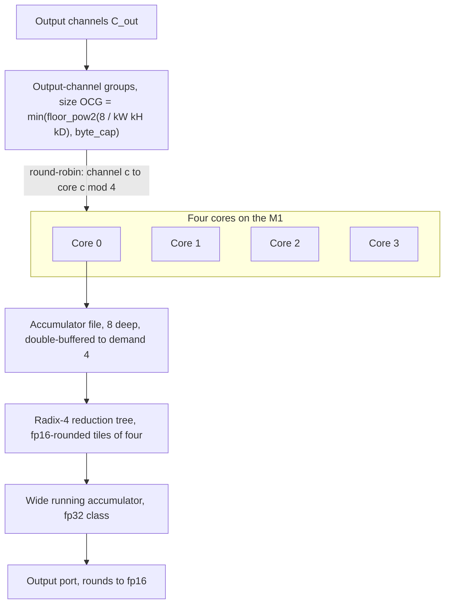

# 20. Datapath and MAC geometry

> The multiply-accumulate array is four cores on the M1, each with an eight-deep accumulator file, reading every geometry constant from a per-chip hardware-abstraction table.
> The lane width emits eight output channels per cycle in the int8 fast path and four in the default fp16 path, and output channels are the dimension that splits across cores and across accumulator passes.
> Each core reduces through a radix-4 tree of fp16-rounded tiles into one wide running accumulator of fp32 class, rounding to fp16 only at the output port.
> The firmware has no convolution, Winograd, or systolic code: it holds the real-time kernel and the tile, kernel, and output direct-memory-access plumbing, and nothing else.

The array is a set of cores, accumulators, and lanes whose dimensions are constants in the compiler and in a per-chip hardware-abstraction table.
The compiler supplies it by re-basing direct-memory-access engines per tile.
[Table](#tbl:c20-geometry) gives those dimensions and the roofline that follows from them, with each constant's hardware-abstraction-table offset and the scope over which it holds.

## Geometry constants

| quantity | table offset | M1 value | scope |
| --- | --- | --- | --- |
| core count | `0x238` | 4 | per die variant |
| accumulator budget per core | `0x0c` | 8 | all chips |
| accumulator-split granule | `0x230` | 64 | all chips |
| performance cycle divisor | `0x228` | 64 | A12 and later |
| output channels per cycle, fp16 | accessor table | 4 | architectural |
| output channels per cycle, int8 | accessor table | 8 | architectural |
| patch-width floor, log2 | `0x400` | 4 | M1 |
| patch-width cap, log2 | `0x410` | 9 | M1 |
| working-set cap | `0x1b8` | 2 MB | M1 |

Table: The multiply-accumulate array geometry constants, with hardware-abstraction-table offset, M1 value, and the scope over which each holds. {#tbl:c20-geometry}

The compiler's performance model reads the array geometry from these fields in the per-chip hardware-abstraction table.
The die, not the generation, keys the core count.
The decoded four-core figure on the M1 counts physical compute sets, which the per-core power-rail step confirms below.
Apple's published per-chip figure, the 16-core count the I/O registry also reports, is a different quantity [AppleANE].
The M1 has four cores; the M5 generation has sixteen; small reference variants have one.
The accumulator budget of eight, uniform across every chip, is the depth of the accumulator file per core in work units.
An operation fits single-buffered when its accumulator demand is at most eight, and double-buffered when twice its demand is at most eight, so double-buffering holds up to a demand of four.

## Output channels per cycle and the lane width

Two accessors of the performance model set the lane width, listed in [table](#tbl:c20-lane-accessors) with what each returns and the input that selects the value.

| accessor | returns | selected by |
| --- | --- | --- |
| `GetNumOutputChannelsPerCycle` | 8 (int8 fast path), 4 (fp16 default), 2 or 1 (narrow modes) | data type and mode |
| `GetNumOutputChannelsPerAccumulator` | 8 / 4 / 2 / 1 (table below) | source-patch size |

Table: The two lane-width accessors of the performance model, with what each returns and the input that selects the value. {#tbl:c20-lane-accessors}

The second accessor selects among four per-accumulator channel counts by source-patch size, which [table](#tbl:c20-oc-per-acc) maps to the hardware-abstraction-table offset that holds each value.

| HAL offset | output channels per accumulator | selected when |
| --- | --- | --- |
| `0x3a8` | 8 | tiny-source mode (small-source-mode field reads 2) |
| `0x3b0` | 4 | small-source mode (small-source-mode field reads 1) |
| `0x3b8` | 2 | default, format 3 / fp16-packed |
| `0x3c0` | 1 | default, non-format-3 and not half-work-unit |

Table: Output channels per physical accumulator slot, the hardware-abstraction-table offset holding each value, and the source-patch size that selects it. {#tbl:c20-oc-per-acc}

The four values are not packed into one accessor argument: each is its own field in the hardware-abstraction table at offsets `0x3a8`, `0x3b0`, `0x3b8`, and `0x3c0`, and `GetNumOutputChannelsPerAccumulator` returns the one the operation's source-patch mode selects.
The values are uniform across every chip in the set, so the multiplexing law is architectural, not per-die.
The source-patch mode is set by `ComputeSmallSourceMode`, which classifies an operation as default, small, or tiny from the output tensor dimensions against the kernel: tiny mode requires a source of at least 2 that fits the field at `0x338`, which is 4 on the M1.

The lane width is the column dimension of the systolic tile.
`GetNumOutputChannelsPerCycle` returns eight in the int8 fast path and four in the default fp16 path, degrading to two or one for narrow modes.
One core streams an input patch and produces up to eight output channels per cycle in double-int8 mode and four output channels per cycle in fp16.
`GetNumOutputChannelsPerAccumulator` sets how many output channels time-share one physical accumulator slot.
A tiny input patch underuses the array spatially, so the compiler packs eight output channels onto one accumulator to keep the multipliers busy.
A large patch lets each output channel keep its own accumulator.

## Radix-4 reduction and wide accumulator

The reduction that supplies one accumulator runs in two stages.
The first stage groups input lanes into tiles of four, each rounded to fp16.
Those fp16-rounded tiles supply one wide running accumulator of fp32 class, and the result rounds to fp16 only at the output port.

The fan-in of four is measured, not inferred from the table.
A reduction of `[+B, -B, +1]` triples, repeated sixteen times so that the true sum is sixteen, returns sixteen survivors below a partial magnitude of 4096 and saturates to exactly four survivors for every `B` at or above 4096.
The saturation count of four is the radix-4 tile signature: once a tile holds a partial at or above 4096, the unit increments sharing that tile fall below half of the fp16 spacing and vanish, and the three-element triple period beats against the four-lane tile to leave four unaffected lanes.
The threshold is at 4096 because that is where the fp16 spacing first reaches four.
The result is layout-independent: the `[+B, -B, +1]` and `[+B, +1, -B]` orderings return byte-identical values, so the hardware reduction order is a fixed lattice over lane index and not the source order.

The cross-tile accumulator is wider than fp16.
A reduction of one value of 4096 followed by 1024 ones returns 5116, between the naive-fp16 result 4096 and the exact 5120, and sixteen unit increments all survive next to a partial of 8192 where a fp16 accumulator would drop most of them.
The radix-4 first stage is consistent with the eight-work-unit accumulator file, since four input lanes plus margin fit the per-core budget.

## Output-channel-group tiling

The compiler tiles output channels into output-channel groups sized to the accumulator file.
`ComputeMaxOcgSize` derives the group size from the accumulator budget, the kernel-element count, and a per-format byte cap.

$$\mathrm{OCG} = \min\!\left( \mathrm{floor\_pow2}\!\left( \frac{8}{k_W \, k_H \, k_D} \right), \; \mathrm{byte\_cap} \right),$$

where the byte cap is 32, 16, or 8 bytes per kernel element depending on the weight format, read from the hardware-abstraction table at offset `0x388`, `0x390`, or `0x398`.
In compiler terms, `ComputeMaxOcgSize` reads the accumulator budget at field `0x0c`, divides it by the kernel-element count, rounds down to a power of two, and clamps to the per-format byte cap, as [listing](#lst:c20-ocg-size) gives.

```python
# ComputeMaxOcgSize: output-channel-group size for one pass
acc_per_oc = GetNumOutputChannelsPerAccumulator(mode)   # 1, 2, 4, or 8
budget     = floor_pow2( HAL[0x0c] / (kW * kH * kD) )    # HAL[0x0c] = 8 accumulators
byte_cap   = HAL[ocg_cap_offset(format)] / (kW * kH * kD)   # 0x388/0x390/0x398 = 32/16/8 B/elem
OCG        = min( ComputeMaxOcg(budget, acc_per_oc), byte_cap )
```

Listing: How the compiler computes the output-channel-group size for one pass from the accumulator budget, kernel-element count, and per-format byte cap. {#lst:c20-ocg-size}

A 1-by-1 convolution has a kernel-element count of one, so it admits a large group.
A 3-by-3 convolution has a kernel-element count of nine, so its group is roughly nine times smaller and it needs more passes over the input.
The compiler relieves that pressure by selecting Winograd for dense 3-by-3 stride-1 convolutions, since the transform cuts the effective kernel-element count.

Once the output-channel count exceeds what one pass holds, the array re-streams the input for a second pass.
The number of passes is

$$\mathrm{OCG\ passes} = \left\lceil \frac{C_{out}}{\mathrm{OCG}} \right\rceil .$$

For a 1-by-1 fp16 convolution at a 32-by-32 spatial size, the per-layer slope shows a distinct super-linear jump in cost between an output-channel count of 192 and 256: a step from 20 microseconds to 61 microseconds per layer, a roughly threefold cost step for a 1.8-fold increase in arithmetic.
That step is the pass count incrementing from one to two as the group cap is reached.
A 3-by-3 convolution reaches the same threshold at fewer output channels per pass, matching the nine-fold accumulator pressure.

## Winograd selection gate

The eligibility gate is `CanUseWinogradMode`, a fixed conjunction of conditions that all must hold, each given in [table](#tbl:c20-winograd-gate) with its meaning.

| condition | meaning |
| --- | --- |
| `HAL[0x680]` bit 0 set | the per-chip Winograd-enable bit, present on the M1 |
| kernel underlying type not 5, not 2, not unity | the format is Winograd-eligible and the weights are not 1-by-1 or identity |
| tensor format not 12 | the input format class is eligible |
| one kernel axis equals 3 | the transformed axis is fixed at 3, so 3-by-3 only |
| the orthogonal kernel axis is below 6 | the input-tile width of the larger tile is 6 |
| no third (depth) kernel extent | two-dimensional convolution |
| unit stride | input and output extents are consistent with stride 1 |
| `OCG x kH x kW x kD x 2` clears the work threshold | enough work to amortize the transform |

Table: The conditions of the Winograd eligibility gate, each of which must hold for the mode to be considered. {#tbl:c20-winograd-gate}

The axis-equals-3 plus orthogonal-axis-below-6 pair pins the supported tile set to two forms: $F(2 \times 2, 3 \times 3)$, with an output tile of 2 and an input tile of 4, and $F(4 \times 4, 3 \times 3)$, with an output tile of 4 and an input tile of 6.
The work threshold on the term $\mathrm{OCG} \times k_H \times k_W \times k_D \times 2$ is precision-dependent: it is 32 for work-unit modes 1 and 2, 8 for a non-float kernel, and 16 for a float kernel.
The higher float threshold is the compiler's guard against the precision cost of the $F(4 \times 4, 3 \times 3)$ transform, since the float convolution must clear a larger work bar before the transform is taken.
There is no accumulator widening tied to Winograd: the precision safety is the eligibility and threshold gating, not a wider accumulator.

Eligibility is not selection.
Even when the gate passes, Winograd is taken only when it beats both direct convolution and the accumulator-double-buffering path, decided by a cost-model comparison that reads the same accumulator and lane-width accessors.
Winograd is rejected when the convolution uses unicast, when the weight is sparse (sparse weights keep their own datapath and skip zeros), or when double-buffering the accumulator file already saturates the array.
The transform matrices themselves are not in the compiler: the compiler sets a single `winograd_mode` config field, and the input, filter, and output transforms run inside the engine datapath.
The textbook $F(2 \times 2, 3 \times 3)$ and $F(4 \times 4, 3 \times 3)$ forms describe the behavior, but the coefficients are resident in hardware and not recoverable from the program.

## Four-core granule

Output channels are the dimension the compiler splits across cores.
`ZinMirNECoreAssignment` builds a strided round-robin map: core $k$ owns output channels $\{k, k + N, k + 2N, \ldots\}$ for a core count $N$.
On the M1 with four cores, channel $c$ is on core

$$\mathrm{core}(c) = c \bmod 4 .$$

The active-core count is shape-driven, not user-selectable.
The compiler sets it from the output-channel count and the group size, rounds it up to the next power of two, and writes it into the task descriptor.
`GetNumNeededNEsNextPow2` sets the count, which [listing](#lst:c20-core-map) gives alongside the channel-to-core map and the pass count.

```python
# ZinMirNECoreAssignment: strided round-robin channel-to-core map (M1: num_nes = 4)
def core(c, num_nes):
    return c % num_nes                       # channel c -> core c mod 4 on the M1

# OCG passes and active-core count, both driven by C_out and the OCG size
def ocg_passes(c_out, ocg):
    return ceil(c_out / ocg)                 # input re-streamed once per pass

def cores_needed(c_out, ocg, num_nes):       # num_nes = HAL[0x238] = 4 on the M1
    return min(num_nes, next_pow2(ceil(c_out / ocg)))
```

Listing: The strided round-robin channel-to-core map alongside the pass count and active-core count, both driven by the output-channel count and the group size. {#lst:c20-core-map}

[Table](#tbl:c20-core-scaling) reports the measured throughput as the active-core count rises from one to four, showing near-linear integer scaling of the single-core rate.

| output channels | cores lit | throughput, GMAC/s | ratio to one core |
| --- | --- | --- | --- |
| 1 | 1 | 3.8 | 1.00 |
| 2 | 2 | 7.6 | 2.00 |
| 3 | 3 | 11.4 | 3.00 |
| 4 | 4 | 15.4 | 4.05 |

Table: Measured throughput as the active-core count rises from one to four. {#tbl:c20-core-scaling}

Driving a single 1-by-1 convolution at each output-channel count below the core count, in a dispatch loop pinned at a fixed rate by per-dispatch overhead, the sustained throughput rises in exact integer multiples of the single-core rate.
Each added core does one more output channel's worth of multiply-accumulates in the same wall time.
The power rail confirms the count independently: the engine draws a step of about 10 milliwatts per added core over an always-on floor of about 800 milliwatts, matching the firmware's one always-on base domain plus four independently power-gated compute sets, one per core.

A live capture of the compiler during a real M1 compile pins the geometry it costs against, which [table](#tbl:c20-live-geometry) records with the active-engine count and the candidate split geometries it speculates.

| quantity | live M1 value |
| --- | --- |
| clusters costed | 1 |
| active engines costed (`GetTotalNumberOfActiveNEs`) | 8 |
| candidate split geometries speculated | 1, 4, and 16 engines |
| kernel-memory budget | 64 units |
| fixed per-layer overhead | 44 cycles |

Table: Costed-geometry constants captured live during an M1 compile, with the active-engine count and the candidate split geometries. {#tbl:c20-live-geometry}

The 8 active engines the compiler costs against differ from the 16 cores the I/O registry reports for the M1: the costed geometry is 8 active engines on 1 cluster, a model-internal figure rather than the registry core count or the four physical compute sets that the power rail confirms above.
The model also holds a 64-unit kernel-memory budget that weight residency must fit under, and a 44-cycle fixed per-layer overhead that is added to every layer's execute cycles.

The full datapath reads top to bottom from the output-channel groups down through the four cores to each core's accumulator and its radix-4 reduction, as [figure](#fig:c20-datapath) draws it.



## Roofline from the geometry

Peak fp16 throughput is the product of the core count, lane width, and clock.
Writing the lane width as output channels per cycle, the peak rate of multiply-accumulate operations is

$$P_{\mathrm{MAC}} = \mathrm{cores} \times \mathrm{lanes} \times f,$$

and the floating-point rate is twice that, since one multiply-accumulate is two floating-point operations.
On the M1 the best fp16 mode is four cores times four output channels per cycle, and the int8 fast path doubles the lane width to eight.
The measured all-four-cores-saturated rate for a large 1-by-1 convolution is about 3.48 trillion multiply-accumulates per second, about 7 fp16 TFLOP/s at the engine output: above the 4.8 fp16 TFLOP/s large-matmul saturating ceiling of chapter 9, because this convolution stays under the 2 MB working-set threshold and remains compute-bound, and below the overhead-subtracted roofline anchor of 12 fp16 TFLOP/s.
The full-saturation power at that rate is about 4.7 watts, which is on the convolution power anchor and within 0.3 watts of the 4.4 watt large-matrix-multiply anchor, so the rail readings are calibrated.

The frontend does not reach that doubled lane.
The int8 compile flag quantizes the weights and leaves the multiply-accumulate in fp16, so it halves the streamed weight bytes and never emits the eight-channel int8 compute path.
The flag thus changes weight bandwidth, not compute rate.
A 3-by-3 convolution at 256 input and output channels and a square matmul both run within a few percent of fp16.
The int8 path reaches about 1.5 times faster only where the weight is large enough to stream from main memory, near a 4096-by-4096 weight at a batch of 256 or more.

The working-set cap closes the roofline at the memory edge.
The largest single operand that stays on chip is 2 MB.
Past that, the operand is tiled and streamed from main memory, which adds traffic and moves the workload onto the bandwidth side of the roofline.

## Task descriptor that holds the geometry

The compiler does not address the array directly: it fills a per-partition task descriptor, a flat register image organized into seven register groups, then serializes each group into the address-value pairs the firmware writes.
On the M1 the descriptor is the version-10 layout, one of fourteen versioned descriptor structs the compiler builds, selected by chip family.
[Table](#tbl:c20-descriptor-groups) lists the seven register groups of that layout, each with its register count, address base, and contents.

| group | register count | address base | contents |
| --- | --- | --- | --- |
| kernel and common | 34 | `0x5500` | kernel-DMA enable, format, stride, common config, task type, output transpose, network id |
| dimensions | 19 | none | input and output width, height, depth, channels, group count, broadcast, transpose, interleave, output-channel-group size |
| tile DMA | 69 | `0x4d00` | the three tile-DMA engines: enable, cache hints, base-address halves, row, channel, depth, group strides, format, wrap |
| elementwise, planar engine, padding | 30 | `0x4100` | elementwise and planar-engine config, padding mode, planar-engine index |
| L2 and texture | 14 | `0x4500` | L2 source and result config, texture mode, source dimensions |
| kernel format and op mode | 11 | `0x4900` | op mode, kernel alignment, sparse and palette flags, padding constant, bias and post-scale enables |
| L2 result | 21 | `0x5100` | L2-result base, strides, wrap, result format |

Table: The seven register groups of the version-10 task descriptor, each with its register count, address base, and contents. {#tbl:c20-descriptor-groups}

The dimension group encodes the per-axis caps directly in its field widths.
Input width, height, and depth are 15-bit fields masked `0x7fff`, while the channel fields are 17-bit, masked `0x1ffff`, so a channel axis reaches 131071 where a spatial axis stops at 32767.
The output-channel-group size is a 3-bit field, and the active-core count is the `ActiveNE` field, a 3-bit value that records how many cores the task runs on, set from the shape by `GetNumNeededNEsNextPow2`.

A fused convolution folds its per-channel affine and its activation into four separate kernel-coefficient streams, each a distinct sub-buffer with its own base offset and a relocation slot the loader patches at load.
[Table](#tbl:c20-coeff-streams) names the four streams, each with the relocation register the loader patches and the role it holds.

| stream | relocation register | role |
| --- | --- | --- |
| bias | `0x1554` | the per-channel additive offset |
| post-scale | `0x1558` | the per-channel output multiply, where a dequantize scale folds |
| palette lookup | `0x155c` | the palettized-weight lookup table |
| activation lookup | `0x1560` | the 33-segment piecewise-linear activation table |

Table: The four kernel-coefficient streams a fused convolution emits, each with the relocation register the loader patches and the role it holds. {#tbl:c20-coeff-streams}

A convolution with batch normalization and a following activation thus does not become four operations: the scale and bias fold into the post-scale and bias streams, the activation runs as the activation-lookup stream, and one fused operation streams all four coefficient banks alongside its weights.
