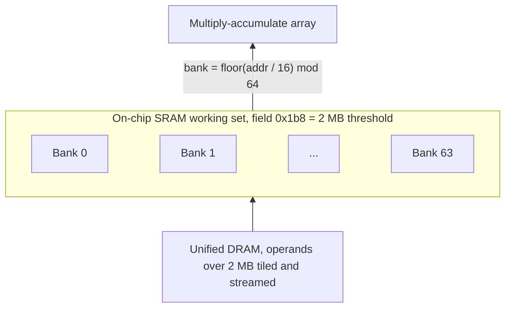

# 21. Memory hierarchy

> The engine holds its working data in one on-chip pool whose 2 MB size, at hardware-abstraction-table field `0x1b8` on the M1, is the dominant size limit: a layer whose largest single operand fits stays on-chip, and one that exceeds it is tiled and streamed from DRAM.
> The pool is interleaved across 64 banks at a 16-byte granule, with the bank index `floor(addr / 16) mod 64`, and a compile-time stride optimizer spreads accesses to avoid conflicts.
> The pool is a compiler-managed scratchpad, not a demand-filled cache: residency and stride are decided at compile time, so re-reference order does not change which operands are resident.

The numbers below come from the engine's hardware-abstraction table, indexed by field offset (for example `0x1b8`); quoted values are the M1/H13 entries.

## 2 MB working-set threshold

The matmul lowering shown in [listing](#lst:c21-matmul-lower) rejects a resident right-hand operand and streams a tiled copy once that operand reaches the working-set bound.

```c
/* ZinMirMatMul::LowerNEMatMulToNEConv */
if (GetTensorSizeInBytes(rhs) >= HAL[0x1b8]) {  /* HAL[0x1b8] = 2 MB on M1 */
    /* reject resident copy-cast; tile and stream the RHS from DRAM */
}
```

Listing: Matmul lowering: reject the resident RHS and stream a tiled copy once the operand reaches the working-set bound. {#lst:c21-matmul-lower}

The largest single operand that stays in on-chip SRAM on the M1 is 2 MB, the value at field `0x1b8`, the maximum operand bytes for the SRAM working set.
The same field holds 1 MB on the efficiency-class engine of the M9 part: the value is per-chip.
The compiler names this field `MemCacheSize`, also `L2Size`, and exposes overrides for it through `fl2-size` and the related cache-mode and allocator options.

A layer runs entirely from the on-chip pool when its largest single operand, the larger of the input activation, weight, or output, fits within this bound.
For a half-precision tensor the operand byte count is the element count times two.
A `[1, 512, 32, 32]` activation is exactly 1 MB and stays resident.
A `[1, 512, 64, 64]` activation is 4 MB and a `[4096, 4096]` linear weight is 32 MB, and both exceed the bound.

When the largest operand exceeds `0x1b8`, the compiler tiles it and streams the pieces from DRAM.
The comparison is on the size of one tensor, not the sum of the operands.
Past the bound, the streamed tile traffic adds DMA bytes that did not exist below it, so the arithmetic intensity of the layer, the ratio of multiply-accumulate work to bytes moved, falls.
The design rule that follows is to keep the largest per-layer operand at or under 2 MB by tiling the batch or the spatial extent or by shrinking the channel count, so the layer stays on-chip.

The M5 softens this threshold.
Its compiler tiles over the batch and the output dimensions together, so neither operand need be fully resident and the crossing is smooth in throughput rather than the sharp step the M1 shows.
The working-set cost then appears in DRAM energy per operation, which bottoms near a 2 MB operand and rises beyond about 4 to 5 MB, around the M5 bound of 4.72 MB.

The measured throughput threshold is slightly above the table value, near 2.28 to 2.34 MB, because the tiler holds roughly 0.3 MB of double-buffer and alignment margin before it splits the weight.
Sweeping a batched matrix multiply whose weight grows from 1.25 to 3.1 MB resolves the threshold directly, as [table](#tbl:c21-threshold-sweep) shows with the smooth plateau below the bound and the sharp step just above it.

| weight size | throughput, GFLOP/s |
| --- | --- |
| 1.25 to 2.25 MB | smooth plateau, 700 to 850, gently rising |
| 2.28 MB | 992, the first step up |
| 2.34 MB | 1038, a sharp threshold, 185 higher in one 0.03 MB step |
| 2.50 MB | 1120 |
| 2.75 MB | 1180 |
| 3.00 MB | 1226 |
| 3.06 MB | 1368 |

Table: Measured throughput of a batched matrix multiply as the weight crosses the 2 MB operand bound. {#tbl:c21-threshold-sweep}

The throughput is higher above the threshold, not below it.
Below the bound the whole weight is one resident operand that must fill before compute starts, a serialized stream into the array.
Above the bound the weight is tiled and double-buffered, so the fill of tile $n + 1$ overlaps compute on tile $n$ and throughput climbs.
The threshold is at the same 2.31 MB sweeping the grid up or down, so the boundary holds no memory state.

## 64-bank pool and bank function

The engine interleaves the on-chip pool across 64 banks at a 16-byte granule.
The bank count is field `0x1c8` and equals 64; the interleave granule is field `0x1c0` and equals 16 bytes.
An address maps to a bank by

$$\mathrm{bank} = \left\lfloor \frac{\mathrm{addr}}{16} \right\rfloor \bmod 64.$$

In compiler terms the two operands are the two table fields directly, as [listing](#lst:c21-bank-index) computes the bank index from a byte address.

```c
/* SRAM/L2 bank index from a byte address */
unsigned bank(unsigned long addr) {
    return (addr / HAL[0x1c0]) % HAL[0x1c8];   /* (addr / 16) mod 64 */
}
```

Listing: The on-chip bank index computed from a byte address using the interleave granule and the bank count read straight from the table. {#lst:c21-bank-index}

The map is direct and modular: there is no second-level grouping above the 64 banks.
The bank-conflict optimizer reads the same two table fields and chooses a row stride that spreads accesses across banks.
Over candidate strides bounded by the maximum stride field `0x1f8`, it selects the stride whose per-bank cost is least, as [listing](#lst:c21-bank-optimizer) searches.

```c
/* ZinMirBankConflictOptimizer::OptimizeL2StrideMinCost */
uVar1 = HAL[0x1c0];                       /* granule    = 16   */
uVar2 = HAL[0x1c8];                       /* bank count = 64   */
uVar4 = param_1 / uVar1;                  /* stride in 16-byte granules */
/* loop over candidate strides, bounded by HAL[0x1f8] (= 2 MB) */
    uVar5 = (uVar4 + uVar9) / uVar2;            /* granules / 64 */
    index = (uVar4 + uVar9) - uVar5 * uVar2;    /* granules mod 64 = bank index */
    fVar10 = cost_vector[index];                /* per-bank conflict cost */
    if (fVar10 < best) { best = fVar10; chosen = uVar8; }
```

Listing: The bank-conflict optimizer searching candidate row strides and selecting the one with the least per-bank cost. {#lst:c21-bank-optimizer}

The cost vector has exactly 64 float entries, one per bank, which fixes the modulus at 64.
The modelled conflict depth for a row stride $s$ over the 64 banks is

$$\mathrm{requests} = \left\lceil \frac{\mathrm{rows}}{64 / g} \right\rceil, \qquad g = \gcd\!\left(\frac{s}{16},\ 64\right).$$

The conflict is worst when the granule stride is a high power of two, which drives $g$ up, and is conflict-free when $g = 1$, which gives one request per bank.
Every accepted stride is a multiple of the 16-byte granule, and the search never proposes a stride above the 2 MB ceiling in field `0x1f8`.
The on-device throughput period that this structure produces is 64 bytes, which is 32 half-precision elements and four 16-byte granules; that period is the granule-quantized echo of the 64-bank interleave after the optimizer has set the stride, not the raw modulus itself.

The pool is a compiler-managed scratchpad, not a demand-filled cache.
The compiler decides residency and stride at compile time and writes them into the program; there is no runtime replacement policy on the operand path, so the order in which weights are re-referenced does not change which ones are resident.

## Resident vs shared output buffers

The output-buffer allocator in [listing](#lst:c21-resident-buffer) decides whether a convolution gets a dedicated resident buffer or the shared default, gated by the residency-threshold field.

```c
/* ZinIrLocalRegAlloc::AllocateOutputDMADefaultBuffer */
if (HAL[0x491] == 1 &&
    (footprint = HAL[0x1c0] * dst_buf_count,        /* 16 * count, in bytes */
     HAL[0x1f0] <= footprint && footprint != HAL[0x1f0])) {
    use_default_buffer;                  /* no dedicated conv_res_l2_buf */
} else {
    allocate "<layer>/conv_res_l2_buf";  /* dedicated resident buffer */
}
```

Listing: The output-buffer allocator deciding between a dedicated resident buffer and the shared default, gated by the residency threshold. {#lst:c21-resident-buffer}

A convolution can be given a dedicated on-chip buffer that holds its output residency across the convolution so the result is not re-streamed.
Field `0x1f0`, the resident-buffer threshold, decides whether that buffer is allocated by comparison against the convolution's output DMA footprint.
On the M1 the field is 0, and the allocator skips the dedicated buffer when the footprint is strictly greater than the threshold.

With `0x1f0` equal to 0 on the M1, any buffer of at least one destination slot has a footprint greater than 0, so the condition is always true and the M1 always takes the default-buffer branch.
The dedicated residency buffer is thus never allocated on this chip.
On the A16-class and M5 parts the same field is 262144, which is 256 KB, so only a convolution whose output DMA footprint exceeds 256 KB receives the dedicated buffer; on the A15 part it is 32768, which is 32 KB.
The field rises with the larger on-chip pools of the newer parts.

The dedicated convolution buffer is not a separate memory.
It is carved from the same on-chip pool as the 2 MB operand working set and the other DMA buffers, aligned to the same 16-byte granule, and its stride runs through the same 64-bank optimizer.
Field `0x1f0` decides only whether a convolution's output residency gets its own named sub-allocation in that one pool.
The kernel-coefficient store is a distinct on-chip budget: 64 KB on the M1, separate from the 2 MB operand working set.

The on-chip granules are finer than the page granule at which buffers are mapped into the engine's address space.
Three alignment scales coexist on the M1: the 16-byte DMA-width granule of field `0x1c0`, a 256-byte segment alignment, and the 16 KB page at which buffers map to the engine.

## Two-stage address translation

A host buffer reaches the array through two stacked translations: the kernel driver pins the pages to physical memory, then maps them through a device input-output memory-management unit to a device virtual address the engine's DMA engines read.
The translation unit that serves the engine is the t6000-generation controller bound to the device node `dart-ane0`.
[Table](#tbl:c21-translation) gives the page size, aperture base, and aperture size read from the live device node.

| property | value | meaning |
| --- | --- | --- |
| page size | `0x4000` = 16 KB | the device virtual page; sub-page buffers still consume a full 16 KB page |
| aperture base | `0x0` | the device-virtual window starts at zero |
| aperture size | `0xE0000000` = 3.5 GiB | the managed device-virtual window |

Table: The device-translation parameters for the engine, read from the live device node. {#tbl:c21-translation}

The aperture is 3.5 GiB, but the firmware clamps every address it programs into a DMA engine to the bottom 4 GiB by asserting that the high 32 bits of every buffer address are zero, so the engine is confined to the bottom of its device-virtual space.
Each page maps to physical memory through a single 64-bit leaf descriptor: for every live engine data page the descriptor is the physical frame address with bit 63 set, the valid bit, and no other field.
The descriptor reads $\mathrm{phys} \mathbin{|} \mathtt{0x8000000000000000}$ for an input, weight, intermediate, or output page alike, since the physical frames are 16 KB-aligned and leave the high bits free; unmap clears the descriptor to zero, dropping the valid bit.
Read-only protection of the inputs is not encoded in the leaf descriptor on the M1: a configuration bit collapses the would-be read-only class into read-write at the translation unit, so input protection is enforced upstream.

Each mapped buffer holds a usage code that records its role, decoded from the mapping call sites and listed in [table](#tbl:c21-usage-codes).

| usage code | role |
| --- | --- |
| 1 | client input tensor |
| 2 | client output tensor |
| 7 | intermediate buffer |
| 8 | kernel and weights |
| 9 | program text, task descriptor, and working set |
| 11 | program constant and scratch |
| `0x1019`, `0x101a` | firmware shared surface and resident heap |

Table: The buffer-role usage code each mapped buffer holds, recovered from the mapping call sites. {#tbl:c21-usage-codes}

The address-translation registers and the full fault path are the subject of chapter 28; this chapter covers the on-chip pool, its banking, and the page granule at which buffers enter the device address space.

## Hierarchy on the M1

[Table](#tbl:c21-hierarchy) gives the on-chip levels and their M1/H13 values, with the table field that holds each one and its role.

| Level | M1/H13 value | Table field | Role |
| --- | --- | --- | --- |
| SRAM operand working set | 2 MB | `0x1b8` | largest single operand that stays on-chip; over this, tile and stream |
| Operand threshold (measured) | 2.28 to 2.34 MB | derived from `0x1b8` | observed throughput threshold, 2 MB plus tiler double-buffer margin |
| Bank count | 64 | `0x1c8` | banks the pool is interleaved across |
| Interleave granule | 16 B | `0x1c0` | DMA-width granule and bank-stride unit |
| Maximum L2 destination stride | 2 MB | `0x1f8` | upper bound of the bank-conflict stride search |
| Residency-buffer threshold | 0 | `0x1f0` | over this footprint, skip the dedicated buffer; 0 means M1 never allocates one |
| Kernel-coefficient store | 64 KB | `0x200` | on-chip weight-coefficient budget at `0x200`/`0x210`, with the 64 KB-or-16 MB mode select at `0x288`, distinct from the operand working set |

Table: The on-chip memory levels on the M1, each with its value, hardware-abstraction-table field, and role. {#tbl:c21-hierarchy}

[Table](#tbl:c21-residency-gens) gives the cross-generational comparison for the residency-buffer threshold, the field that varies most across parts, with its effect on whether a dedicated buffer is allocated.

| Part | `0x1f0` value | Effect |
| --- | --- | --- |
| M1/H13 | 0 | dedicated residency buffer never allocated |
| A15-class | 32 KB | dedicated buffer when convolution output footprint exceeds 32 KB |
| A16-class and M5 | 256 KB | dedicated buffer when convolution output footprint exceeds 256 KB |

Table: The residency-buffer threshold across generations and its effect on whether a dedicated convolution output buffer is allocated. {#tbl:c21-residency-gens}

The levels stack from unified DRAM at the bottom, up through the on-chip working set and its 64 banks, into the multiply-accumulate array, as [figure](#fig:c21-hierarchy) draws them.


