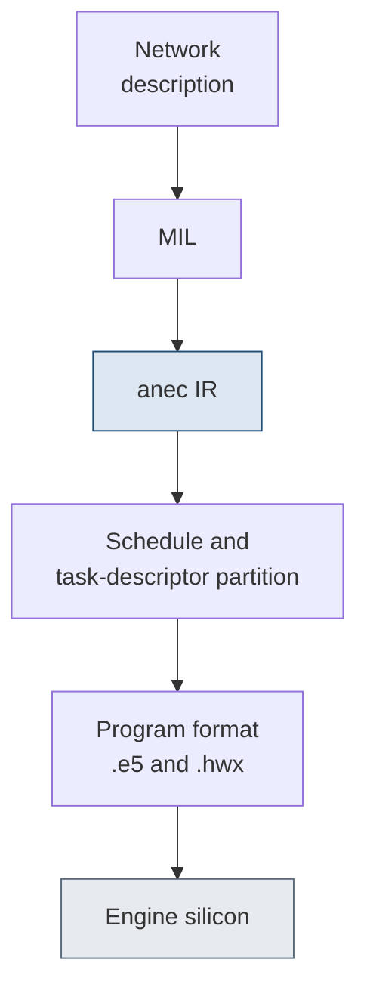

# 22. Compiler

> The compiler turns a network description into a loadable program through four phases: fusion to one compute operation, legalization to the hardware envelope, schedule and task-descriptor partition under the on-chip working set, and memory and direct-memory-access optimization.
> A frontend operation lowers to one or more backend `anec.*` operations, most one to one, with a convolution absorbing its bias, activation, padding, and dequantize into a single fused operation.
> An exported `_ANECValidate{Op}Layer` entry point checks each operation first, one of 50 per-layer validators among 55 `_ANECValidate*` exports, and a callable validator signals that an operation is reachable on the direct path.
> A validator that accepts does not guarantee code generation: top-k, sort, dynamic-slice, and three-dimensional convolution pass validation and fail backend lowering on the M1.

## Pipeline

The compiler runs four phases in execution order, each listed in [Table](#tbl:c22-phases) with its job and the passes that represent it.

| phase | job | representative passes |
| --- | --- | --- |
| 1. Fusion | collapse the graph to one fused compute operation | transpose fusion, bias and activation hoisting into conv and matmul, elementwise-copy elimination |
| 2. Legalization | make the fused graph hardware-legal | dimension and rank legalization (rank `\le 5`), kernel-memory split, multi-segment graph cuts |
| 3. Schedule and task-descriptor partition | linearize the graph and carve it into on-engine partitions | parallel-execution discovery, the greedy list scheduler, partition emission |
| 4. Memory and direct-memory-access optimization | lay out buffers and streams | bank-conflict optimization, pad optimization, width-concat, weight packing |

Table: The four compiler phases in execution order, each with its job and representative passes. {#tbl:c22-phases}

Each phase has a fixed job, and the phase structure decides what is free to emit and what costs a separate dispatch.
The [figure](#fig:c22-pipeline) traces the same pipeline as a dataflow, from the network description through the intermediate forms to the loadable program on the engine.



Phase 1 collapses the whole graph to a single compute operation.
Transposes are free: they fold into the adjacent operation or route to the dedicated transpose engine rather than becoming a separate dispatch.
A bias add and an activation that follow a convolution or a matrix multiply hoist into that operation, so `conv + bias + relu` and `matmul + bias + gelu` each become one fused operation rather than three.

Phase 2 enforces the hardware envelope.
Tensor rank is capped at five, per-dimension maxima apply, and an operation whose coefficients exceed the per-buffer kernel-memory cap is tiled or split.
The compiler cuts a graph that cannot run as one segment into several at bridge operations.

Phase 3 turns a fused operation into real on-engine work.
A greedy priority-queue list scheduler linearizes the operation-layer graph into one execution order, then chunks that order into task-descriptor partitions under the on-chip working-set budget.
The scheduler pops the highest-priority ready node each step, ordered by a fixed tie-break sequence: ring-buffer membership first, then branch-sibling score, then merge-sibling score, then the working-set-aware branch test, then topological order, then raw node id.
The partition boundary is a memory test, not an operation count: the scheduler tentatively schedules a layer, queries the peak L2 pressure over its live range, and closes the current partition when

$$\mathrm{peak\ L2\ pressure} > \mathrm{HAL}[\mathtt{0x1b8}] \times f,$$

where $\mathrm{HAL}[\mathtt{0x1b8}]$ is the 2 MB on-chip static-memory ceiling on the M1 and $f$ is a margin fraction below one.
A partition grows until the next layer's live range would push the peak past that scaled budget.
The branch decision that keeps the live set on chip reads the same 2 MB field: when a diamond's endpoints fit, the scheduler runs the larger-footprint branch first while its peak still fits in 2 MB, draining it before the working set grows.

Phase 4 lays out the buffers the partitions read and write: it re-strides the destination buffers to avoid bank conflicts on the main engine, folds padding, and packs the weight stream.

The allocator runs alongside phases 3 and 4.
It tags every root tensor with an allocation type from a nine-state set that records whether the tensor is resident on chip, streamed from dynamic memory, chained directly into the next operation in the on-chip cache, or held as a ring buffer.
[Table](#tbl:c22-alloc-states) decodes the nine allocation-type values, each with its meaning.

| value | meaning |
| --- | --- |
| 0 | plain on-chip resident operand |
| 1 | streamed from dynamic memory |
| 2 | L2-chained, supplies the next operation directly in L2: the double-buffer state |
| 3 | depends on an L2 producer |
| 4 | in-place rewrite in L2 |
| 5 | in-place rewrite, L2-dependent |
| 6 | ring-buffer resident |
| 7 | ring-buffer resident, L2-dependent |
| 8 | in-place in dynamic memory |

Table: The nine allocation-type states the allocator assigns to each root tensor, decoded from the bit-test predicates that read them. {#tbl:c22-alloc-states}

A single-fanout producer immediately followed by a same-engine consumer with matching tile geometry is marked chainable, allocation type 2, the structural form of double-buffering: the producer output stays on chip and supplies the consumer in place instead of round-tripping through dynamic memory.
Chainability is a structural pattern, not a size threshold.
The decision is a conjunction.
The per-chip chaining-enable bit must be set, the producer must have exactly one outgoing layer, and both ends must be the same engine class on the same engine.
The producer's emitted tile geometry must match the consumer's declared input geometry, the consumer must be scheduled immediately after the producer with no other layer in the gap, and the producer's emitted rows must cover the consumer's first tile including overlap.
The ring-buffer state, allocation type 6, is the state the scheduler ranks first when it orders ready operations.

Phase 3 also discovers operations that can co-issue on the two engines.
The rule is restrictive: two operations run concurrently only when one is a multiply-accumulate operation and the other is a planar-engine operation, since two operations on one engine cannot overlap.
The discovery disqualifies a pair when either is unscheduled, when both are the same engine class, when they are on different engines, or when they stand in a producer-consumer relation.
A pair is also disqualified when either input is chained or chainable, or when both outputs stream from dynamic memory and would serialize on the shared channel.
A matrix multiply's resident weight is exempt from the last test, so it does not block its partner.
The attention block is the operation this filter selects: a softmax on the planar engine co-issued with a value matrix multiply on the multiply-accumulate array.
Chaining and co-issue are mutually exclusive: an operation is either pipelined into its neighbor or co-issued with an independent operation on the other engine, never both.

## Lowering one operation

A frontend operation lowers to one or more backend `anec.*` operations through the operation-converter pass, most of them one to one.
A matrix multiply lowers to `anec.matmul`, which holds the contraction as two attributes rather than as a fixed operand order, as [listing](#lst:c22-matmul-lower) gives with its operands, attributes, and pre-lowering constraints.

```text
mps.MatMulOp  ->  anec.matmul
  bottoms:  2   (A, B)
  attrs:    transpose_lhs : bool
            transpose_rhs : bool
  constraints (checked before lowering):
    depth(A) == 1 and depth(B) == 1
    out_channels == channels(A)
    width(A) + pad == channels(B)
    out-channel bytes of A must fit kernel memory
```

Listing: The matrix-multiply lowering, with its operands, the transpose attributes that set the contraction direction, and the pre-lowering constraints. {#lst:c22-matmul-lower}

The contraction direction is parametric: `transpose_lhs` and `transpose_rhs` select which operands are transposed before the product, so one backend operation covers every transposed and non-transposed matrix-multiply form.
The compiler rewrites a matrix multiply whose right-hand weight fits the on-chip working set into a resident convolution, a single fused operation; a weight above the 2 MB ceiling stays a tiled matrix multiply.

A convolution lowers the same way and absorbs more of its neighborhood, as [listing](#lst:c22-conv-lower) gives with its folded weight and bias, its attributes, and its pre-lowering constraints.

```text
mps.Conv2DOp  ->  anec.convolution
  bottoms:  1   (+ weight and bias folded in)
  attrs:    strides
            dilation_rates
            groups
            explicit_padding / padding_style
            kernel_sizes
            weights_layout
  constraints (checked before lowering):
    filter and input rank 4 or 5
    kernel within the per-chip [min, max]
    in-channels and out-channels divisible by groups
    padded input >= kernel
```

Listing: The convolution lowering, with its folded weight and bias, its attributes, and the constraints checked before lowering. {#lst:c22-conv-lower}

The bias becomes the convolution's gain-offset control, and a following activation becomes a post-operation lookup table on the same operation.
A padded, biased, activated convolution thus emits as one backend operation with the pad folded, bias as a per-channel affine, and activation as a 33-segment piecewise-linear table.
A quantization scale folds into the per-channel output multiply that precedes that table, so a dequantize between the convolution and its activation does not become its own operation either.

## Fusion rules

Fusion does not happen in the MIL the host hands over.
The MIL is the pre-fusion handoff: a biased, activated convolution arrives as three separate operations, `conv` then `add(x=conv, y=bias_const)` then `relu`, and the collapse into one engine layer happens entirely inside ANECompiler's `ZinIr`/`ZinMir` layer-graph stage.
The fused hardware unit is the gain-offset control, `anec.gain_offset_control`, a per-channel or singular affine $y = \mathrm{gain} \cdot x + \mathrm{offset}$ applied at engine output.
The `ZinNEBypassLayer` container wraps a fused engine operation in a fixed seven-slot epilogue chain whose constructor argument order, given in [listing](#lst:c22-nebypass), fixes the seven slots.

```mlir
ZinNEBypassLayer( engine_op,
    ZinTextureLayer,      // in-place spatial/texture remap
    ZinBroadcastLayer,    // broadcast of a fused operand
    ZinActivationLayer,   // pre-GOC activation
    ZinGOCLayer,          // the gain/offset (scale + bias) unit
    ZinActivationLayer,   // post-GOC activation
    ZinTransposeLayer,    // output transpose / layout
    ZinQuantLayer )       // output (re)quantization
```

Listing: The `ZinNEBypassLayer` constructor, whose argument order fixes the seven epilogue slots a single engine layer can absorb. {#lst:c22-nebypass}

A convolution, matrix multiply, pool, or elementwise operation absorbs, in slot order, a texture remap, broadcast, pre-GOC activation, the gain-offset affine, a post-GOC activation, output transpose, and output requantization.
The bias-add fills the GOC offset, the scale or batch-norm gain fills the GOC gain, and the activation fills one of the two activation slots.
The pass that forms the offset is `ScaledEWOrEWWithConstInToGOC`, and an internal guard reads `"Must have 2 inputs when convert EW to GOC"`: the elementwise-to-GOC rewrite needs exactly one live operand and one constant operand.
That guard is the dividing line between a fusable epilogue and a fusion barrier.
[Table](#tbl:c22-fusion) gives each pattern, how it fuses, and the gating pass, alongside the barriers that keep operations as separate layers.

| pattern | fuses as | gating pass |
| --- | --- | --- |
| bias-add (`add` with one constant) | GOC offset | `ScaledEWOrEWWithConstInToGOC`, `ZinMirHoistGOCorActivationForConvFusion` |
| scale or batch-norm (`mul` with one constant) | GOC gain, or folded into the weights | `FoldScale`, `FoldWeightsWithScale` |
| activation (relu, leaky, clamped, swish, sigmoid, tanh, gelu) | a pre- or post-GOC activation slot; transcendentals become a palette lookup table | `MergeFusableActivationPairs`, `SimpleActivation` |
| transpose and reshape chains | the NEBypass transpose slot; symmetric pairs cancel | `CollapseTranspose`, `ZinMirNETransposeFusion` |
| dequantize | folded into the convolution weight path as `kernel_scale` or `kernel_palettized_LUT` | `CollapseQuantDequant`, `DeduplicateStandaloneDequantGOCsAcrossConcat` |
| matrix multiply or linear | rewritten to a convolution, then takes the convolution epilogue rules | `ReplaceMatmulWithConv` |
| two-live-input elementwise (`add(conv_a, conv_b)`) | does not fuse: stays a real `anec.add` engine layer (fails the one-constant guard) | barrier |
| concat | a fusion boundary unless `IsFusableConcat` qualifies it | barrier |
| scaled-dot-product attention | a hard segment cut between programs | barrier |

Table: The fusable epilogues that collapse into the producing engine layer and the barriers that keep operations as separate layers. {#tbl:c22-fusion}

A two-live-input elementwise operation is the one barrier that follows from the GOC definition itself.
The GOC is an affine of one tensor whose gain and offset are constants or per-channel vectors, so `add(conv_a, conv_b)` cannot be a GOC and remains a real `anec.add` engine layer that separates the two convolutions.
A trailing activation can still fill the add's own post-GOC activation slot, but the add itself does not vanish.
Concat is a boundary unless it qualifies as fusable, scaled-dot-product attention is a hard segment cut that matches the host's own segmentation, and the `ZinMir*Split` capacity passes can re-cut a fused layer that exceeds the tile or engine limit, so a fusion formed earlier can be undone downstream.

## Validator surface

Before an operation lowers, a per-layer validator checks it.
The validators are a family of exported `_ANECValidate{Op}Layer` entry points, one per operation class, with an umbrella `_ANECValidateNetworkCreate` that iterates a network's layers and invokes the per-layer validator for each.
The export table has 55 symbols whose name starts `_ANECValidate`, which split into 50 per-layer `…Layer` validators and 5 non-layer exports.
[Table](#tbl:c22-nonlayer) names the five non-layer exports and the role of each.

| non-layer export | role |
| --- | --- |
| `_ANECValidateNetworkCreate` | the umbrella oracle: a dry-run of network creation that iterates the layers and invokes each per-layer validator |
| `_ANECValidate` | the top-level wrapper for a single operation or descriptor |
| `_ANECValidateMPSModule`, `_ANECValidateMPSModuleCreate` | validate an intermediate-language module before its conversion to the backend form |
| `_ANECValidateMutableProcedureInfo` | validate a weight-editing procedure descriptor |

Table: The five non-layer `_ANECValidate*` exports and the role of each, alongside the 50 per-layer validators. {#tbl:c22-nonlayer}

Five per-layer validators have no matching descriptor constructor, since they validate computed or umbrella operations rather than directly authored layers: argmin-max, global argmin-max, broadcast, cross-product, and elementwise.
The same per-layer code runs in two places: the placement dry-run that decides whether an operation is eligible for the engine, and the backend legalizer during a real compile, so the eligibility prediction matches the compile outcome.

Each validator checks the operand count and the shape, type, and attribute envelope for its operation, and emits a fixed reject string when a constraint fails.
The matrix-multiply validator requires exactly two inputs, depth one on both, the output channel count equal to the first input's channel count, and the first input's output-channel bytes to fit kernel memory.
It rejects with `"Matrix mult. layer can only have two bottoms"`, `"depth > 1 is not supported for MatMult"`, and `"can not fit the Kmem"`.
The convolution validator checks the kernel against the per-chip bounds and the channel-group divisibility, rejecting with `"Invalid conv kernel %s = %zd, It should be in [%zd,%zd]"` and `"input/output channels should be divisible by num group"`.

The validators that gate a feature on the chip read a per-chip support byte, so the same operation can validate on one generation and reject on another.
[Table](#tbl:c22-feature-gates) lists representative feature-gated validators, the support byte each reads, and the generation it gates on.

| operation | support byte | gated on |
| --- | --- | --- |
| softmax | `0x815` | rejected on the older targets |
| instance norm | `0x816` | per-chip |
| dropout, random | `0x4a9` | the A15 and later generations only |
| affine transform, resize, resample, padding mode | `0x81d` | the texture engine, absent on the M1 |
| dynamic gain-offset control | `0x814` | absent only on the smallest legacy parts |
| three-dimensional convolution | dimension and kernel-depth fields | has the capability byte yet fails backend lowering |

Table: Representative feature-gated validators, the per-chip support byte each reads, and the generation it gates on. {#tbl:c22-feature-gates}

The reject strings name the constraint plainly: a softmax on a target without `0x815` returns `"Softmax is not supported by this ANE architecture"`, a dropout without `0x4a9` returns `"Dropout layer is not supported on this architecture."`, and an affine transform without the texture engine returns `"affine transform is not supported on this architecture"`.
The network-level umbrella adds its own checks, rejecting a module newer than the current schema, bonded network the target cannot run, unit-name collision, or missing conversion record.
The reject strings include `"Bonded networks are not supported on the target"` and `"ANE internal error: Unit name \"%s\" collision during MIL to ANEC IR conversion."`.

Every per-layer validator is an exported, user-callable symbol: an operation whose validator accepts the schema is reachable by direct network authoring.
This is the attested-is-not-reachable rule from chapter 4 in its compiler form: an operation can pass its `_ANECValidate*Layer` schema check and still fail at backend lowering.
On the M1 the top-k, sort, and dynamic-slice validators accept their inputs and then reject at code generation, and the unflatten validator passes yet fails lowering for every variant.
Three-dimensional convolution has its capability byte yet fails backend lowering on every device mask.
One opcode-surface gap exists below the validator layer: the contrast-adaptive-sharpening and reverse operations have an internal validation routine but no exported per-layer validator, so they are not reachable by direct authoring at all.
The reachable surface here is confirmed against an on-device sweep.

Validation happens in three distinct layers.
The exported `_ANECValidate*` catalog, the per-layer and umbrella validators, is the outward face.
Behind it the in-binary `ValidateSemantics_Impl` family holds the `MatchParams` and `MatchStatus` pattern grammar that the exported validators are generated from.
Below both, an in-kernel `ZinComputeProgramValidate*` family validates the compiled program again at load, across single-plane, multi-plane, uncompressed, and tiled-compressed matrix forms.

## Native layers and netplist authoring

The 50 per-layer validators pair with 45 native hardware layer descriptors, the operation classes the engine silicon implements.
A few of these never reach the engine through the conversion-tool front door, since that path always decomposes them, yet they are reachable by authoring the network description directly.
The fused scaled-dot-product-attention layer is the clearest case: its descriptor takes four or five inputs, the query, key, value, scale, and an optional additive mask, and its validator rejects with `"4 or 5 bottoms must be present for SDPA"` and `"Mask format must be same as Q, K and V"`.
Its one parsed parameter is the max-subtraction flag, which defaults to off and must be set on for a numerically correct softmax, and the causal-decode form is not a separate descriptor but the additive-mask variant.

The network description is a property-list document, the netplist, schema version 1.0.10, whose keys the compiler reads verbatim and [Table](#tbl:c22-netplist) names with the role of each.

| key | role |
| --- | --- |
| `Networks`, `ProcedureList` | the network names and the callable entry points |
| `Units`, `Weights` | the ordered layer list and the weight-blob files |
| `InputList`, `OutputList`, `OperationList` | the external ports and the operation order |
| `Bottom`, `Type`, `Params` | per-unit wiring, layer-type tag, and typed attributes |
| `BatchSize`, `InputChannels`, `InputDepth`, `InputHeight`, `InputWidth`, `InputInterleave` | the port shape five-tuple and the channel-interleave packing |

Table: The netplist dictionary keys the compiler reads, with the role of each. {#tbl:c22-netplist}

A layer is a unit with a `Type` tag, a `Bottom` wiring list, and a `Params` sub-dictionary of typed attributes, and the wiring is by symbol name.
The compiled program that comes out is a container with the magic `0xbeefface`, whose text section holds the task-descriptor register-write stream and whose `__KERN_N` sections hold the weight coefficients, the same image the kernel loads.
