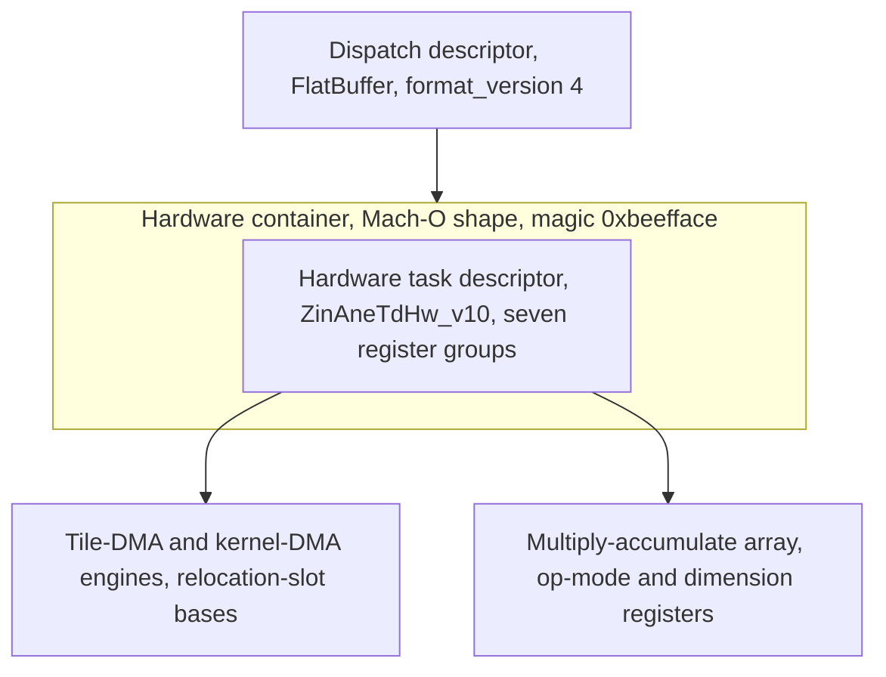

# 23. Program and container format

> A compiled network reaches the engine as two layered files: a dispatch descriptor, a FlatBuffer that names the operations and binds the buffers, over a hardware container.
> The hardware container is a Mach-O-shaped file with the magic `0xbeefface` that holds the register-write program and the weight banks.
> The descriptor tracks dispatch count, not operation count: a fused graph of any depth reduces to one inference operation bracketed by input and output casts, and a bridge cut adds one inference operation per segment.
> Between them is the hardware task descriptor `ZinAneTdHw_v10`, a register image in seven groups, serialized sparsely as 44-byte records whose buffer bases are relocation slots resolved at load.

## Two layers

A model passes through six on-disk and in-memory forms, which [Table](#tbl:c23-forms) gives with the format, identifying tag, and role of each.

| Stage | Format | Tag | Role |
| --- | --- | --- | --- |
| Intermediate-language text | text | versioned `3520.4.1` | the compiler's input |
| Network description | property list | version `1.0.10` | the layer and wiring graph |
| Hardware container | Mach-O shape | `0xbeefface` | register-write program plus weights |
| Dispatch descriptor | FlatBuffer | vtable `0c00 1400 0400 0800` | the operation chain the runtime submits |
| Loaded program image | Mach-O shape, signed | `0xbeefface` | the same container, virtualized per load |
| Firmware container | sectioned blob | `ANEH` / `ANEP` / `ANES` | the on-package load form |

Table: The six on-disk and in-memory forms a model passes through, each with its format, identifying tag, and role. {#tbl:c23-forms}

The compiler produces a dispatch descriptor and a hardware container for one network, cached together.
The dispatch descriptor is above the operation level of the intermediate language: it holds the operation chain as a parametric program structure, with each operation reduced to an argument frame and a kernel attribute blob.
The hardware container is below that level: it holds the register-write stream, weight coefficients laid out for the streaming datapath, and typed input and output layout, all in a Mach-O-shaped file with the magic `0xbeefface`.
The hardware container and the loaded program image share one byte format: the loaded copy is the on-disk container after the address relocations are resolved.

The [figure](#fig:c23-stack) shows the layering, with the dispatch descriptor over the hardware container over the task-descriptor register groups that drive the DMA engines and the multiply array.



## Dispatch descriptor

The dispatch descriptor is a FlatBuffer whose root table has four fields.
The serializer method set yields the root layout, validated byte for byte against a real descriptor and given in [Table](#tbl:c23-root) with each field's vtable offset, contents, and type.

| Field | Voffset | Contents | Type |
| --- | --- | --- | --- |
| 0 | 4 | the symbol and section name vector | `symbol_names: [string]` |
| 1 | 8 | build-info key and value pairs | `build_info: BuildInfo` |
| 2 | 12 | the section descriptor vector | `sections: [Section]` |
| 3 | 16 | inline scalar, value `4` | `format_version: int` |

Table: The four fields of the dispatch-descriptor root table, with their vtable offsets, contents, and types. {#tbl:c23-root}

The operation set the descriptor can hold is fixed.
The serializer instantiates one attribute-serialization template per operation kind, and the twelve instantiations enumerate the complete set that [listing](#lst:c23-schema) recovers as the root table and the operation-type enumeration.

```fbs
// E5Program root table, recovered from the E5Serializer symbol family
// and validated against a real H13C dispatch descriptor (3816 B).
table E5Program {
  symbol_names: [string];     // operation, tensor, and section names
  build_info: BuildInfo;      // compiler version and source path k/v
  sections: [Section];        // per-operation arg_frame + op_attrs refs
  format_version: int;        // observed == 4
}

enum OpType : ubyte {
  Cast, AneInference, EirInference, CpuInference, BnnsCpuInference,
  MlcCpuInference, MpsGraphInference, E5MinimalCpu, Quant, Dequant,
  Barrier, JitCall            // ordinals inferred; membership measured
}
```

Listing: The recovered FlatBuffer schema for the dispatch-descriptor root table and the twelve-member operation-type enumeration. {#lst:c23-schema}

The schema was recovered from the serializer symbol family rather than from embedded reflection, since the runtime strips the binary schema and the schema source.
The deciding evidence is the `E5Serializer` method set, one serializer method per schema table, with the attribute-serialization template instantiated once per operation kind, so the table list and the operation-type enumeration fall straight out of the symbols.
[Table](#tbl:c23-serializers) pairs each demangled serializer method with the schema table or operation-type union it proves.

| Demangled serializer method | Schema element it proves |
| --- | --- |
| `SerializeFunction` | `table Function` |
| `SerializeBlock` | `table Block` |
| `SerializeOperation` | `table Operation` |
| `SerializeOpArgFrame` | the `__arg_frame` section of an operation |
| `SerializeOperand` | `table Operand` |
| `SerializeIOPort` | `table IOPort` |
| `SerializeAliasSymbol(string, uint, uint)` | `table AliasSymbol{name, symbol_index, addr_offset}` |
| `SerializeBuildInfo` | `table BuildInfo` |
| `SerializeOpAttrs<CastOpT>` and 11 more | `union OpAttrs` and `enum OpType` |

Table: The dispatch-descriptor serializer methods, each proving one schema table or the operation-type union. {#tbl:c23-serializers}

The tensor and surface descriptor each have a fixed field list, lifted verbatim from one runtime type-encoding string and reproduced in [listing](#lst:c23-tensordesc).

```c
/* TensorDescriptor, the per-operand layout record, from the runtime type encoding.
   Q = u64, i = i32; the two leading pointers are runtime-only and not serialized. */
struct TensorDescriptor {
  void    *data, *reserved;     /* runtime pointers, not on the wire */
  uint64_t dim[4], stride[4];
  uint64_t width, height, channels, batch_number, sequence_length;
  uint64_t stride_width, stride_height, stride_channels;
  uint64_t stride_batch_number, stride_sequence_length;
  int32_t  storage_type;        /* the element-type code */
};
```

Listing: The tensor and surface descriptor field list, recovered verbatim from a runtime type-encoding string. {#lst:c23-tensordesc}

The canonical program shape is a fused compute operation bracketed by input and output format casts.
A network that fuses to one engine dispatch decodes as `Op0_Cast` then `Op1_AneInference` then `Op2_Cast`.
The cast operations convert the host half-precision layout to the engine-internal interleaved layout on input and back on output; the single inference operation is the entire fused graph.

Each operation has two sections: an argument frame that names the operand binding and the per-axis tensor layout, and an attribute blob that holds the kernel parameters.
The attribute blob is a nested FlatBuffer sub-descriptor, not expanded microcode: its byte diversity is 0.19, the low value of a structured and sparse record, and the descriptor size does not change with the compute shape.
A contraction over an inner dimension of 64 and one over an inner dimension of 256 both produce the same descriptor size, so the compute shape is a parameter the descriptor holds, not a program it expands.

Two properties follow from this structure.
The descriptor is depth-invariant: a one-operation graph and a six-operation fused graph both reduce to a single inference operation of the same size.
It tracks the dispatch count, not the operation count: a bridge operation that cuts the graph into three segments produces three inference operations and a larger descriptor.

## Hardware task descriptor

The hardware task descriptor is the register-level program the engine runs: each group below is a block of register writes that configures one engine unit.

| Group | Struct base | Registers | Register base | Contents |
| --- | --- | --- | --- | --- |
| Kernel and common | `+0x2c` | 34 | `0x5500` | kernel-DMA enable, format, stride, task type, network id |
| Dimensions | `+0xfc` | 19 | none | input and output width, height, depth, channels, groups, transpose |
| Tile DMA | `+0x150` | 69 | `0x4d00` | the three tile-DMA engines: enable, cache hints, base address, strides |
| Element-wise and planar | `+0x26c` | 30 | `0x4100` | element-wise and planar-engine config, padding mode |
| L2 and texture | `+0x2ec` | 14 | `0x4500` | L2 source and result config, texture mode |
| Kernel format and op mode | `+0x32c` | 11 | `0x4900` | op mode, kernel alignment, sparse and palette format, bias enables |
| L2 result | `+0x360` | 21 | `0x5100` | L2-result base, strides, wrap, result format |

Table: The seven register groups of the hardware task descriptor, each with its struct base offset, register count, addressable aperture base, and contents. {#tbl:c23-td-groups}

Between the parametric attribute blob and the register-write records the engine executes is the hardware task descriptor.
On the M1 generation it is the versioned descriptor `ZinAneTdHw_v10`, a flat register image the compiler fills field by field and then serializes into address and value pairs, partitioned into the seven groups [Table](#tbl:c23-td-groups) lists.
The version family is per generation: the same descriptor is instantiated under a different version number for each silicon family, and the byte offsets, register addresses, and field widths move between versions.

The dimension fields show the hardware encoding behind the per-axis size limits.
Spatial dimensions are 15-bit and channel dimensions are 17-bit, read from the register getters and confirmed against the vendor's own field symbols, as [listing](#lst:c23-td-fields) gives with each field's descriptor offset and bit mask.

```c
/* ZinAneTdHw_v10 dimension and DMA fields, offsets on the descriptor base.
   Field names and widths confirmed against the vendor TD symbol table. */
Win        @0x0f4  mask 0x07fff   /* input width,  15-bit */
Hin        @0x0f6  mask 0x07fff   /* input height, 15-bit */
Cin        @0x100  mask 0x1ffff   /* input channels,  17-bit (up to 131071) */
Cout       @0x104  mask 0x1ffff   /* output channels, 17-bit */
OCGSize    @0x118  mask 0x07      /* output-channel-group size, 3-bit */
numGroups  @0x11c  mask 0x1fff    /* conv groups, 13-bit */

/* The four DMA engines. Base addresses are relocation slots, resolved
   at load; strides and formats are written in-image. */
TileDMASrc1 base   reloc reg 0x1344   /* input tile read  */
TileDMASrc2 base   reloc reg 0x134a   /* second operand   */
TileDMADst  base   reloc reg 0x1442   /* output tile write */
KernelDMASrc       group G0 @0x2c     /* weight banks, up to 16 sub-buffers */
```

Listing: The dimension and direct-memory-access fields of the hardware task descriptor, with their descriptor offsets and bit masks. {#lst:c23-td-fields}

The compiler does not write buffer base addresses into the image at compile time.
It leaves each as a named relocation slot keyed by a register address, and the loader patches the device address in.
The full v10 address-register relocation table is the input tile, second operand, output tile, and four kernel coefficient streams, which [Table](#tbl:c23-reloc) maps slot by slot.

| Relocation register | Slot |
| --- | --- |
| `0x1344` | input tile read base |
| `0x134a` | second-operand read base |
| `0x1442` | output tile write base |
| `0x1554` | kernel bias stream |
| `0x1558` | kernel post-scale stream |
| `0x155c` | kernel palette-lookup stream |
| `0x1560` | kernel activation-lookup stream |

Table: The v10 relocation-register map, the address slots left symbolic at compile time and patched to device addresses at load. {#tbl:c23-reloc}

The four weight sub-streams, bias, post-scale, palette lookup, and activation lookup, each get their own relocation slot, so a convolution with a folded batch normalization lowers to four independent weight streams.
Each direct-memory-access stride is a 26-bit signed field located at bit 6 of its register word, range-checked against a per-chip bound table.
A tensor's element strides become these register words: a row stride, channel stride, depth stride, and group stride per engine.

The loader patches more than buffer bases.
Each relocation is a custom bar that writes a resolved value, a device address, an on-chip-memory data-set identifier, or a buffer offset, into an exact descriptor bit-field named by its register, bit offset, and bit width.
Runtime-variable shapes and strides bind separately as live-in parameters, each tied to a named procedure input and range-checked against a start, stop, and step, so one compiled program serves a range of input shapes without recompiling.

The descriptor layout is versioned per silicon generation: the M1 builds the v10 image, and other generations build a different version under the same family of accessors, with the dimension block, relocation-register addresses, and field widths all moving between versions.
The M1 v10 image omits the compute-cache direct-memory-access engine entirely: every setter for the on-chip atomic, counter, and wait-event primitives asserts that it is unsupported on this architecture.
This is the silicon-level reason a resident in-place state buffer cannot be expressed on the M1 and falls back to a shared buffer.
Any tool that reads task-descriptor bytes must dispatch on the version number rather than assume a fixed layout.

The serializer emits the image sparsely: a register reaches the stream only when its value differs from the architectural default, which is why a small contraction yields only six to eight records.
Each surviving record is a fixed 44 bytes: a count marker, the register address in one IOMMU aperture, and one or two device addresses in a second aperture that are written to the DMA base-address registers.
The register addresses are per-load device addresses, virtualized by the IOMMU, so the same logical register resolves to different addresses across loads.

## A decoded program

A 64-to-64 half-precision linear layer with an identity weight matrix is the smallest real program on the M1 host that includes a resolved layout sidecar.
Its container is a Mach-O-shaped file with the magic `0xbeefface`, a pseudo-architecture marker, and the executable file type.
The resolved frame runs `[1, 1, 1, 64]` half-precision input to `[1, 1, 1, 64]` half-precision output, all strides 128 bytes.

The container maps each external tensor and the weight bank to its own page-aligned aperture in the engine virtual address space, base `0x30000000`, which [Table](#tbl:c23-segmap) gives segment by segment with each one's virtual address, size, protection, and role.

| Segment | Section | Virtual address | Size | Protection | Role |
| --- | --- | --- | --- | --- | --- |
| guard | none | `0x00000000` | `0x4000` | none | guard page |
| input | const | `0x30008000` | `0x80` | read | input aperture |
| output | data | `0x3000c000` | `0x80` | write | output aperture |
| text | text | `0x30010000` | `0x474` | read and execute | register-write program |
| weights | kernel | `0x30018000` | `0x2000` | read | weight coefficients |

Table: The segment map of the decoded identity linear layer container, with each segment's virtual address, size, protection, and role. {#tbl:c23-segmap}

The segment protection encodes the hardware read and write direction: read for the input and the weights, write for the output.
Two named port descriptors form the external binding table, each a 24-byte body of `{byteSize, apertureVA, nameRef}`, binding `t0` to the input aperture and `t2` to the output aperture.

The register-write program in the text section is 0x474 bytes: a 12-byte header then a sparse packed register image holding exactly two task-descriptor blocks, an input layout-convert and the fused matrix-multiply, matching the two operations the symbol table names.
[Table](#tbl:c23-regprog) decodes the program record by record, each with its offset, bytes, and meaning.

| Offset | Bytes | Meaning |
| --- | --- | --- |
| header | `00 00 00 00 00 00 9c 00 08 04` | size and version words, register-count base `0x408` |
| TD-0 +0x010 | `28 00 00 00 ...` | record marker `0x28`, a tile-DMA base relocation slot |
| TD-0 +0x034 | 16 times `80 00 00 00` | per-group value `0x80` for the 16 output-channel-group partitions |
| TD-0 +0x0c8 | `21 a0 00 50 41 20 00 00` | register `0x5021` set to `0x2041`, the kernel-common record |
| TD-0 +0x128 | `31 20 00 01` | op-config descriptor `0x2031`, starts the operation |
| TD-1 +0x234 | 16 times `81 00 00 00` | the second descriptor's 16 partitions |
| TD-1 +0x274 | `00 02 04 ... 1e` | the 16 output-channel-group offset indices |
| TD-1 +0x470 | `31 20 30 01` | op-config descriptor variant, terminates the program |

Table: The register-write program decoded record by record, with each record's offset, bytes, and meaning. {#tbl:c23-regprog}

The 16-wide register runs are the binary form of the 16 output-channel-group partitions, one per weight sub-kernel.
The kernel-common record `0x5021` set to `0x2041` is identical across both descriptor blocks and matches the firmware's own program-manager log byte for byte.

A live M1 program image has the same shape in the task-descriptor stream itself.
Its program-image text section holds three chained `ZinAneTd<7u>` records linked by a next-record pointer at offset `+0x1c` and followed to a null terminator.
Each operation descriptor has a 32-bit opcode word, and the three operations of this program decode as the opcode words [Table](#tbl:c23-opcodes) lists.

| Operation | Opcode word |
| --- | --- |
| Convolution | `0x5042a063` |
| Reduce-mean | `0x5000a021` |
| Matrix multiply | `0x5000b021` |

Table: The version-7 codegen opcode words of three operations decoded from a live M1 task-descriptor stream. {#tbl:c23-opcodes}

These are the version-7 H13 codegen opcodes.
The high half-word, `0x5042` or `0x5000`, is shared across operations, and the low 16 bits distinguish the operation.
The full operation identity is also in the lookup-table and configuration words, not in the opcode word alone.
The container closes with an `LC_THREAD` trailer holding the procedure and tensor names `main_ane`, `t0_ane`, and `t5_ane@output`.

The container header is a 32-byte Mach-O-shaped block whose fields [Table](#tbl:c23-header) gives with each one's value and meaning, and its load-command census names the binding and configuration records the loader walks.

| Offset | Field | Value | Meaning |
| --- | --- | --- | --- |
| `0x00` | magic | `0xbeefface` | engine compute executable |
| `0x04` | cputype | `0x80` | engine pseudo-architecture |
| `0x08` | cpusubtype | `0x4` | the H13 codegen revision |
| `0x0c` | filetype | `0x2` | executable |
| `0x10` | ncmds | 15 | load-command count |
| `0x14` | sizeofcmds | `0x32d8` | load-command bytes |
| `0x18` | flags | `0x200000` | |

Table: The hardware-container header fields of the decoded identity linear layer, with each field's value and meaning. {#tbl:c23-header}

The 15 load commands of this container break down as seven segment commands, two input and output port descriptors, three operation descriptors, one build-info banner, one source-note, and one symbol table.
The two-port, three-operation-descriptor signature is the form of a single-input, single-output graph: one header descriptor that lists the aperture bases plus one descriptor per engine pass.
The header operation descriptor has an aperture-address table that pre-resolves the segment bases to the engine virtual map, re-virtualized per load by the input-output memory-management unit.

The build-info banner is the compiler invocation that produced the container, recorded verbatim.
It names the toolchain (`zin_ane_compiler v9.509.0`, the intermediate-language component `3520.4.1`) and the target plus the live flag set, of which the relevant entries [listing](#lst:c23-buildinfo) reproduces are the target selector and the streaming and cache policy.

```text
-t h13g                              target H13, the M1 engine
--fl2-cache-mode=resident            keep the L2 working set resident
--fkernel-rewind=enabled             kernel-stream rewind
--split-kernel-section=true          split the weight section
--max-kernel-section-size=134217728  128 MB weight-section ceiling
--e4m3-overflow-setting=Saturate     fp8 overflow policy: clamp, not NaN
--memcache-size=4194304  --bss-limit=3221225472
--foptimize-ne-utilization=true  --enable-global-cw-optimization=true
-i  .../model.mil   -o  .../model.hwx.tmp
```

Listing: The entries of the build-info banner, the target selector plus the streaming, cache, and fp8 policy flags. {#lst:c23-buildinfo}

The container is self-describing.
Its symbol table holds the 24-entry element-type catalog with range encodings, half-precision as type 5, the 8-bit floating form as type 16, and 4-bit integer as type 23, alongside the per-axis stride frame for each tensor as a typed array, both reproduced in [listing](#lst:c23-typecat).

```c
void:t1  int8:t2=r2;0;127  uint8:t3  int16:t4  float16:t5=r1;2;0  float:t6=r1;4;0
... e4m3:t16=r1;1;0 ... int4:t23=r1;-8;7
t0:t44=ar1;0;1; s128n: s128c: s128h: s2w:5   // batch, channel, height, width strides
```

Listing: The container's element-type catalog and per-axis stride frame. {#lst:c23-typecat}

The container stores each weight tensor at a decoded symbol region with a fixed tiling.
A convolution weight is in a `0xC0`-stride layout and a matrix-multiply weight in a `0x40`-stride layout, the two strides [Table](#tbl:c23-wtstride) gives, and a weight-value edit leaves the program descriptor unchanged, so weights are patchable in place.

| Weight kind | Tiling stride |
| --- | ---: |
| Convolution weight | `0xC0` |
| Matrix-multiply weight | `0x40` |

Table: The decoded weight-region tiling stride per weight kind, the fixed layout that lets a host patch weight values without recompiling. {#tbl:c23-wtstride}

The weight bank holds 16 sub-kernels at a 512-byte stride.
Decoding the bytes proves the model: only 64 of the 8192 bytes are nonzero, each the half-precision value `0x3c00` equal to 1.0, laid one per partition across the 16 sub-kernels, the diagonal of a 64-by-64 identity matrix.
The container is the complete compiled form of an identity linear layer that copies its input through the multiply-accumulate array.

The dispatch descriptor and the container correspond to one network at a time.
A stateful recurrent model with one input and five held states decodes as six input casts, one fused inference operation, and six output casts, with the state buffers laid at 16-kilobyte strides.
The whole fused graph is still a single inference operation and a single dispatch.

## On-disk container, decoded segment by segment

A second M1 sample, an `h13g` container of 64 kibibytes, confirms the same format and contributes the deltas below; its segment map, `+0x1c` next-record chain, `0xC0` and `0x40` weight strides, build-info banner, and element-type catalog all match the identity-layer decode above.
The delta that proves the format is a Mach-O variant rather than a Mach-O proper is the header magic: `0xbeefface` is little-endian bytes `CE FA EF BE` where a real 64-bit Mach-O would hold `0xfeedfacf`.
Patching those four bytes lets `otool` and `rabin2` parse the file, while the in-kernel loader accepts the engine magic directly.

The segment commands name `__FVMLIB`, `__TEXT`, and `__KERN_0` regions.
The two `__FVMLIB` windows declare the input and output tensors with `fileoff` and `filesize` both zero: they have no on-disk bytes and exist only as virtual-memory declarations that the kernel maps into the address-translation aperture at submit time.
The window sections align to `0x4000`, the 16-kibibyte page granule of the address-translation unit, while the task-descriptor and weight sections align to `0x40`, the 64-byte engine tile granule.
A pair of window-binding load commands, each a `{u32 size, u32 pad, u64 vmaddr, char name[8]}` record, binds the symbolic names `t0_ane` and `t5_ane` to the input and output virtual addresses.

### Task-descriptor linked list

This sample holds three `ZinAneTd` records linked through the `+0x1c` next-offset field at `0x000` to `0x300` to `0x500` to terminator.
Each descriptor header decodes into the small set of fields [Table](#tbl:c23-td-header) gives, including the next-offset field that chains the list.

| Offset | Field | Meaning |
| --- | --- | --- |
| `+0x00` | index and flags | a 16-bit index plus a flags high byte, where `0x03` marks the last or barrier record |
| `+0x04` | size | a per-descriptor size or latency field |
| `+0x08` | op and engine config | an operation-kind word whose low byte distinguishes the engine pass |
| `+0x10` | config mask | an engine configuration mask sharing a `0x00fff8xx` prefix across records |
| `+0x18` | DMA word | the direct-memory-access or compute descriptor word |
| `+0x1c` | next offset | the byte offset of the next descriptor, zero at the tail |

Table: The decoded header fields of a `ZinAneTd` task descriptor, with the next-offset field at `+0x1c` that chains the list. {#tbl:c23-td-header}

The weight bases each descriptor consumes are not in the header but in an inline array of relocations against `__KERN_0`.
The twelve relocations on `__text` are the tile base offsets: the first weighted descriptor reads eight tiles, the third reads four, and the middle descriptor has no kernel relocation and so is a non-weighted pass such as an activation, reshape, or pool.

### Weight tiling and the per-lane naming

The `__kern_0` section holds the half-precision weight coefficients split into 64-byte-aligned tiles, one tile per engine compute lane, named in the symbol table as `K<sha256>_ne_<i>` where the index `i` selects the lane.
The first weight in this sample, `K596A4B73…`, splits into eight tiles `_ne_0` through `_ne_7` at the `0xc0`-byte convolution stride of `3 × 64`.
The second weight, `KE125552B…`, splits into four tiles `_ne_0` through `_ne_3` at the `0x40`-byte matrix-multiply stride, each tile a small weight padded up to the 64-byte tile granule.
The symbol table also lists tiles `_ne_4` through `_ne_15` for that second weight, all pointing at the section end as empty sentinel tiles for the unused lanes, distinguished by a `desc` field of zero against `0x0002` on the live tiles.
The tiling rule this sample exhibits is that a weight splits into `min(8, lanes)` tiles, each padded to a multiple of 64 bytes and laid out contiguously, with each descriptor referencing tile `i` by its 64-byte-aligned offset through a relocation.

### Stabs-style shape descriptors

The input and output tensors are shaped through stabs-style type descriptors in the symbol table, the entries with symbol type `0x20`, encoded as `s<stride><axis>` byte-stride lists over the four axes `n` for batch, `c` for channel, `h` for height, and `w` for width, as [listing](#lst:c23-stabs) gives for the bound input and output.

```c
t0_ane  (input,  vm 0x30000000):  s8192n / s1024c / s64h / s2w
t5_ane  (output, vm 0x30004000):  s64n   / s64c   / s64h / s2w
```

Listing: The stabs-style shape descriptors for the bound input and output tensors, encoding the per-axis byte stride. {#lst:c23-stabs}

The input strides describe an eight-channel tensor packed channel-major into the 64-byte tile and 16-kibibyte page tiling.
The width stride of 2 bytes is one half-precision element, the height stride of 64 bytes is one tile row, and the channel stride of 1024 bytes is sixteen height rows.
The same symbol table enumerates the full hardware element-type catalog, the wider set decoded under the element-type enumeration section below.

### Build manifest

The build manifest matches the banner decoded above and also names the bundle `com.apple.ANECompilerFramework`.
Three `LC_THREAD` commands hold the per-engine register and thread state, the context-restore blobs the kernel pushes before it launches the descriptor chain.

## Element-type and operation enumerations

The serialization element-type enumeration the descriptor uses for an operand is a closed set of eleven codes, which [Table](#tbl:c23-eltcodes) gives.

| Code | Type | Code | Type |
| --- | --- | --- | --- |
| 0 | int4 | 6 | uint16 |
| 1 | uint8 | 7 | int32 |
| 2 | int8 | 8 | uint32 |
| 3 | float16 | 9 | int64 |
| 4 | float32 | 10 | uint64 |
| 5 | int16 | | |

Table: The eleven serialization element-type codes the dispatch descriptor uses for an operand. {#tbl:c23-eltcodes}

The 8-bit floating forms and the palettized index types are a separate hardware element-type space, not part of this serialization enumeration: they are gated by the hardware-abstraction table and held as typed fields rather than parsed from an attribute string.
The container's symbol-table catalog runs to 24 entries because it holds that wider hardware set.

The single inference operation the descriptor holds is a fused graph of backend operations, each one of a fixed micro-operation opcode space and one operation-class selector.
The operation-class enumeration, the unit the descriptor calls the operation mode, has 79 members; the compute-unit entries a developer reaches appear in [Table](#tbl:c23-opclass).

| Class | Code | Class | Code |
| --- | --- | --- | --- |
| Conv | 1 | MatrixMultiplication | 18 |
| Pooling | 2 | Reduction | 20 |
| Concat | 3 | Linear | 60 |
| ElementWise | 4 | NEConv | 68 |
| ScaledElementWise | 5 | NEMatMul | 69 |
| Neuron | 6 | NEPool | 70 |
| GOC | 8 | SDPA | 77 |
| Softmax | 24 | AllReduce | 78 |

Table: Selected entries of the 79-member operation-class enumeration, the selector the descriptor calls the operation mode. {#tbl:c23-opclass}

There is no transposed-convolution class: a transposed convolution lowers to a convolution, cross-correlation, or kernel rasterizer, not a separate operation mode.
The full 79-member set and the 126-member micro-operation opcode space are decoded in full in Appendix C.

## Submission ABI

The runtime hands the dispatch descriptor and the bound buffers to the driver through one external-method interface keyed by a selector and a structure size, and the kernel disambiguates an overloaded selector by the structure size rather than the selector alone, as [Table](#tbl:c23-abi) gives method by method.

| Selector | Method | In bytes | Out bytes |
| --- | --- | --- | --- |
| 0 | device open | 104 | 104 |
| 2 | program send request | 2376 | 40 async |
| 3 | program create | 32 | 0 |
| 3 | program output set enqueue | 40 | 0 |
| 4 | program prepare | 56 | pointer |
| 4 | program inputs ready | 3104 | 0 |
| 5 | program memory map request | 1 scalar | 2080 |
| 6 | program destroy | 16 | 0 |
| 8 | program create instance | 32 | 0 |
| 8 | program chaining set active procedure | 32 | 0 |
| 9 | program chaining prepare | 16 | pointer |

Table: The external-method selectors of the submission interface, with the structure size that disambiguates each overloaded selector. {#tbl:c23-abi}

The submit call is the asynchronous selector 2, whose 2376-byte argument structure holds the program token, a sequence number, the quality-of-service pair, and the array of input, output, and intermediate surface identifiers.
The 40-byte asynchronous reply holds the sequence result and the echoed token, and completion arrives on a wake port rather than a shared-memory poll.
The chaining-prepare and chaining-set-active selectors build the firmware chaining cache, the structure a multi-segment descriptor and the resident-state path use to wire one inference segment to the next.
