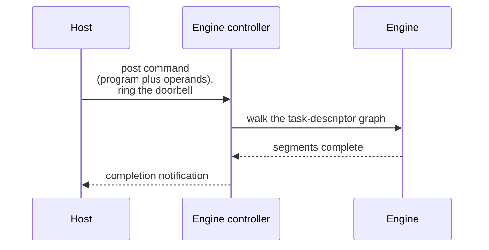

# 30. Host-to-firmware command protocol

> The host drives the engine with one message protocol over a shared mailbox: a fixed `sCSneControllerCmdHdr` header naming a program, process, and procedure, followed by a command body.
> The dispatched command space on the M1 is 93 identifiers, `0x00` through `0x5c`, indexed by `eCSneCmdId`, with `0xFFFFFFFF` reserved as the invalid sentinel.
> A submission posts to a bound ring endpoint, the controller validates and queues it by priority, runs it, and returns completion as a firmware-to-host notification in the same identifier space.

The in-package controller is a real-time-kernel firmware image, and the host communicates with it through a ring-buffer endpoint with a single command vocabulary, `CSNE_CMD_*`, the controller-side neural-engine command set.
This chapter covers the wire protocol between the host-side execution model of chapter 2 and the program file layers of chapter 23.

## Command header

`sCSneControllerCmdHdr` prefixes every ring message with the six fields of [Table](#tbl:c30-cmd-header) that name the command and bind it to a loaded program.

| Field | Offset | Width | Meaning |
| --- | --- | --- | --- |
| `id` | `0x00` | `u32` | the `eCSneCmdId` selector, logged as `%#04x` |
| `size` | `0x04` | `u32` | byte length of the command body that follows |
| `priority` | `0x08` | `u32` | scheduling band, `0..7` |
| `programId` | `0x0c` | `i32` | loaded-program slot, `-1` when invalid |
| `processId` | `0x10` | `i32` | per-program process instance, `-1` when none |
| `procedureId` | `0x14` | `u32` | index into the program's procedure table |

Table: The six fields of the command header. {#tbl:c30-cmd-header}

The dispatcher validates the full message length before reading the body: `maxCmdBufSize >= sizeof(*pMsg) + pCmdHdr->size`.
The byte offsets follow the field order under a packed 32-bit layout, and the field presence and widths are read from the firmware's assert and log format strings.
The `priority` field holds two scheduling classes: values `0` and `1` are the privileged realtime band and values `2` through `7` are the normal queue.
These are encoded by the firmware checks `(priority >= 0 && priority <= 1) || (priority >= 2 && priority <= 7)` and the normal-only `(priority >= 2 && priority <= 7)`, under the full-range bound `fwPriority < 8`.
The signed `programId` and `processId` hold `-1`, which reads as `0xFFFFFFFF`, as the unbound-slot marker.
The firmware resolves the pair against `progProcInfo[builtinProgramId]` with the fields `.valid`, `.progId`, and `.procId`, under `builtinProgramId < maxProgramServerSupported` and `id < CAneBuiltInNetworkId::ANE_NET_TOT`.
The resident cache-request commands prepend one further field, an opaque 64-bit `cacheHandler` logged as `cacheHandler: 0x%llx`, naming a long-lived request object rather than a single submission.

The scheduler maps the eight priority levels onto the two admitted classes of [Table](#tbl:c30-priority).

| Level | Class | Firmware gate |
| --- | --- | --- |
| `0`, `1` | high, realtime | `(priority >= 0 && priority <= 1)`, separately admitted |
| `2` through `7` | normal queue | `(priority >= 2 && priority <= 7)` |

Table: The eight priority levels and the two scheduling classes they map onto. {#tbl:c30-priority}

The full-range bound is `fwPriority < 8`, with `maxPriorityNbr <= 8`, and a submission is queued under the scheduler key `(userId, jobId, fwPriority, hwqId, tqId, queueId)`, where `queueId < priorityQCount` selects the schedule-info slot.

## Command set

The dispatched space is 93 entries, identifiers `0x00` through `0x5c`.
The firmware enumerates them in one contiguous, ordered string table, `CAneControllerStringsH11`, which begins at firmware file offset `0xa83b4` and runs sequentially.
The command logger indexes that table by identifier to render each `CMD = %#04x [%s]` log line.
The dispatched identifiers group into subsystems rather than ninety-three unrelated commands: lifecycle and power bring the controller and engine up and down, property reads and writes config and registers, stats drives printing, profiling, and tracing, ipc binds endpoints, buffer configures and recycles the channel pool, and program, execution, cache, and secure carry the inference path itself.
The complete set in numeric-identifier order, with each command's direction, subsystem, and recovered request struct, is in [Table](#tbl:apc-command-table).

Most identifiers are host-to-firmware requests; fourteen in the same space are firmware-to-host notifications, and one, `BACK_CHANNEL_RPC` at `0x5b`, flows in both directions.
The sentinel `ECSneCmdId_Invalid`, value `0xFFFFFFFF`, is the no-command marker and has no table entry.
Two further strings the firmware contains are not dispatched identifiers: `CSNE_CMD_START` is a standalone log string with no table slot, and `CSNE_CMD_IPC_ENDPOINT_TYPE_DATA_CHAINING` is an endpoint-type enum value rather than a command.

## Command lifecycle

A submission moves through the four stages of [Figure](#fig:c30-lifecycle): the host posts, the controller picks it up, executes it, and notifies completion.

The host posts by writing the header and body into the ring-buffer slot of a bound endpoint and signalling the controller.
The host must bind the endpoint first with `CSNE_CMD_IPC_ENDPOINT_SET`, and the execution-loop endpoint is required to be the data-chaining type: the firmware asserts `endPointId == CSNE_CMD_IPC_ENDPOINT_TYPE_DATA_CHAINING`.
The flag `ipcEndpointSetDone` guards endpoint state, false before the bind and true after, so the firmware rejects a submission on an unbound endpoint before any work begins.

The controller picks the message off the ring and dispatches on `id`.
For a procedure call it validates the named procedure against the loaded program, `procedureId < pProg->pProgram->procNbr`, and resolves the content type through `getProcedureCallType(programId, procedureId)`, which must fall in the admitted set or the firmware rejects the call with `getProcedureCallType(): invalid procedureId=%d, tot=%d`.
The validated call enters the priority queue keyed by `(userId, jobId, fwPriority, hwqId, tqId, queueId)`, and a full queue is reported by `[isHWReady] priority queue is full!`.
The controller drops a submission whose target program is not running, logged for the inference path as `CSNE_CMD_INFERENCE_CALL dropped. prog %d process %d not running.`

Completion and asynchronous status return as firmware-to-host notifications that reuse the command identifier space: a per-program event as `CSNE_CMD_PROGRAM_EVENT`, a data-chaining stage completion as `CSNE_CMD_DATA_CHAINING_EVENT`, a prefetch completion as `CSNE_CMD_PREFETCH_DSID_EVENT` logged `Dsid (%d) Event (0x%x)`, and an error as `CSNE_CMD_CH_ERROR_NOTIFICATION`.
Performance signposts captured during a run originate in the firmware as `CSNE_CMD_CH_SIGNPOST*` notifications, not as a host-side instrumentation artifact.

## Procedure-call body

The body of a procedure call is `sCSneCmdProcedureCall`, a shared container whose trailing variable-length arrays spill into an over-allocated `sCSneCmdProcedureCallCopyContainer`.
The counted fields after the header describe the call's shape, each bounded by a firmware assert, as [Table](#tbl:c30-proccall-body) gives.

| Field | Type | Bound |
| --- | --- | --- |
| `nbrOfOutputBufferSets` | `u32` | `== 1` on the M1 generation |
| `nbrOfWaitEvents` | `u32` | `nbrOfWaitEvents + nbrOfSignalEvents > 0` |
| `nbrOfSignalEvents` | `u32` | `<= 16` |
| `nbrOfCustomBars` | `u32` | `<= 32` on the wire |
| `stats.buffer` | `u64` | `>= pProc->pStatArrayBaseOrig` |
| `stats.size` | `u64` | covers the three stats records |

Table: The counted fields of the procedure-call body. {#tbl:c30-proccall-body}

The firmware logs the decoded shape on one line: `Bufs = %d Priority = %d CustomBars = %d WaitEvents = %d SignalEvents = %d`.
A wait or signal event is a fixed 24-byte record, `{ uint32 type; uint32 targetMask; uint64 id; uint64 value; }`, recovered from the event log strings `waitEvent[%d]: type=%d mask=%x id=%lld value=%lld` and the matching signal line.

The procedure-call type gate admits only certain content types: `getProcedureCallType(programId, procedureId)` must return `ContentType_0`, `_3`, or `_4` for a plain `PROCEDURE_CALL`, and `_0` or `_3` on the cache-request path, under `procedureId < pProg->pProgram->procNbr`.
The `WITH_CUSTOM_BARS` variant adds a trailing custom execute-order array, whose offset and length are bounded by `callSize <= customExecuteOrderArrayOffset`, `0 < nbrOfCustomExecuteOrder`, `nbrOfCustomExecuteOrder <= 128`, and `(customExecuteOrderArrayOffset + nbrOfCustomExecuteOrder * sizeof(uint32_t)) <= sizeof(sCSneCmdProcedureCallCopyContainer)`.
Each custom bar holds `type == ANE_CUSTOM_BAR_GENERIC` and `config == ANE_CUSTOM_BAR_HW_32BIT`, the on-wire count is bounded `nbrOfCustomBars <= 32`, and a blob in the compiled program may hold up to 128.
The `WITH_SIGNAL_EVENTS` variant adds the `procCallWithSignalEvents` sub-struct, bounded by `nbrOfSignalEvents > 0 && nbrOfSignalEvents <= 16`, with the sub-network custom execute-order disallowed (`0 == bSubNetworkCustomExecuteOrder`).

[Table](#tbl:c30-percall-limits) collects the per-call and per-request numeric limits so a host can size a submission ahead of dispatch.

| Quantity | Limit | Firmware gate |
| --- | --- | --- |
| trigger input buffers | 16 | `nbrOfInputBuffers <= (16)` |
| active shared events | fewer than 2 | `sharedEventsActiveNbr < 2` |
| task-descriptor partitions on the M1 single path | 1 | `1 == nbrOfTdPartition` |
| ANE requests in list on the M1 single path | 1 | `1 == pCacheReq->nbrOfAneRequestInList` |

Table: The per-call and per-request numeric limits on the M1 generation. {#tbl:c30-percall-limits}

The resident cache-request family is the firmware substrate behind keeping a buffer set on the engine across calls.
An install command at `0x45` returns the 64-bit `cacheHandler` and creates a long-lived request indexed internally by `cacheReqIdx` in the range `0 <= cacheReqIdx < maxCacheRequest`, allocated from a `CIndexPool`.
A trigger command at `0x46` names that handle and fires it, holding an `execTimestamp` that must be strictly monotone against `pCacheReq->lastTriggerExecTimestamp`, and checking that the handle is live first.
The firmware drops a trigger on a handle not in the `ANE_DATA_CHAINING_CACHE_REQUEST_IN_USE` state with `cacheHandler (0x%llx) in wrong state (%d) for trigger. trigger dropped`.
The recycle command at `0x47` returns a consumed output buffer to a resident request, the invalidate command at `0x48` tears it down, and the group select at `0x4f` picks the active member of a buffer-sharing group.
The force-disable at `0x4d` is the global disable, which the firmware admits only when set true.
The firmware constrains chained buffers to the low address window: a data-chaining buffer descriptor must hold `buffer.type == eCSneBufferDescriptorType_OutputBuffer`, `outputBufferSetId < nbrOfOutputBufferSets`, and a device address whose high 32 bits are zero (`(buffer >> 32) == 0`).

The inference call at `0x5a` is the higher-level submission path, which the firmware expands into one or more `CANE_SUB_PACKET_CMD_PROCEDURE_CALL` sub-packets, holding a pre-mapped property buffer and validating the buffer count against the program descriptor: `pMsg->bufNbr == 1 + pAneProgramDesc2->procedures[procedureId].numIoBuffers`.
The `PREMAP_BUFFER` command at `0x4a` pre-maps that property buffer, hard-validated for exactly one operation and exactly one buffer (`pPreMapOp->nbrOfBuffers == 1`) with nonzero address and size.
The procedure call at `0x41` is the lower-level direct form addressing the program, process, and procedure triple; both share the `sCSneCmdProcedureCall` body and the same priority scheduler.

The property channel exposes a register-poke surface that the host uses to read and write firmware registers directly.
The read command at `0x1f` and the write command at `0x1e` each hold a two-field body, recovered from the `IPC Writer regAddr 0x%lx regValue 0x%x` log line as `{ uintptr regAddr; uint32 regValue; }`, and a write checks `regValue != 0`.
The back-channel RPC at `0x5b` is a firmware-initiated call into the host driver: the firmware client posts directly into the direct-proc-call event pool, gated on `GetDirectProcCallEventPoolAvailNum() >= 2`, tracks outstanding calls in `RPCEventMap[%d]`, and reports a stuck slot with `RPCEventMap[%d] is dirty. (No ack from driver)`.

## Recovered command-id enum

The dispatched table above is the contiguous logger ordering, but the firmware also holds the canonical protocol enum as a packed `{char* name; u64 id}` array at vaddr `0xf5ba8` (file offset `0xf9ba8`, in `__DATA.__const`).
This is the `ECSneCmdId` enum, 94 named entries plus a trailing zero-id terminator, and the id is the literal 16-bit value held on the wire at message `+0x4`.
The array is reached through a fixed-up pointer with no `adrp`+`add` cross-reference, consistent with a shared name-lookup helper.
The protocol enum and the dispatched logger ordering are not the same numbering in the `0x2xx` region, so this enum is the wire vocabulary while the table in the preceding section is the firmware's own logger index.

The named ids partition by high byte into the families of [Table](#tbl:c30-id-families), each a contiguous range.

| Family range | Count | Subsystem | What the family covers |
| --- | --- | --- | --- |
| `0x01`–`0x34` | 52 | control, config, power, debug | `START`, `STOP`, `RESET`, `CONFIG_GET`/`CONFIG_GET_EXT`, `PRINT_ENABLE`, `BUILDINFO`, `BOOT`, `PING`, the `TIMEPROFILE_*` trio, `POWER_DOWN`, `POWER_DEVICE_ON`/`OFF`, the PMU-base and dynamic-powergate setters, `IPC_ENDPOINT_*`, the `CH_BUFFER_*` pool and recycle set, `CH_PROPERTY_READ`/`WRITE`, `TRACE_ENABLE`, `RESOURCE_INFO_GET`, `STATS_BUFFER_SIZE_GET`, `SUSPEND`, `DSID_SET`, `MCACHE_SIZE_GET`, `SECURE_MODE_START`/`STOP`, `EXCLAVE_MODE_START`/`STOP`, `QUIESCE_STATE`, `CPU_LOAD_GET` |
| `0x100`–`0x108` | 9 | channel notifications | firmware-to-host async messages: `CH_ERROR_NOTIFICATION`, `CH_POWER_CONTROL`, the `CH_SIGNPOST*` and `CH_SIGNPOST64*` single and grouped variants, `CH_RESET_NOTIFICATION`, `CPU_LOAD_NOTIFICATION`, and the secure-mode resume transition |
| `0x200`–`0x212` | 19 | program, process, procedure call | the inference path: `LOAD_PROGRAM`/`UNLOAD_PROGRAM`, `CREATE_PROCESS`/`TERMINATE_PROCESS`, `PROCEDURE_CALL`, `LOAD_AFPP`/`UNLOAD_AFPP`, `PROGRAM_INTERFACE_VERSION_CHECK`, the `PROCEDURE_CALL_*` cache-request and custom-bar and signal-event variants, `PREMAP_BUFFER`, `FORCE_DISABLE_CACHE_REQUESTS`, and the time-management sync error |
| `0x300`–`0x305` | 6 | events | `SET_ACTIVE_CACHE_REQUEST_IN_GROUP`, `PROGRAM_EVENT`, `USER_EVENT`, `DBG_EVENT`, `DATA_CHAINING_EVENT`, `PREFETCH_DSID_EVENT` |
| `0x400`–`0x404` | 5 | id handshakes | `SECURE_MODE_EVENT`, the `REQUEST_PROGRAM_ID`/`RETURN_PROGRAM_ID` and `REQUEST_PROCESS_ID`/`RETURN_PROCESS_ID` allocate-and-free handshakes |
| `0x7000`, `0xff00`, `0x0000` | 3 | outliers | `INFERENCE_CALL` at `0x7000`, `BACK_CHANNEL_RPC` at `0xff00`, and `DEBUG_COMMAND_DATA_CHECK` at `0x0000` |

Table: The six command-id families of the `ECSneCmdId` enum at `0xf5ba8`. {#tbl:c30-id-families}

## Firmware fast path

The live on-chip dispatcher is `CAneEngineExeLoop::dispatch` at vaddr `0x4a42c`, which reads the 16-bit id with `ldrh w8,[x21,#4]` and decodes it through a compare tree rather than a jump table.
The tree implements only about ten ids, all on the procedure-call and inference fast path, and every other id falls through to a default arm at `0x4aa4c` that logs `Cmd 0x%x is not supported through ExeLoop cmd channel` and then asserts, panicking the firmware.
Sending a non-fast-path id on this channel is thus a hard fault on the live device, consistent with the unrecoverable behavior of a DART or fence fault.

The implemented arm of the compare tree dispatches each id to a PAC-signed virtual method on the engine object, reached through the `ldr`/`autda`/`blraa` pattern at a fixed vtable offset.
Each such slot is an arm64e auth-rebase chained pointer in `__DATA.__const` whose low thirty-two bits hold the raw target address, matched to its call site by the `movk` discriminator, so the seventy-six-slot table resolves statically.
The procedure-call slot at `+0x200` targets `0x7374c` and the inference slot at `+0x190` targets `0x74510`.
[Table](#tbl:c30-exeloop-ids) gives the ids the ExeLoop dispatcher implements, with each id's vtable offset and behavior.

| ExeLoop id | Meaning | Vtable offset | Behaviour |
| --- | --- | --- | --- |
| `0x2d` | `CH_DATA_FILE_LOAD2` | `+0x250` | guarded by the engine flag at `[x19,#0x2bb]` |
| `0x204` | procedure call | `+0x200` | validate `(programId, procId)` then dispatch, the inference trigger |
| `0x209` | cache-request trigger | `+0x218` | logs `cacheHandler 0x%llx` |
| `0x20a` | cache-request submit | cache path | cache-request submission |
| `0x20c` | procedure call with bars | `+0x208` region | custom buffer-address-register call |
| `0x211` | procedure call with events | events path | event-signalled call, force-disable-cache arm |
| `0x212` | procedure-call variant | `+0x210` | shared reply and verify path |
| `0x404` | `RETURN_PROCESS_ID` | `+0x190` | process-id handshake reply |
| `0xff00` | `BACK_CHANNEL_RPC` | func `0x47818` | length-and-magic guarded host-to-firmware payload |

Table: The ids the ExeLoop dispatcher implements. {#tbl:c30-exeloop-ids}

The procedure-call arm at id `0x204` decodes a fixed message layout, recovered from the debug line `[EXELOOP] CMD=%#04x [PROC CALL] at %lld : ProgId=%d ProcId=%d Proc=%d Pri=%d`: a `u16` id at `+0x04`, then `u32` `programId`, `procId`, `proc`, and `priority` at `+0x08` through `+0x14`.
Its argument validator at `0x48644` rejects a `programId` of `144` or more and a `procId` of `288` or more, then indexes a per-program validity byte at `engine + programId * 0x20 + 0x9948`, so a 144-entry program-slot table of stride `0x20` is at engine offset `0x9948`.
The back-channel RPC handler at `0x47818` caps its payload length at `0x800000` and requires the magic `0x55aa55aa` before processing, the same back-channel surface as id `0x5b` in the dispatched table.

The `0x00xx` config, power, trace, and profile commands are present in this image only as enum names and as the per-command struct and assert strings, for example `sCSneCmdReset`, `sCSneCmdConfigGet`, `sCSneCmdTraceEnable`, and `sCSneCmdPowerSupplyControl`.
Exhaustive `adrp`+`add` and constant-pointer scans find zero references to any of those handler strings anywhere in `__text` or `__DATA.__const`, so the strings are linked in from a shared protocol header while the handlers are not compiled into this M1 and H13 build.
`AppleH11ANEInterface` and `AppleANELoadBalancer`, the kext that owns power, IPC-endpoint, and buffer management, service those config-command handlers host-side, so their status is opaque by absence rather than undecoded.
The `0x01xx` notification family is firmware-to-host output emitted on the channel rather than dispatcher input, so it does not appear in the ExeLoop compare tree either.
